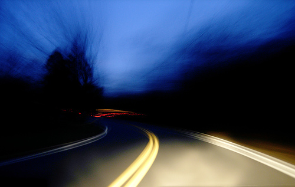

 

Perjalanan darat malam hari menyetir mobil selalu menjadi hal yang menyenangkan dan menantang buat kebanyakan cowok.. Setiap kali aku mengendarai mobil di jalanan luar kota, ada sensasi tersendiri ketika harus menaklukkan gelapnya jalan, menantang pengendara lainnya, meliuk-liuk diantara bus dan kendaraan besar lainnya.. Pengalaman menantang bahaya yang ada memberikan sensasi dan adreanalin terpacu luar biasa..

Tapi tahukah kamu, berkendara malam hari,  terutama saat kita mengantuk dan kelelahan sama berbahayanya dengan menyetir dengan kondisi mabuk.. \*wow..!\* .. Seperti itulah hasil dari studi yang dilakukan oleh sekelompok peneliti eropa tentang hubungan kondisi fisik dengan performa dalam mengendarai kendaraan.

Peneliti dari Universitas Utrecht di Belanda memperoleh kesimpulan bahwa, berkendara di malam hari lebih dari 3 jam sama berbahayanya dengan berkendara dalam pengaruh intoksikasi alkohol. Bahkan efek bahaya yang ada sudah dimulai saat dua jam pertama berkendara di malam hari.

Peneliti melakukan studi ini dengan meminta 14 pria umur 21-25 tahun untuk mengendarai mobil dibawah supervisi di malam hari, mulai dari jam 3 - 5 dini hari, jam 1-5 dini hari dan jam 9 malam - 5 subuh. Para subjek berkendara dengan kecepatan konstan 128 km/jam dan mengendalikan mobil untuk selalu berada tepat di tengah marka jalan. Selama tes, performa berkendara mereka dimonitor dan dicatat, performa berkendara diukur dari kemampuan subjek untuk menjaga mobil tetap berada pada marka jalan.

Hasilnya, cukup mengejutkan.. Para peneliti yang dipimpin oleh Dr. Joris C. Verster menemukan hubungan yang sama antara kemampuan pengendara yang mengalami kelelahan di malam hari dengan pengendara yang mabuk.

2 jam berkendara di malam hari memiliki kesalahan yang sama dengan pengendara yang memiliki kadar alkohol dalam darah 0,05.  Lalu naik sama dengan kadar alkohol darah 0,08 begitu subjek berkendara selama3  jam. Naik lagi secara signifikan menjadi 0,10 pada jam keempat. Peneliti menemukan bahwa membuka jendela mobil untuk mendapatkan udara segar atau menyalakan musik sekencangnya tidak terlalu berpengaruh dalam meningkatkan performa berkendara dari subjek yang diteliti.

Woaahhh... dari studi yang dilakukan tersebut kita bisa melihat dong ya bahayanya nyetir mobil malam hari.. Bahkan kelompok studi tersebut memprediksi bahwa 20% kecelakaan di jalan disebabkan oleh pengemudi yang kelelahan.

Kelelahan tentu saja harus menjadi pertimbangan kita dalam berkendara, terutama ketika harus berkendara ke luar kota.. Lebih baik menepi di lokasi istirahat dan tidur sebentar, daripada harus mempertaruhkan nyawa tetap memaksa diri berkendara saat kelelahan..

Sumber : [_Journal of Sleep Research_](http://onlinelibrary.wiley.com/doi/10.1111/j.1365-2869.2010.00901.x/abstract;jsessionid=F0F9FF80026C877A8577CC2C295FC43B.d03t01)
