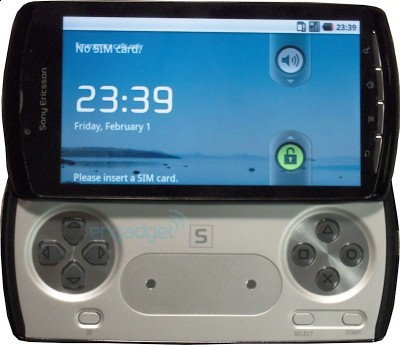

> _"We do not want to comment on rumors.."_ Sony Ericsson Spokesperson

Rumor tentang adanya generasi terbaru PSP yang dibekali fitur telefoni tampaknya benar-benar akan menjadi kenyataan.. Terbukti dengan beredarnya banyak gambar bocoran tentang salah satu gadget yang dinanti jutaan gamers ini di internet.. Bahkan majalah teknologi dan gaya hidup T3 UK membahasnya secara khusus dua halaman penuh di edisi januari 2011 ini..

Dari gambar teranyar yang beredar di internet, penampakan sony psp phone tampak berbentuk seperti Vivaz Pro, ponsel multimedia yang sudah diluncurkan sebelumnya oleh SE. Perbedaan terbesarnya tentu  pada terdapatnya kontroler psp yang menggantikan tempat qwert keyboard pada Vivaz Pro.

Dari rumor yang beredar kencang di internet, SE PSP Phone ini akan dibekali dengan prosessor _Qualcomm_ 1 GHz yang berkemampuan sama seperti iPhone 4 atau ponsel cerdas dengan windows mobile 7  , 512 Mb RAM, 1 Gb ROM, layar sentuh kira-kira antara 3,7 sampai 4,1 inci yang dibekali dengan fitur multi-touch membuat gadget ini akan memberikan pengalaman _gaming_ layaknya iPhone. Untuk sistem operasi, rumornya akan diisi oleh _gingerbread a.k.a_ Android 3.0. Yang menarik adalah, kabarnya Sony PSP phone akan dibekali fitur penyimpanan tambahan berupa microSD, tidak seperti PSP sebelumnya yang beruba memory stick. Belum tau juga alasan Sony kenapa mengganti memory stick ini.

Pihak resmi Sony sendiri menurut juru bicaranya menolak memberikan komentar atas rumor yang beredar tentang Sony PSP phone ini, tapi menurut _[engadget](www.engadget.com)_ , info yang mereka dapatkan tentang gadget ini beserta fitur-fiturnya didapatkan dari sumber yang sangat terpercaya. Peluncuran resminya sendiri diperkirakan bersamaan dengan _Mobile World Congress_ yang akan diselenggarakan februari nanti. So, ditunggu saja..
