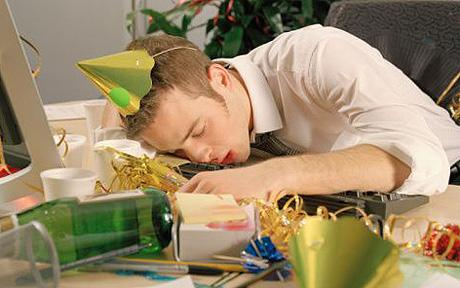

\[caption id="attachment\_91" align="aligncenter" width="460" caption="sumber gambar : www.telegraph.co.uk"\]\[/caption\]

I still can always recall the time of summer 2008, during the time i did my elective program in Taipei, Taipei was awesome.. The city, the vibes, the people, and yes, the nightlife..  Where else in this planet you can spend a wild open bar party for only NTD 400 (around 12 US bucks). And yes, i was nailed with the happy 'poisonous' juice, from vodka, bailey to some funny name of boozes like 'godmother' and 'godfather' ..\*like whaaatt...-\_\_-\*

One night during the party i had in one of the club downtown Taipei. Jackpot! Nasty hangover yes i had.. that was the worst hangover in my entire life.. Everything was blur and funny.. though i still kept it vomit free, but i ended up sitting on the floor beside the toilet and starts talking mandarin with another hangover Chinese guy next to me.. funny thing because, i cannot speak mandarin at all! but i recalled that we had a very nice conversation back there,what can i say, we were two jerks poisoned by the booze.. \*kyaaa..\*

Was it good? no not good at all, i spent weeks after that with a guilty conscience,, yes, weeks after that.. Alcohol is bad.. well, but i'm not gonna lecture you guys here about alcohol influence and so forth, i'm pretty sure that your mom already told you about it.. Yet, we still took it, many of us still enjoy cocktail as much.. Well, just because so many people get drunk doesn't make it OK. A recent survey found that 3 out of every 5 college students have engaged in binge drinking. Binge drinking completely thrashes your liver and kidneys, not to mention puts you at risk of death via alcohol overdose.

This article is not for people who want to stop drinking vodka, yet, this is for those who realize that alcohol is bad, but still very hard to put down the habit. Can we manage the hangover well? yes, we can... how, let me show you how..

One ounce of prevention is better than a pound of cure, of course it's still the best way not to take alcohol at any sip.. They don't call it intoxication for nothing. Happy juice is poisonous. Put enough of it into your body and you die. What concerns us here, however, is not so much alcohol itself (which we'll take as a given) but the by-products of alcohol, and especially one particularly nasty chemical critter by the name of acetaldehyde. It's got a lot more of the bad kind of kapow, and the latest research suggests that it may be responsible for the worst of your hangover.

If you still cannot hold yourself from drinking alcohol, you can still do another prevention by doing two things.. Eating and drinking enough water before you go wild to the party..  Eat a hearty, carbohydrate-rich meal before consuming alcohol. Foods like breads and pasta can absorb some of the alcohol you drink. Drinking milk before also can coat your stomach and reduce alcohol absorption.

What you drink also may impact the severity of your hangover. Dark alcoholic beverages like whiskey often cause more intense hangovers than an equal quantity of light-colored alcoholic beverages, such as vodka. Similarly, carbonated drinks can produce heavy hangovers because of the way the alcohol enters the bloodstream. The drinks that are least likely to cause hangovers are non-carbonated mixed drinks with light-colored spirits, such as vodka with fruit juice.

Another thing to do is during the party you have to keep yourself in a clear conscience so that you can stop yourself from too much drinking. Drinking moderately is the best way to do this. Our liver breaks down alcohol at a rate about a beer in every hour.. Bottomline is, the less the merrier.. :-)

By the time you get back to your room -make sure it's really your own room :-p - drink no more alcohol! -of course- and rehydrate yourself with water, isotonic water is preferable, since we need to replace again all the fluid that flush down during the party. Beware of coffee, some friend of mind always suggest to drink coffee after hangover to prevent the headache, the fact is coffee is a diuretic drink that will only make you lose the fluid more than before.

Some also suggest to take analgesic medicine like aspirin to prevent headache, here's the thing, This isn't a good idea. Medicine like aspirin and acetaminophen (paracetamol) will only upset the stomach and aggravates the symptoms of a hangover. Paracetamol, when mixed with the alcohol still in your bloodstream, might cause your liver to explode (best to avoid). If you want to take a pill, a multivitamin might help by replenishing some of the B vitamins you've pissed away during the course of the evening

By this period of post hangover, you are pretty sure experiencing all the symptoms like headache, muscle pain, nausea, fatigue, dizziness, sensitivity to light and sound, and irritability. At last, the best way to pass over the hangover is by taking a rest in your bed. There's no exact way to eliminate hangover, since various factor accounted for the condition. But most of the hangovers last not more than 24 hours, letting the progress of hangover runs during your sleep is the best cure after all..

Oh, and one more, this is very IMPORTANT, See a doctor IMMEDIATELY if you are experiencing tremors, stomach pain, or if you see blood in your vomit. These are indications that you have tippled way too much, and must get professional medical attention, (e.g., a stomach-pump at the local emergency room). Better safe than sorry.

Again, we don't have to really experience nasty hangover, not only that is bad for us.. but also, we don't want to put our full function body at a stake just for a short wild night do we?

One time i spoke mandarin during my hangover, and that's it.. It was fun though, but the hardest part after the hangover is when we have to deal with the guilty conscience which pretty much the effect of alcohol to our brain..

Drink responsibly is good, but not drinking alcohol at all is remain the best..

enjoy your weekend my friends..:-D
