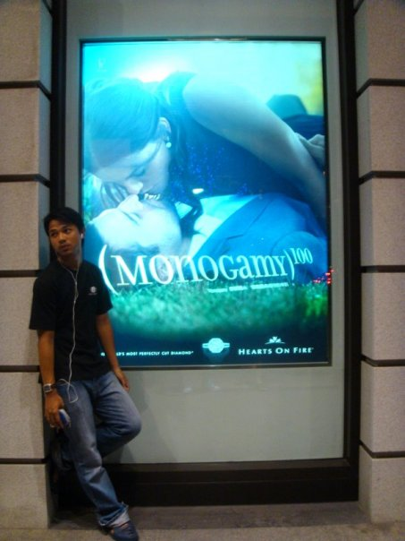

Halo

Namaku Kurniawan Satria Denta, lahir 24 tahun lalu di kota kecil di tengah pulau terpadat di Indonesia, aku berakhir menjadi seorang dokter lulusan baru yang bukannya bekerja di rumah sakit, puskesmas atau semacamnya, malah terdampar di dunia yang sama sekali tidak pernah aku impikan sebelumnya, dunia penelitian kedokteran.

Setelah menghabiskan berbulan-bulan berdiskusi, mencari referensi, dan menghabiskan waktu terbanyaknya dengan melamun, aku menemukan sesuatu yang harusnya aku sadari bertahun-tahun yang lalu ketika aku masih cukup muda dan alay untuk menemukan jati diri, sebuah prinsip hidup...

Prinsip hidupku benar-benar sangat sederhana, hidupku adalah perjalananku, maka aku tidak akan pernah menghabiskan waktuku sedetik pun, untuk melakukan sesuatu yang tidak aku sukai, tidak bisa aku nikmati, dan tidak memberikan kontribusi yang bermanfaat untuk semesta hidup ini.

Ini adalah hidupku, perjalananku, hanya akan aku lakukan apa yang aku cinta, dan akan aku lakukan terus cinta itu sampai akhir waktuku nanti. Jika aku tidak menyukai sesuatu, maka ku akan berubah. Aku telah berhenti mencari cinta matiku, karena cinta matiku rela menunggu sampai aku berhasil menjalani apa yang aku cinta.

Dan apa sebenarnya yang aku cinta, aku cinta hidup ini, segalanya yang indah di semesta raya ini, mungkin pilihan hidupku sekarang bukan yang terbaik, tapi aku sangat total menikmatinya.. Aku menikmati posisiku sekarang ini, aku sangat menyadari bahwa tugas utamaku sebagai dokter bukan untuk menyembuhkan orang sakit, tugas utamaku adalah membuat orang untuk tidak pernah menjadi sakit. Lagipula aku tidak pernah suka dengan orang sakit, aku suka dengan orang sehat.. Aku peduli dengan orang sehat, maka aku ingin menjadi dokter yang membuat orang tidak perlu ke dokter lagi karena sakit yang dideritanya..

Hidup sangat singkat, singkat sekali, aku mungkin bukan pablo picasso, lady gaga, ataupun melly goeslaw, tapi hidup sudah aku dedikasikan untuk terus memberikan karya terbaikku.. Cita-citaku dari dulu sampai sekarang masih sama, untuk menjadi seniman besar dari hidupku sendiri. Every child is an artist, the problem is how to remain an artist once he grows up, itu kata picasso.. Kata aku, hidup sangat singkat, jangan buang waktu kita untuk melakukan sesuatu yang tidak kita sukai, berhentilah berpikir terlalu panjang, do something, create!

Namaku Kurniawan Satria Denta, dibalik semua kegilaan dan keserakahanku atas kenikmatan semesta, niatku tulus untuk selalu memberikan yang terbaik atas nama perjalanan super hebatku dalam hidup ini.

Sincerely.

Me...
