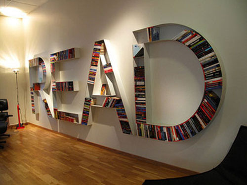

Alkisah, saat aku SD dulu -ya, aku pernah SD- kira-kira kelas 4-5, SDku tiba-tiba tanpa hujan tanpa badai merenovasi perpustakaan sekolah menjadi lebih sophisticated \*halah\*. Aku gak punya fotonya, secara jaman segitu, ya jaman segitu gila yah berasa tua banget, belum ada kamera portabel digital atau henpon berkamera biar bisa moto2 dimana saja kapan saja, dimana aku bersyukur bgt jaman segitu belum ada henpon berkamera, otherwise i would have ended up being alay dahsyat yang memasang foto pose 45 derajat dari atasnya disegala penjuru semesta.. Anywayy, aku emang gak punya fotonya, tapi aku gak pernah melupakan perpustakaan hasil renovasi tersebut, perpus yang awalnya kumuh, kotor, reyot, tempat para pengemis dan gelandangan tidur (ini berlebihan) dirubah menjadi perpustakaan modern dengan karpet, AC (walaupun AC bekas yang bunyinya horror banget pas buat ilustrasi waktu baca goosebumps di perpus), dan yang paling oke, ratusan buku-buku baru dari seluruh Indonesia didatangkan..

Layar terkembang, Salah Asuhan, Azab dan Sengsara, Siti Nurbaya, you name it, hampir semua karya klasik Indonesia, mulai dari sastra melayu lama, angkatan balai pustaka, angkatan 45, 66, woaahh, lengkap.. Jadilah sesi istirahat kita waktu SD dulu dihabiskan dengan tiduran di karpet perpus membaca semua yang bisa dibaca saat itu, dan memilih-milih buku untuk dipinjam dibawa pulang.. Manado, tempat aku sekolah dulu, itu sangat jauh dari sentuhan peradaban, secara lokasinya jauh banget dari Jawa, tapi setiap kali aku membuka buku di perpus, rasanya aku bisa melayang jauh sampai ke Padang dengan Siti Nurbaya, keliling Jawa dengan Pramodya, bahkan berteriak ketakutan di Amerika saat memasuki rumah hantu bersama R.L Stine.. Berlebihan? biarkan saja.. I had my first bookgasm in library there, sudah jelas alasannya..:-)

Sampai sekarang aku gak tau siapa yang membawa ide untuk merenovasi perpustakaan SDku itu.. Tapi semenjak saat itu, dalam hati kecilku paling dalam aku berobsesi, suatu saat nanti,, akan kubangun perpustakaan versiku sendiri, dengan buku-buku yang aku kumpulkan sendiri, minimal punya perpus pribadi di rumah yang akan kubangun nanti.. Call me nerd or whatever, perpustakaan adalah prioritas utama dalam rancangan rumahku nantinya, gak peduli gak ada dapur, tempat tidur, ruang tamu, atau lainnya, yang penting ada perpustakaann.. wohahaha.. -\_-"

Imagine if you had one of these library built inside your very sweet home (click the picture to enlarge)...

\[gallery columns="4"\]

\[slideshow\]
