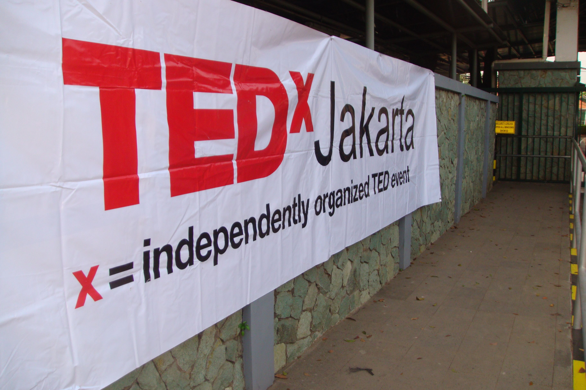
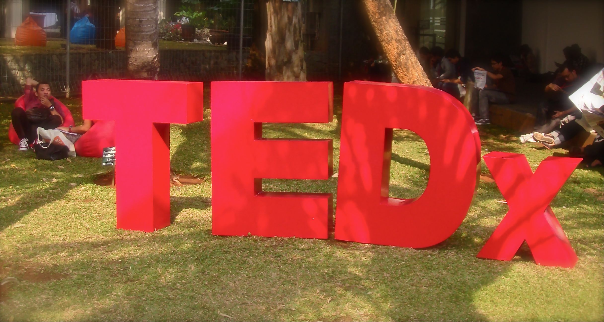
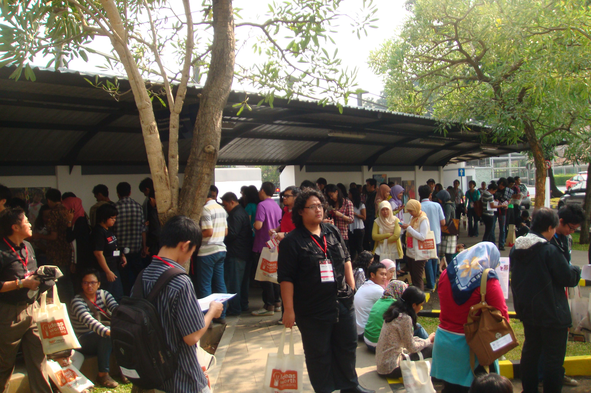
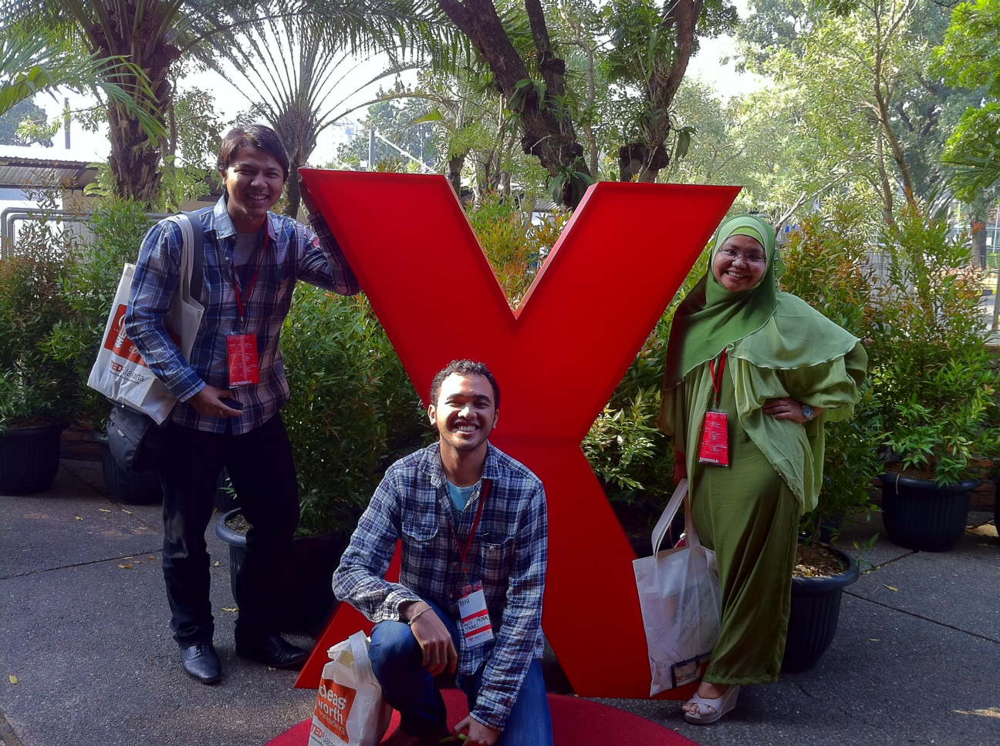

> What a 60 years international school in the capital has to do with spreading ideas, magnificent speakers, and ecstatic audiences?

Jakarta International School, one of the most well known international school in this country, on the August 13, 2011, opened its gate and welcoming 750 of us the audiences slash loyal followers of TED and TEDxJakarta. Because yes my baby, that day was another day in the history when TEDxJakarta presenting the very best ideas from the very best speakers to the world (or should I say, to the lucky 750 bastards who can get the limited invitation, and yes, including me).

I have been following TED talks since 2 years ago, and keep fascinated by the way they spread the ideas and provoke everyone with their mind blowing thoughts. However, I didn’t have even a glimpse of ideas about what does TEDxJakarta look like.. Are they good? Are they cool? Are they as exceptional as the reputation in twitter? That’s why I didn’t bring any expectation for TEDxJakarta along with my 50 minutes flight from Jogja and another 2 hours getting lost in Jakarta’s traffic. Yes, I left my expectation back home because I didn’t want to have this uneasy feeling if TEDxJakarta didn’t come as I expected. Otherwise I would have ended up cursing myself for wasting money and time just to attend a lousy conference.

So how’s it? IT WAS GOOOODDDD...!! Oh sorry, saying good would be an understatement.. ehm.. Let me repeat again.. IT WAS FREEAKINGG GOOODD!! TEDxJakarta was that good until my brain blew to the level of nervous cells and synapses,, resulted in a multiple orgasm of my brain and soul. I was lucky I could still control myself from literally having ecstatics orgasmic seizure on my seat. God knows what’s next if that’s truly happened.

Just for a friendly reminder, I have this high taste when it comes to the presentation of events, speakers and all attributes around it, I am like the Chef Juna of the conference world. I would criticize an event to the marrow and cells of it's, cursing it, and putting the committees into a very deep poignant humiliation if they gave me such a bad experience during an event. So, you could count on my judgement for this.

I came to JIS early in the morning because I didn’t want to get stuck with the registration process if I came late. The venue was exceptional, I never put my step on JIS before, but the school was amazing, I immediately checked my bank account to know how much more it takes so I can afford putting my kids to this school in the future.. (and yes, deep sighing). Registration was fast, I didn’t even need to show my photo ID during registration as requested in the invitation. Attending this meeting alone was not really inspiring so I started wandering around scanning one face to another to find some familiar look, and voila! I ran into Parama, a friend from Surabaya, so relieved to know that I wasn’t the only freak willing to fly to Jakarta just for this twitter-booming event. Further in this event I met with another friend, Fina and her yoga friends who happened to be my new friends. Nice!

\[slideshow\]

Started on time, the audiences was directly provoked with the religious thoughts from Ibu Siti Musdah Mulia, a progressive Islamic Scholar, and then spoilt by delightful performance from Mas Didik Nini Thowok, a world respected dancer, continue with his story of how it all began for him and how the minority issues effected his life. This 1st session closed with the presentation of cool TED video from Ron Gutman about smiling and Arif Abdillah’s talk about his secrets sharing project in www.langkahkaki.com

After the break, just like the endless battle between autobots and decepticon, the dark side of my brain was bombarded with gazillion thoughts, ideas, inspiration coming from series of great presenters like John Hardy the green school guy, Eva Wojkowska with her kopernik project, Ridwan Djamaluddin Mr Ocean Scientist, Derek Sivers the modern day philosopher, and after only a little break in between, there were another brutal minds blowing attack from M Noer, Zaini Alif the freaking good toys master, and Muljadi Pinneng with his underwater photographic pieces which swear to God made me swearing in jealousy.

Breathlessly in my deep excitement, the day was perfectly ended by the performance from Jubing Kristianto -who afterwards gave me this euphoria to get intimate again with my guitar, and ended up as an epic fail from the very first chord, meh- . Only that? No hell no.. TEDxJakarta brought another surprise, the very best for the last, it was Pak Raden!! Yes, The Pak Raden, the guy who sticked in every kids mind long time ago for his vicious yet funny role in Unyil. My goodness, it has been like eons! He closed this event with his story of a king eagerly to pursuit his happiness, man he’s good. The story kicked my mind’s ass so hard for my never ending greedy capitalistic trait.

In my very personal opinion, the highlights speakers of the day , aside from Pak Raden, were Derek Sivers and Zaini Alif. Derek presented his ideas from a very different vantage point made me so hard not to be provoked, his ideas represent the philosophical concepts necessary to survive in this time of abundance, later after the event I introduced my self to him, and found out that we can have another ideas sharing discussion in my lovely hometown Jogja where he continued his visit in Indonesia. Another one was Zaini Alif, he came to the stage with his devoted relationship with traditional toys. His presentation was a time machine, brought me back to my happy joyful childhood with all the games I used to play with my friends. I must say, i began to well up by the time he told all the stories about traditional toys and their philosophical meanings. I guessed the crowds experienced the same, hence, the big standing applause from the audiences.

[")](http://bydnta.files.wordpress.com/2011/08/photo-1.jpg)

I would like to give my big appreciation for all the committees and curators behind this event. You guys were like contestant in MasterChef with TEDxJakarta as your signature dishes, and I am pretty sure even chef Juna cannot outweigh the food you guys have made with TEDxJakarta.

Maybe some small notes for this event, like the praying place was to small, and there were some technical problem arise, but other than that -allow me to give you this two syllables damn- you guys are deeeyyymmn good!

Thank you for the splendid experience, thank you for the great ideas, thank you for the multiple brain-gasms . You definitely should do this more often, and I will make myself to go for another event of TEDxJakarta. Again, you guys are bad ass! Surely more bad ass than Bruce Willis or even Chuck Norris! :-D
