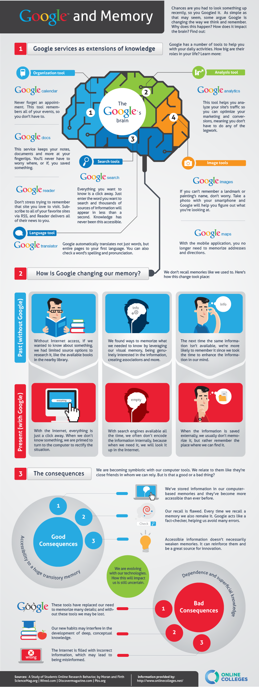

Unless you are one of the post asteroid impact survivor, kamu pasti tau google itu apa.. Hidup kita sangat bergantung pada google sampai-sampai ada yang mengusulkan untuk menambahkan kebutuhan primer manusia menjadi sandang, pangan, papan, dan google.. Aku pribadi sekarang tidak bisa membayangkan hidupku seperti apa tanpa google. sebuah mesin pencari monumental dimana kita bisa mencari informasi tentang celana dalam buatan uganda hanya dengan sekali klik, everyone is now suddenly a Jason Bourne..

Tapi tanpa disadari, perilaku kita mencari informasi di google ternyata mempengaruhi juga cara memori kita bekerja.. Infografis berikut mendeskripsikan secara ringkas tentang google, layanannya dan efeknya untuk memori kita.. Tentu saja, bukan aku yang bikin infografisnya, buat apa bikin, kan tinggal google aja..:-)

\[caption id="attachment\_191" align="aligncenter" width="490" caption="source: www.onlinecolleges.net"\]\[/caption\]
