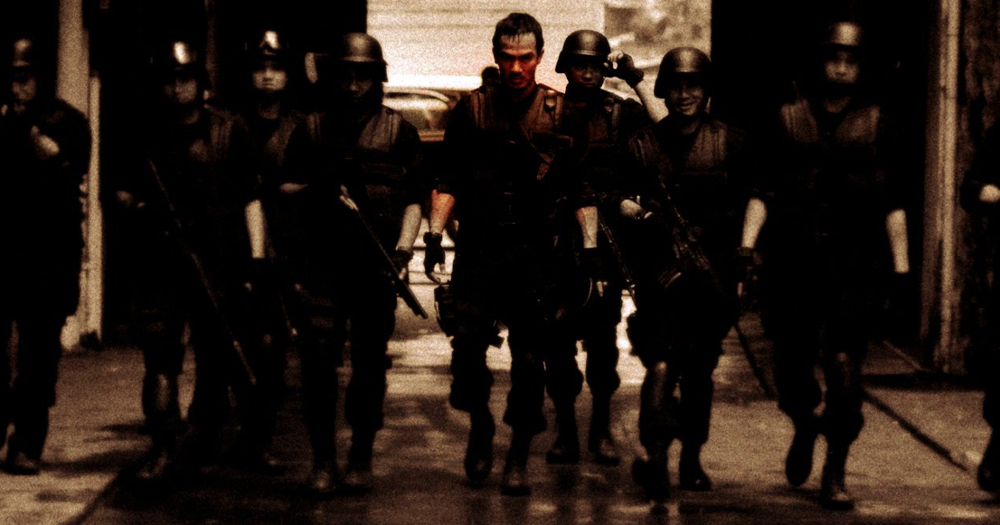
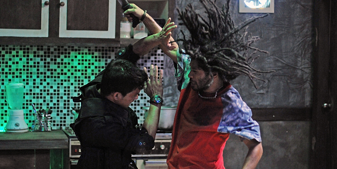
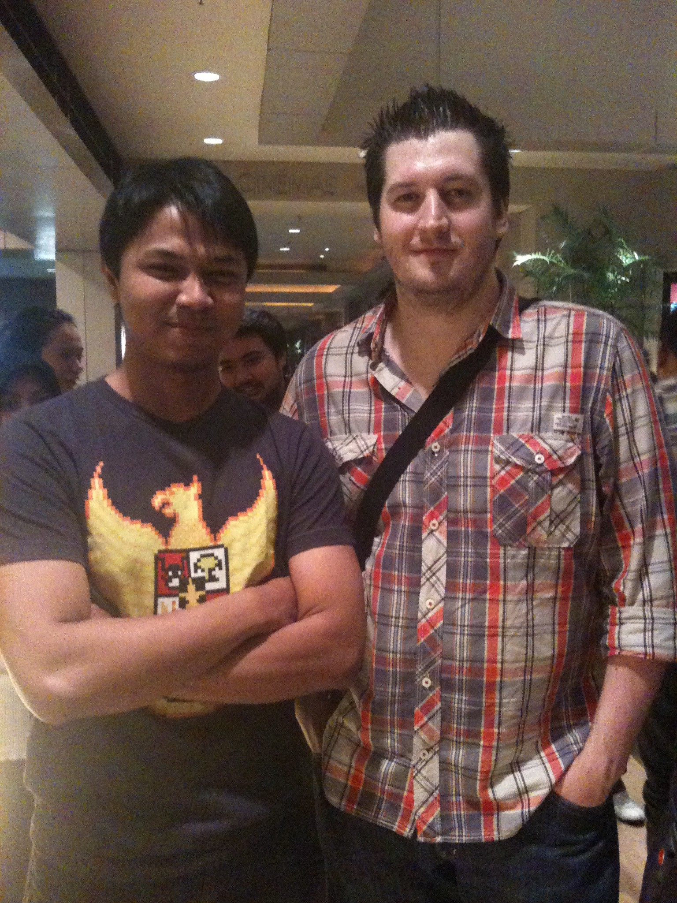

> “If you are just as sick as I am, you are gonna love this movie..”
> 
> \-Gareth Evans at JAFF Netpac special screening of The Raid-

## How do we define “action movie”?

Some might say action movie is a movie when explosion, blood, bone-crushing, car chasing are as beautiful as the view of cherry blossom during the spring in Japan. Others might say action movie is a tasteless piece that only exploit the human needs of violence and brutality behind the darkest side of every human being.

Well, every one in this world could really come up with their own definition of action movie, and of course we all, even the haters, deserve an action movie that is made with soul and passion, an action movie that can satisfy our needs of violence without even make a real damage. An action movie, that gives the ability for us to elude from the riot of  the real world with the ecstatic feeling from the, well, good explosion, blood and bone-crushing of course.

I have been a regular movie buff since the time my parents brought me to the cinema to watch Demi Moore and Patrick Swayze in Ghost when I was 4 -yeah i know, what kind of parents brought their 4yr old boy to watch Ghost-, though my first cinema experience was rather traumatic -don’t ask me why- , i was always still looking forward to go watching movie with my parents, and then I went to the cinema for “Best of the Best”, my first ever action movie that i watched, the movie that broke my action-movieginity, it was one hell of a movie and  then after that, I always feel that i have this special connection with action flicks that will bring me again and again to every nearby cinema just to watch you know, ultimate explosion, blood, and bone-crushing..

\[caption id="attachment\_281" align="aligncenter" width="490" caption="The Raid"\]\[/caption\]

The same connection brought me to “The Raid”, even before the project is done and still widely known as “Serbuan Maut” I knew already that I had to be one among the first timers to watch it on the cinema. And yes after cursing all the people in Toronto and Jakarta for the golden opportunity watching the movie before it’s widely released, I finally had the chance to watch it on Jogja Netpac Asian Movie Festival. Getting the special screening ticket was like, dude, the highlight of my year 2011!

This post is not gonna tell you about the storyline, spoiler, or even details from the movie, i am pretty sure you can read that from the already wide spread reviews out there, or even from IMDB. This post is more about the experience brought by The Raid, the after effect, the elated feeling after watching one of the most anticipated indonesian movie now at the moment.

The Raid is a movie with a really simple mission, to educate people of the world with how an action movie is supposed to be made. The Raid is more than a movie, It’s like Evans’ attempt to tell the people,, this is me, my team, my passion, and my action movie. A showcase of passion + great efforts + collaboration + execution from a project with a premise to bring Silat to a better respected place in action movie universe, along with kung-fu, karate, and to prepare Yayan Ruhian as a replacement for Chuck Norris in the future. \*big grin\*

With that simple premise and strenuous mission, The Raid clearly had done really a great job. Evans and his team didn’t want the spectator to simply just watch the movie, they want us to feel it, to experience action movie more than we had before, they want us to feel the pain from their character, the emotion, the brutality and the frustration. So we, whether we are sick bloody violence (movie) enthusiast or not, can  perceive a true soul of an action movie from every scene in the movie.

This movie provides us with unbelievably stunning full packed action with Silat as the appetizer, main course and dessert. The fighting choreography is so intense we could feel the physical suffering from every character in the movie (I can say this because 2/3 of the viewer in the theater when i watched the raid continuously moaning with ARGH! and OUCH! like they were the one who got stabbed by Iko Uwais). Pictures are both beautiful and brutal, the handheld technique following the character and fighting used in this movie is so optimal. I will highlight another strongest point from this movie, it’s the editing, at first I couldn’t imagine how i could enjoy a movie with 90% of its duration consisted of only fighting and fighting, and I became more curious with the majority of positive feedback from the people pleased  by The Raid, how did exactly Gareth Evans do that? After watching the movie with my own eyes and soul, I believe the secret is on the editing, it’s neat yet dynamic, the pace of The Raid is really neatly arranged and displayed. Some scenes are actually just as violent, but the good editing could provide the viewer with different feels and experiences, it has enough dramatization as needed, everything is sufficient, well, except for the action and Silat of course, they have to be exaggerated, that’s what they’ve been trying to sell to us right.. : ).. Without the superb editing, The Raid would have ended up as a Silat documentary rather than a superlative action movie, I can tell you that.

There are some downside of course with The Raid, like the stiff dialogue and vocalization between the main characters, or some goofs and errors, but for me The Raid still brings a simple concept of a massive police ambushed mayhem into a movie with colossal impact! Really a masterpiece of Gareth Evans and his team so far.

The Raid is exactly how Gareth Evans defines action movie. The Raid has humiliated another action movies to the lowest level, The Expendables now only feels like Teletubbies, Die Hard feels like Dora the Explorer, and Chuck Norris  should feel ashamed on himself he couldn’t stand to see himself on the mirror, and pisses in his pants every time Yayan Ruhian is around.

#### Now, if you asked me what is an action movie? I will only give you one answer and one answer only, action movie my friend,, is The Raid.

\[caption id="attachment\_283" align="aligncenter" width="490" caption="with Gareth Evans"\]\[/caption\]

_A small note from me, after asking for short picture taken session with Evans and some small talks, I was quite surprised to find out, that besides his peculiar preference in violence and blood, he is really a nice, fun and outgoing person. I have met some movie directors before, and usually they made a gap between them and us the laypersons, he’s not definitely one of them. He put himself just like most of the people at that time, as a fellow movie enthusiasts, not as a successful world class director whose the right of The Raid had been bought for the Hollywood remake,. I salute you for that kind of attitude Pak..: )_
