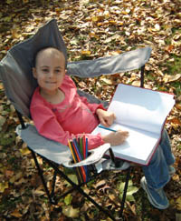
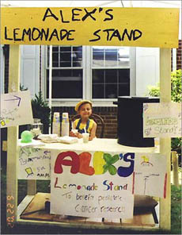
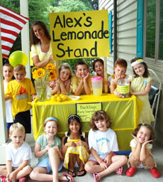

Perkenalkan Alexandra Scott, biasa dipanggil Alex, bayi perempuan lucu menggemaskan ini lahir di Connecticut, Amerika Serikat pada tanggal 18 Januari 1996. Dari anak ini aku belajar, bahwa semua orang di dunia ini punya kesempatan yang sama untuk mengubah dunia menjadi tempat yang lebih baik, bahwa siapapun dengan latar belakang apapun bisa menjadi inspirasi dan solusi di bumi yang lumayan kacau balau ini.

Cerita Alex berawal pada saat dia berumur hampir satu tahun, Alex jatuh sakit dan dokter yang merawatnya mendiagnosis Alex dengan Neuroblastoma, salah satu bentuk kanker yang paling sering terjadi pada anak-anak. Kanker yang menyerang Alex cukup agresif sampai-sampai dokter memvonis bahwa jika Alex bisa bertahan, peluang dia untuk bahkan bisa berjalan pun sangat kecil.

Alex tidak menyerah, di umur yang sekecil itu dia menunjukkan kepada keluarga dan bahkan tim dokter yang merawat, determinasi dan semangatnya menghadapi kanker yang tidak lebih dari 50% kasusnya tidak bereaksi dengan kemoterapi ini. Bahkan setelah tiga tahun berjuang dengan kanker, dengan lugunya Alex berkata pada keluarganya, bahwa dia ingin membantu para dokter untuk menemukan obat penyembuh kanker pada anak. Ketika ditanya bagaimana caranya, Alex kecil menjawab, dengan jualan es lemon pa, ma..: )

Ide yang tampaknya sederhana ini diwujudkan oleh keluarganya dengan membantu mendirikan stand es lemon segera setelah Alex keluar dari Rumah Sakit. Begitu didirikan untuk pertama kali, stand es lemon Alex menghasilkan USD 2000 yang disumbangkan sepenuhnya ke Rumah Sakit tempat Alex dirawat sebagai donasi untuk riset kanker anak..

Tahun-tahun setelahnya Alex terus berjualan es lemon sambil tetap berjuang melawan kanker yang dideritanya. Berita tentang Alex dan usaha stand es lemon untuk kanker-nya menyebar luas keseluruh dunia, banyak orang terinspirasi dan membuat stan es lemon seperti Alex dan menyumbangkan hasil penjualannya untuk mendukung usaha Alex membantu anak-anak seusianya yang menderita kanker dari seluruh dunia..

Bulan Agustus tahun 2004, saat Alex berusia 8 tahun, Alex sampai pada nafas terakhir perjuangannya melawan neuroblastoma. Usahanya bertahan hidup dengan kanker pun berakhir. Tapi tidak dengan inspirasinya, di tahun yang sama, dia berhasil mengumpulkan total USD 1 Juta untuk membantu pembiayaan riset kanker anak. USD 1 Juta yang diawali dari niatan tulus dari seorang anak dan inspirasinya yang membuat banyak orang tergerak untuk membantu usahanya.

Inspirasi Alex bertahan bahkan sampai sekarang, 7 tahun setelah Alex meninggal. Keluarga Alex meneruskan warisan perjuangannya lewat [Alex's Lemonade Stand Foundation](http://www.alexslemonade.org/index.php), sebuah yayasan yang berjuang meneruskan cita-cita Alex sebelumnya, untuk membantu meringankan beban anak-anak penderita kanker baik dengan membantu riset kanker anak, maupun secara langsung membantu para penderitanya menghadapi kanker.

Lebih dari USD 20 Juta telah terkumpul untuk membiayai 200 riset tentang kanker anak. Jumlah yang luar biasa, sangat luar biasa. Alex dan secangkir lemonnya telah mampu membuat dunia menjadi tempat yang lebih baik.

Membuat aku berpikir tentang apa yang aku punya sekarang, dan bagaimana akan aku menggunakannya untuk dunia yang lebih baik dari saat ini...

Bisa? kalau Alex saja bisa, masak kita tidak..

> /////God Bless You Alex.. May You Rest in Peace../////
