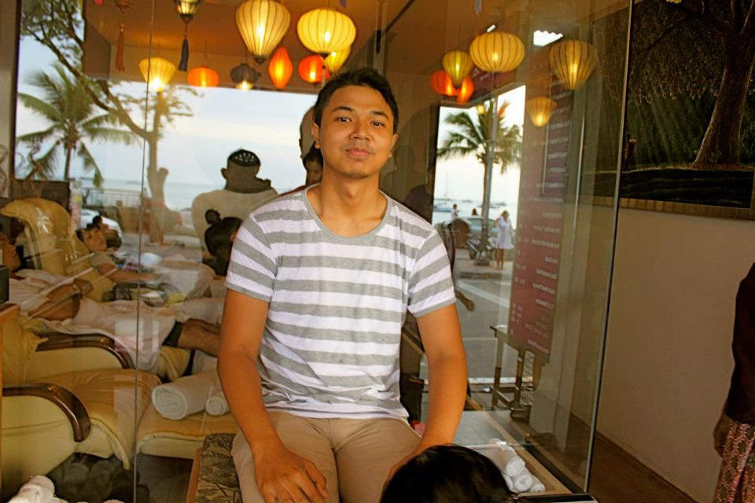

Kalo diperhatikan, aku jarang banget ya update blog. Emang ini penyakit dari jaman MiRC masih happening dulu.. Tiap kali punya blog pasti kayak bang Toyib, tiga kali lebaran baru update.

Beberapa pembaca sampai ada yang protes ke aku soal ini, kenapa kok jarang banget update.. Oke, bukan beberapa pembaca, satu pembaca saja, tapi lumayan kan ada yang protes. Oke, yang protes sebenarnya bukan suka sama tulisanku, dia cuman gak suka kalah taruhan ama pembaca lainnya, soal seberapa sering aku akan update blogku. Oke bukan pembaca, sebenernya itu temen-temenku. -\_\_\_-

Anyway, selama puasa update blog dua bulan ini, sebenarnya banyak hal menarik terjadi. Dua bulan dimana aku berpindah dari satu kota ke kota lainnya, satu pulau ke pulau lainnya, satu negara ke negara lainnya. Semuanya untuk memuaskan kegalauan hati. Mau dibawa kemana hidupku ini.

Pertanyaan yang selalu ada sejak aku sudah disunat pertama kalinya ini kembali mengganggu pikiranku terutama setelah lulus sekolah kedokteran dan menjadi bapak dokter. Dan tahun ini semakin menggila ketika aku menghadapi kenyataan, sebentar lagi aku berusia seperempat abad, dua setengah dasawarsa, 3.125 windu, 0.025 milenium! Aku memang belum tua-tua banget, tapi dengan umur yang sekarang ini aku harusnya sudah tau kapan dan dimana aku akan menetapkan karya dan hidupku.

Agak sedikit terintimidasi juga ngelihat banyak orang yang seusia dengan aku, bahkan lebih muda, sudah bisa menghasilkan sesuatu yang jauh lebih berarti daripada aku. Lihat Samir Nasri, bocah itu hanya beda beberapa hari denganku usianya, tapi sudah bisa bikin Joe Hart berteriak , KAMPREEET! saat gawangnya dijebol semalam.

Tapi aku belajar banyak hal dari sekitar nyaris 10,000 km perjalanan yang aku lakukan dua bulan terakhir ini untuk mencari siapa dan kemana aku akan berlabuh.

Aku belajar untuk selalu hadir. Hadir dalam setiap detik dan tarikan nafas. Selama ini aku sering mengacuhkan kelemahanku, masalahku, ketakutanku, berharap mereka bisa hilang dengan sendirinya kalo dicuekin, well ternyata nggak. Masa laluku bakal terus ada mau diapain juga, ketakutanku akan selalu manja mau dicuekin kayak apapun juga.

Aku ingin selalu hadir, aku capek menutup mata tiap kali ngambil duit di atm biar gak bisa ngeliat saldo atm yang selalu menipis. Aku capek marah-marah sama tukang parkir yang selalu tidak ada saat aku markir motor, tapi langsung muncul dari langit menagih selembar ribuan begitu aku mau pergi -dan kembali lagi menghilang ke langit, begitu seribuan diserahkan-.

Hidup ya harus selalu hadir, hadir untuk menghadapi apapun itu yang hidup berikan. Ketika hidup memberikan kamu jeruk nipis -bentar, kok agak aneh rasanya kalo dibahasakan- oke, When life gives you lemon, you make an ass kicking lemonade out of it.

Ternyata saat aku benar-benar hadir dalam hidup, semua jadi terasa lebih enak dijalani. Mungkin gak menjadi lebih mudah, tapi lebih nyaman rasanya. Masa lalu yang biasanya menangis, saat ini sudah lebih bisa menghapus airmatanya dan ikhlas. Ketakutan yang biasanya merajuk, saat ini sudah lebih bisa tersenyum nggolet2 manja. Kelemahan yang biasanya marah-marah, saat ini sudah bisa diajak nongkrong bareng menikmati secangkir cokelat hangat.

Saat aku belajar untuk hadir, aku lebih bisa melihat masa depanku dengan lebih jelas. Sekarang jelas sudah, masa depanku akan selalu ........tidak jelas.. :D

Aku ditakdirkan bukan untuk memiliki masa depan tampaknya, mungkin yang aku punya hanya sebuah perjalanan tak berujung.

Dimana aku akan berlabuh dan menetap? Ya nanti, saat aku dipanggil. Itu masa depan terjelasku. Sampai saat itu tiba, aku tidak akan pernah berhenti berjalan dan mencari. Berjalan dan mencari ujung dari hidupku, dan menjadikan diriku salah satu sumber dimana faedah alam semesta dibagi-bagikan ke umat manusia.

Alhamdulillah, baru sekarang aku mendapatkan pencerahan untuk selalu hadir.. Bukan saat aku masih kuliah. Hidup akan terlalu berat untuk dijalani jika harus selalu hadir saat kuliah dulu.

Salam hangat penuh kehadiran..: )
