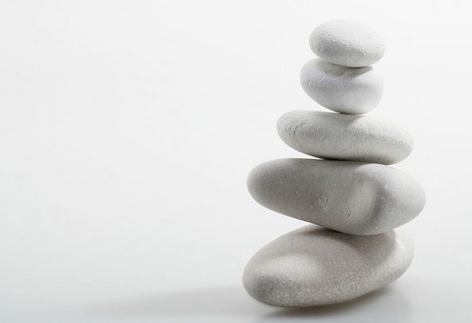

\[caption id="attachment\_343" align="aligncenter" width="490"\] credit to original uploader\[/caption\]

Go wake up early in the morning, the breeze will enter every inch of your marrow and initiate your energy reserve of the day.

Remember that life is as simple as wake up in the morning, survive the day with style,and then go back to sleep again. an interminable cycle of life only ceased by the event of death. Which will bring you to another interminable undefinable cycle of only God-knows what exactly is that.

Eat a good food, get a fine sleep, excercise recurrently, establish discipline meditation and you will unlock the unlimited source of energy. Enough energy for you to open the infinite opportunity of life and dreams.

Never love or hate something or someone excessively, excessive emotion will bring nothing but more pain and misery.

Don't look so faraway at the past  as you will never be able to alter it, don't hook yourself too close with the future it will only hold you back from your real life. Be presence, live your moment as if it's your last. One day you might be right.

Never expect too much from someone, the only person you should rely on is yourself.

If somebody hurts you, take 5 minutes to let yourself feel the anger, and the hatred, feel every pain from that emotion they will vanish easily as long as you do not escape from it. After that, pray for the one that hurted you to get their happiness and be far away from sufferings.

Take a moment before you sleep, think nothing, do nothing but taking a deep breath. Then sleep.

Salam.
