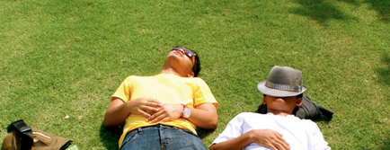

I recently read a book written by a meditation guru slash buddhist, The Buddha Walks Into a Bar. A book that hit me right in my head and soul so many times as I was reading it. Lodro Rinzler, writer of the book, really put this ticklish feel in my brain, poke my conscience, and made me spend much longer time in my morning defecation slash contemplation session, thinking about the true essence of my life.

Am i living my life fully?

Childhood was the moment I cherish the most in my life, I worried nothing but the ghost that might make a visit during my sleep, though I was smart enough to handle the situation by always fully covered my body with the blanket. Every day was a day full of laugh and happiness. Nothing, seriously, nothing during my childhood could beat me, since I was the red ranger -well sometimes masked rider sometimes doraemon-. Childhood was really the moment of happiness, no single doubt in that.

Now that I have to be a grown up -still deny the fact that I have to be one though- I should learn from the other grown ups, how to live as a grown up. So I observe, and I was poignantly made to realize the fact that most of the grown ups live the life far less than what I expected as a kid long time ago that being grown up means being much more cooler.

Most of us treat this life as a battle, a sustained fight between ourselves and our life. We keep fighting as if life is a never ending battlefield. We starts our day in a rush, have no time to enjoy our first meal or first breeze in the morning. We go rushing to work, swearing at the traffic, spend so much energy in working without knowing the meaning, tons of emails, projects, tasks we must handle. So much works and we still unsure whats ahead, what are we becoming into with all this works.

We tend to worry too much, we are worried of our past and future, we are worried about our family, lover or kids. we are worried about our marriage, or money, or cars, saving, anything. So many things to worry forgetting the fact that contentment will never be achieved if we don’t get the energy of inner peace. We are worried so much we forget that to live the life worry-less, we are obliged to feel happy first. Happiness first, pain vanishes, and success will follow.

It’s not like that we cannot worry about our life. We just shouldn’t over bother anything. High level of worry will hold us back. Over bother will keep us in pain and stop us from clear thinking and doing good things in life.

Take the time, take the time to think, that we are the center of our life. Instead of feel intimidated by our worry. We should see life as full of good things, life is full of chances. Even a decapitated cock roach still has 2 weeks more the chance to feel good in his life. The point of grown up is to please ourselves, see the life more in a opportunity to appreciate what we have in our life. We appreciate life and please ourselves until we feel the peace and energy emanating from inside and move us from the place we are now to the place we are better.

We shouldn't stop playing, life is not a battle, it’s a big playground, a very big playground. Have fun. : )
