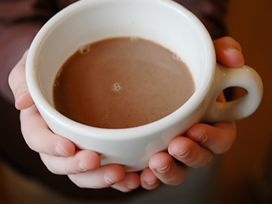

\[caption id="attachment\_416" align="aligncenter" width="460"\] source: http://www.offthefence.org.uk/\[/caption\]

23:30 and I'm still awake, fully awake with a cup of chocolate milk, switching through the telly channel -notice that i said telly instead of TV, i blame BBC series for that- everyone is either bothered with high price of tempe, or the cheap story of Indo celeb. My mind, as usual, flipping back and forth random thought about everything from the greatest mind of Nolan until the pain of my past.

Ouch! where did the pain thoughts come from? Guess my past doesn't really get over me, always miss me they keep appearing and dissapearing. One moment I think about the last chocolate milk I had, and all of sudden, All I could think about is the last mistake I did that bring me down like Bane did to Bruce Wayne, locked him up inside the underground prison.

I like to analyze thing, sometimes over analyze, like when I tried to get the answer of why did one direction exist in this world, so I strip down my pain feeling to the core. Why this pain and mistakes of mine keep visiting. Is it because I never get to move on, or is it because what I did in the past was that bad I will never leave it behind?

And I realize all the mistakes from the past suddenly appear everytime I have a good things in mind, can be some new ideas to work on, or some cheerful event that I had just experienced. It's as if I did not deserve to move on, like I couldn't be able to get extra chocolate in my milk because I have been extra bad, like I couldn't do good because I still have past that I haven't resolved.

Well, screw it, if i cannot get over the pain, then let me make the pain a good company of mine. If my mistakes keep holding me back from doing good or feeling good, I will tell them that they are pure awesome, do a fist bump with 'em, and finish my glass of milk while moving on, of course still with 'em.

Fear of the past is my biggest mistake I swear myself never happened anymore. If I want to do good, best thing I could do is never let my mistakes hold me back and just do it. Should I wait till I am mistakes-free to do something good? My conscience certainly doesn't think so. Because even evil can do good also.

So come with me bro, my past, my mistakes, stop hiding and feel free to join me in my journey to the center of the earth ,fuck why did I type that, I mean please feel free to come with me drink chocolate milk together, and yes you can skip that Indo celeb news and watching K-Pop instead.

> Never let perfection be the enemy of doing good
