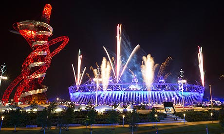

\[caption id="attachment\_424" align="aligncenter" width="460"\] source: www.olympic.org\[/caption\]

Berikan 27 Juta poundsterling kepada seorang sutradara peraih Oscar dan dapatkan pertunjukkan terbaik yang pernah ada di muka bumi ini. Pembukaan Olimpiade 2012 di Inggris.

London dalam ingatanku adalah sebuah kota yang ribet, rumit, mahal, agak sedikit jorok, dan arogan, persis seperti Jakarta bedanya hanya di jaringan tube-nya yang luar biasa dan orang-orang yang bicara dengan aksen british dimana-mana. Boleh jadi memang ingatan itu akan terus berada di kepalaku seperti saat terakhir kali aku mengunjungi kotanya Sherlock itu kalo saja tidak diingatkan oleh Danny Boyle tadi pagi dengan pertunjukan spektakuler yang membuka olimpiade kali ini.

Pertunjukkan dimulai dengan Wiggins, yang baru saja menang Tour de France, membunyikan lonceng raksasa, lalu stadion pun berubah menjadi penuh lanskap hijau dan perbukitan khas Inggris Raya. Ritme pertunjukkan sendiri berjalan cepat dan dinamis, it feels like Slumdog Millionnaire all over again, dari pedesaan berubah menjadi urban, dengan orang-orang yang bergerak penuh visi dan ambisi. Mr Bean muncul, yang asli tanpa kesurupan DePe, Sir Paul juga muncul nyanyi hey Jude. Dan yang paling epik versiku adalah, adegan kemunculan Ratu Inggris yang ditemani oleh, Bond, ya, James Bond.

Di Indonesia, sama seperti kebanyakan negara lainnya, jika pemimpin negaranya muncul di suatu acara, emsi-nya pasti akan menyambut pak SBY dengan meminta hadirin untuk berdiri. Yang terjadi di pembukaan olimpiade tadi, adalah salah satu kemunculan pemimpin negara paling gokil yang pernah ditunjukkan, dengan visualisasi James Bond menjemput Ratu Inggris dengan helikopter, lalu helikopter melayang berputar-putar diatas stadion, dan WUSS! Ratu Inggris plus James Bond meloncat keluar dari helikopter dan membuka parasut, lengkap dengan musik pembuka khas film James Bond. Epic.. Tapi ya gimana lagi, mereka punya James Bond, masak pak SBY kita minta untuk dijemput ama Mad Dog. -\_\_-

Those British certainly have good sense of humour.

Boyle mengingatkan kembali kepada seluruh manusia bahwa Inggris Raya adalah kerajaan terbaik di bumi ini, tidak cuman di masa lalu, tapi juga masa kini dan masih akan menjadi terbaik di masa yang akan datang.

Inggris Raya bukan cuman kerajaan yang menaklukkan dunia, Kerajaan yang tidak pernah melihat matahari terbenam saking besarnya wilayah kekuasaannya waktu itu, tapi juga kerajaan yang menerangi dunia dengan ilmu pengetahuan, dari Charles Darwin sampai Stephen Hawking, mereka juga menyembuhkan dunia, terima kasih untuk Alexander Fleming dan oh ya, GlaxoSmithKline dengan panadolnya. Dan jangan bilang kerajaan ini tidak menghibur dunia dengan warisan budaya dan popnya, lihat saja yang dilakukan Boyle bersama Rowan Atkinson, Sir Paul McCartney, Daniel Craig, dan kerabat kerja yang lain.

Oke, terus gue harus bilang WOW gitu? Well, tanpa bilang wow kita bisa belajar dari kegilaan mereka untuk mewujudkan ide-ide mereka pada dunia. Dulu mungkin pas arisan bangsa-bangsa, Bangsa Inggris ditertawakan oleh bangsa-bangsa lainnya begitu dia bilang, dia ingin menaklukkan dunia, bangsa sekecil itu menaklukkan dunia. Dunia pun tertawa.. Sampai pada akhirnya Inggris Raya bisa berkata, bitch please... Own the world, like a sir.

Selamat Inggris Raya, atas keabadian yang kalian capai dari kegilaan dan perwujudan ide-ide kalian.
