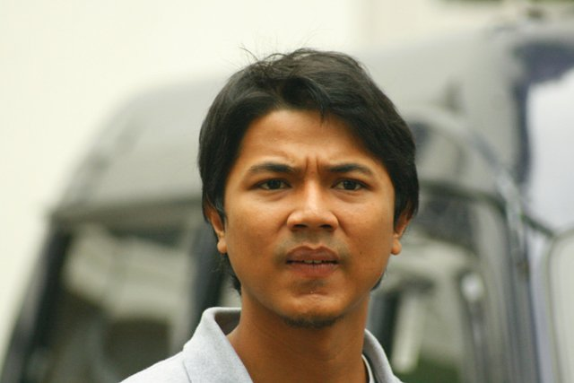

Rata-rata ada sekita 70 orang yang membaca blog ini setiap hari. Terus terang aku tersanjung, ada lebih dari 5 lusin orang yang tau isi pikiranku setiap harinya, itu banyak, bayangkan jika setiap orang yang membaca tulisanku itu memberitahukan 2 orang temannya saja tentang aku, ada 140 orang yang tau tentang aku, dari 140 itu memberitahukan ke 2 orang temannya lagi, bakal ada 280 orang yang mengenal aku, jika dari 280 itu memberitahukan 2 temannya lagi, dan dari jumlah tersebut memberi tahukan 2 temannya, lalu 2 temannya, dan 2 temannya lagi, orang yang tau tentang ide-ideku bakalan menjadi............banyak. Dan orang-orang di level pertama yang membaca blog-ku sudah bisa mendapatkan kapal pesiar atau rumah mewah atas jasanya mengumpulkan downline.

Walaupun aku bisa mengetahui statistik jumlah pembaca blog-ku ini dari fitur statistik wordpress yang impresif, aku tidak bisa mengetahui motif orang-orang yang membaca tulisan-tulisanku. Apakah karena memang tertarik dengan ideku, atau ingin mencari inspirasi baru, atau karena gak sengaja menge-klik link blog ini yang aku sebar di twitter dan facebook-ku, atau murni karena emang ingin mengumpulkan downline biar bisa cepet dapet kapal pesiar \*apacobak\*.

Well apapun motifnya, aku akan selalu berterima kasih atas inspirasi dan apresiasi menulis yang aku dapatkan dari setiap orang yang membaca dan tidak membaca tulisanku. Jujur, aku menulis di blog bukan cuman buat aku sendiri, kalo cuman buat aku sendiri aku bakal cuman nulis di jurnal pribadiku setiap malam tentang petualanganku membasmi vampir dan perjalananku menjadi presiden Indonesia.

Selain agar bisa menjadi presiden Indonesia, well at least kalo ga bisa jadi presiden jadi pemburu vampir aja cukup, aku punya obsesi agar sebanyak mungkin orang bisa mengetahui apa ide-ide yang muncul dari kepalaku. Kenapa? simpel aja, aku ingin hidup abadi. Ya, aku tau, tubuhku tidak mungkin hidup abadi, ragaku mungkin saja besok mati, lalu aku menjadi vampir, tapi vampir baik hati yang akan rela menunggu di kamar seorang wanita pujaan hati melihat dia tidur terlelap, and yes that sounds creepy. Sampai mana tadi? oh ya, ragaku mungkin bisa mati, tapi aku tidak mau ide dan karyaku turut terkubur bersama jasadku di San Diego Hills, halah.

Karena setiap manusia sesungguhnya punya kesempatan untuk hidup abadi, lewat karyanya, lewat pemikirannya, lewat apa yang dia hasilkan selama hidupnya. Einstein boleh saja sudah tidak ada, tapi relativitas-nya akan selalu hidup bersama kita, Gus Dur juga sudah tidak ada, tapi sulit rasanya untuk tidak terinspirasi ide damai dalam keberagamannya, Colonel Sanders juga sudah meninggal, tapi beliau akan selalu hidup dengan kita bersama krispi kulit ayam, original recipe dan CD Agnes Monica-nya.

Jangan mau kalah, mari kita hidup abadi dengan karya-karya kita, sekecil apapun itu, walaupun hanya ada segelintir orang yang merasakannya, karena dari situlah awal ilmu-ilmu kita yang bermanfaat akan berkembang, dan akan menjadi penyelamat kehidupan kita di dunia seberang kelak. Amin.
