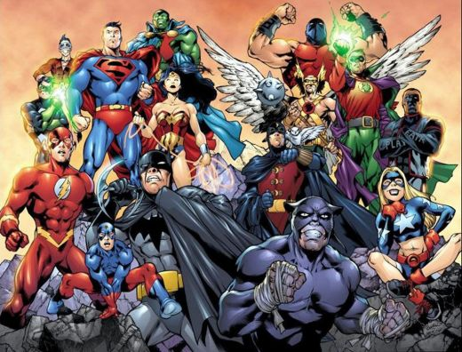

\[caption id="attachment\_446" align="aligncenter" width="520"\] source : openmindsdanceclub.blogspot.com\[/caption\]

Sudah dua kali aku nonton The Dark Knight Rises, dua-duanya selalu diakhiri dengan mulut menganga dengan sisa-sisa pop corn berjatuhan dari mulut, mata terbelalak, lalu diakhiri dengan gelengan kepala sambil berkata dalam hati, How did Nolan do that? Benar-benar epic conclusion dari sebuah trilogi tentang seorang Batman, ceritanya memang tidak semegah the dark knight, tapi hey, ini adalah sebuah konklusi, sebuah hidangan pencuci mulut, mana mungkin hidangan pencuci mulut kita lebih mengenyangkan dari hidangan utama? kecuali ya, kalo ada dari kita yang terbiasa menghabiskan satu whole chicken bucket KFC untuk mencuci mulutnya, lengkap dengan CD Agnes Monica-nya.. \*teteup\*

Seperti biasa, sebagai seorang yang selalu (sok) mikir, aku lalu merenungkan film tersebut sampai ke akar cerita dan motifnya, sampai terbawa mimpi, sampai gak bisa tidur, errr gak bisa tidur kok sampai kebawa mimpi. Renungan yang cukup berat, bagaimana caranya menjadi Batman?

Aku tau tidak mungkin dalam seumur hidupku aku bisa jadi Batman, pertama, aku tidak sekaya Bruce Wayne, kedua, oke katakanlah setelah aku berhasil lalu cukup kaya untuk bisa jadi Batman, aku tidak setakut itu sama kelelawar, Bruce Wayne kan memutuskan jadi Batman gara-gara fobianya terhadap kelelawar, aku sendiri, lebih fobia dengan kecoa bersayap yang suka dengan bejatnya terbang kesana kemari, masak iya aku jadi Cockroach Man, dengan kemampuan utama, bisa hidup dua minggu tanpa kepala, musuh kayak apa yang bakalan takut sama superhero macam itu.

Ya sudah kalo tidak bisa jadi batman, toh dunia tidak butuh pahlawan seperti Batman. Dunia jauh lebih rumit dari Gotham, Gotham enak musuhnya jelas, kalo gak Joker, ya Bane, kalo gak mereka berdua, masih ada The Riddler, Two Face, Poison Ivy, Penguin, jelas gitu nama-namanya. Kita hidup dengan musuh yang abstrak, dengan musuh anonym dan pseudonym, musuh yang tersebar ada dimana-mana, bahkan mungkin musuh utama kita adalah yang ada disekitar kita, atau bahkan diri kita sendiri, musuh dalam musuh dan musuh, musuhception.

Dunia lebih butuh pahlawan-pahlawan kecil yang bersedia untuk bergerak terus menerus, melakukan yang terbaik bukan hanya buat keuntungan dia sendiri, tapi juga keuntungan umat manusia.Perbuatan yang dalam pelajaran PPKn jaman SD dulu, dikenal sebagai...... Perbuatan yang terpuji.. tsah! Dan aku ingin menjadi salah satu dari pahlawan-pahlawan kecil itu.

Dalam perjalananku untuk menjadi pahlawan kecil, aku memutuskan untuk tidak menyusup ke museum serangga dan dengan sengaja menyerahkan leherku untuk digigit laba-laba yang sudah teradiasi sebelumnya, iya kalo beneran yang gigit laba-laba, mungkin bisa jadi spiderman, lah kalo yang gigit kumbang kepik? Aku juga memutuskan untuk tidak nongkrong 24jam disamping mesin fotokopi kantor hidup terus menerus dengan harapan radiasinya cukup untuk merubahku menjadi,,,, Shrek. Instead, aku memutuskan untuk menjadi pahlawan kecil dengan cara belajar dari pahlawan-pahlawan yang sebelumnya sudah ada.

Pahlawan pasti punya tujuan hidup, punya misi. Dan setiap individu punya misi yang berbeda, gak masalah, yang penting misi tersebut bisa punya arti buat hidup kita, dan hidup orang lain disekitar kita. Salah satu profesorku misalnya, misinya adalah untuk mencetak dokter-dokter unggul indonesia, yang cerdas dan berguna bagi nusa dan bangsa. Ada juga salah seorang temanku yang punya misi, untuk menjadi ayah dan suami yang baik, dan bisa memberikan manfaat bagi tetangganya. Karena dalam misi mengandung niat kita, arti yang akan mewarnai hidup dan mengarahkan hidup kita. Setiap kita tersesat dalam persimpangan dan tidak tau berbuat apa, misi hidup kita akan mengingatkan kembali tujuan kita dalam hidup ini, dan dengan senang hati menempatkan kita ke jalan yang benar.

Hmm, misiku adalah mendapatkan yang terbaik dari hidup, dan memberikan yang terbaik untuk hidup. Sama-sama enak lah mauku, kan asyik.. ya gak ya gak.

Setiap orang bisa jadi pahlawan dalam versinya sendiri. Asalkan dia bisa merasa nyaman dengan misinya, tujuan hidup dan apa yang dia kerjakan. Bisa percaya bahwa apa yang dikerjakannya adalah sesuatu yang positif. Tau darimana coba kalo sesuatu yang kita kerjakan itu positif? Kita bisa tau apa yang selama ini kita rasakan dan kerjakan adalah suatu hal yang positif adalah dari sebuah kelegaan, rasa lega dari nurani kita. Seperti saat kita menolong orang tua menyeberang, atau menyingkirkan paku di jalanan, atau saat kita mendorong teman kita untuk move on dari mantan yang baru saja mutusin dia atau matiin keran yang mengucur di wastafel padahal gak ada yang make, pasti ada rasa lega kan, rasa lega setelah berbuat baik. Ya rasa lega itu yang kita jadikan indikator kita dalam berbuat baik. Karena nurani emang gak pernah bohong.

Kenapa coba Bruce Wayne akhirnya bisa move on, pergi berduaan nongkrong asik sore-sore ke Florence ama Selina Kyle? tidak lain dan tidak bukan adalah karena rasa leganya telah berkontribusi positif buat penduduk kota Gotham. Dan cara manusia biasa dan bersahaja seperti kita untuk jadi pahlawan adalah dengan punya misi baik dalam hidup ini, dan berbuat baik, sesimpel itu. Dan tentunya, sebelum berusaha jadi pahlawan buat orang lain dan mengalahkan super villain yang ada di luar sana, lebih asik kalo kita sudah jadi pahlawan buat diri kita sendiri. Jadi pahlawan gak perlu hidup merana dulu kok, kalo bisa hidup asik sambil jadi pahlawan buat orang lain, kenapa tidak. Kalo Baginda Tony Stark bisa kayak gitu, kenapa kita gak.: )
