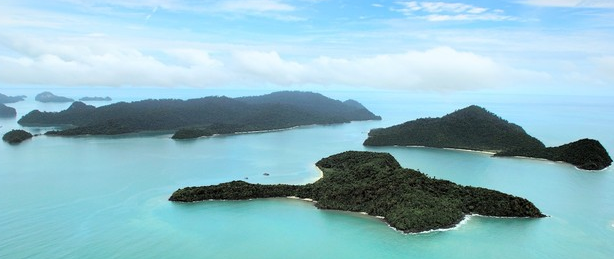
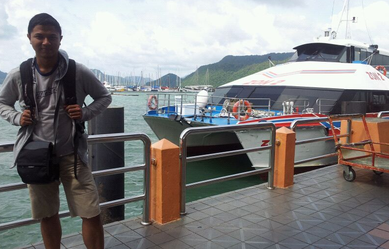
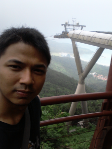

Apa yang akan dilakukan oleh seorang pemimpin visioner terhadap sebuah pulau terpencil di ujung perbatasan negeri? Jika pemimpin itu adalah Mahathir Mohammad, maka pulau tersebut akan disulap menjadi salah satu destinasi eksotis di planet ini. Dan pulau tersebut adalah, Langkawi.

Sebelum tahun 1980, Langkawi hanyalah gugusan pulau kecil di laut andaman yang bisa dikatakan, jauh dari peradaban modern. Pulau terkutuk, seperti yang diceritakan beberapa orang tua yang kudengar saat berkunjung kesana beberapa bulan lalu. Pulau tersebut dikutuk sampai tujuh keturunan oleh seorang putri cantik dari kerajaan Siam yang menikah dengan ksatria setempat, tapi dibunuh oleh penduduk atas fitnah saat suaminya pergi berperang yang disebarkan oleh istri kepala desa yang iri pada kecantikannya. Sangat...Sinetron...Sekali.. Well, kecuali bagian dimana putri tersebut, namanya putri Mahsuri btw, baru bisa dibunuh setelah ditusuk oleh Keris pusaka keluarga Mahsuri, dan kita pun tau darimana sinetron legenda 3D slash dubbing Indosiar mendapatkan inspirasinya.

dr. Mahathir Mohammad tampaknya datang membangun langkawi setelah turunan kedelapan, karena mulai dari situlah kesialan yang disumpahkan oleh putri Mahsuri untuk pulau Langkawi berangsur-angsur menghilang. Langkawi sekarang adalah salah satu destinasi unggulan negeri tetangga kita yang menawarkan eksotisme pantai dengan campuran rasa melayu dan siam yang berpadu unik ditawarkan kepada siapapun yang berkunjung kesana.

Datang ke Langkawi, jangan diharap pulau tersebut akan sehappening Bali, atau segila Pattaya dan Phuket. Langkawi lebih mirip sanctuary island dengan segala fasilitas dibangun pas saja, tidak berlebihan, agar lingkungan di kepulauan tersebut tetap terjaga dari kerusakan, tapi para pendatang tetap bisa nyaman menikmati perjalanannya. Mulai dari jalan-jalan bagus untuk akses ke seluruh penjuru pulau, bandara Internasional yang memadai, dan tempat belanja, tempat makan, semuanya serba pas. Kotanya saja bisa selesai kita putari dengan mobil tidak lebih dari setengah jam.

Menuju Langkawi, bisa dengan jalur laut dan udara. Ada penerbangan langsung dari KL, Penang, Phuket, Singapura, Hongkong, dan Guanghzou, cukup impresif  untuk sebuah kepulauan kecil di perbatasan negara. Paling enak ke Langkawi lewat jalur udara. hanya 40 menit dari penang, atau sekitar 1 jam-an dari KL atau Singapore. Kecuali kamu sedang ingin menguji ketahanan tubuh kamu, aku tidak menyarankan untuk lewat jalur laut dengan kapal feri cepat dari penang, atau dari kuala kedah dan kuala perlis.

Pertama kali aku ke Langkawi naik feri dari Penang, dan itu adalah 3 jam terlama dalam sejarah hidupku sebagai umat manusia. Aku tidak pernah yang namanya mabuk laut, nenek moyangku seorang pelaut, aku pernah naik kapal 8 jam dari manado ke ternate, pernah naek feri nyeberang Jawa-Bali, Sumatera-Jawa bahkan Banda Aceh-Sabang, semuanya sea-sickness free. Baru di perjalanan Penang-Langkawi itulah aku merasakan yang namanya mabuk pertama kali, ferinya kecil beradu dengan ombak lepas, kadang seperti terombang-ambing di lautan, perut rasanya dikoyak, pusat vestibularku berhenti bekerja, dan itu dimulai dari pertama kali aku menginjakkan kaki ke dalam feri cepat tersebut.

3 Jam di atas feri cepat itu pun dihabiskan untuk menahan agar isi perutku tidak berhamburan sambil melambaikan tangan ke udara berharap itu semua hanya sebuah uji nyali di tivi agar cobaan itu bisa langsung dihentikan. Alhamdulillah, i made it to the ground, puke free, walaupun agak muncul kembali sakitnya waktu ngeliat flyer di feri mempromosikan, FERI CEPAT PENANG-MEDAN, HANYA 4 JAM!! ....... Seketika itu pula aku sujud syukur karena rumahku bukan di Medan dan aku tidak perlu pulang naek feri kesana. And yes, Despite the return ferry ticket that have been bought before, I decided not to take the crazy sea ride back from Langkawi. 3 Jam di atas ferinya sudah cukup membuatku merasakan gilanya perjalanan di atas laut andaman.

Sampai Langkawi, sewalah mobil untuk berpergian kemana-mana di pulau tersebut. Jangan mengandalkan bis yang kayaknya hanya lewat setiap bulan purnama itu. Car renting in Langkawi is unbelievably cheap, keluarkan sekitar 60 RM (kira-kira 180ribu) dari dompetmu dan kamu bisa membawa sebuah city car transmisi manual sebagai tongkrongan andalanmu memutari pulau. Punya duit lebih? dengan setara 450ribu, kamu dah kemana-mana naek civic model terbaru di langkawi, not bad.

Jika kamu adalah tipikal pelancong dengan standar ekonomi dibawah garis kemisikinan ehm,,, seperti aku, jadikan pantai Cenang atau Pantai Tengah sebagai tempatmu berlabuh, lumayan banyak tersedia akomodasi murah dan tempat makan serta belanja yang tersedia. Semua dalam jangkauan dompet tipis kita semua. Jl Pantai Cenang juga adalah jalanan yang paling happening di malam hari, tempat dimana pelancong-pelancong berkumpul, makan nasi kandar di Tomato, nongkrong di restoran little Mexico, jajan di pasar malam, atau sekedar takeaway nasi lemak ,salah satu yang terenak yang bisa kamu temukan di negeri Jiran, di pinggir jalan dan memakannya di pinggir pantai, exquisite!

Kalau kamu punya kartu kredit dengan limit yang cukup tinggi, atau membawa cek perjalanan dengan nominal besar, cukup besar untuk membayar kamar seharga 2000-5000 RM semalam, silahkan ke bagian pulau yang menawarkan akomodasi dan pengalaman yang lebih eksklusif, seperti four seasons di Tanjung Rhu, atau di sepanjang jalan pantai kok didekat bandara dengan deretan resort mewah seperti sheraton, tanjung sanctuary, atau the Danna resort, resort dengan laguna dan sekumpulan yacht berlabuh dimana tokoh-tokoh dalam serial Revenge pasti akan menghabiskan waktunya jika main-main ke Langkawi.

Daftar teratas dari rekomendasi untuk dilakukan di Langkawi adalah Islands Hopping, dimana kita berputar dari satu pulau kecil ke pulau kecil lainnya di gugusan kepulauan Langkawi, naek boat atau jet ski, seharian penuh kita bisa snorkling diantara pulau dan mampir di pulau kecil lainnya menikmati makan siang. Sayang sekali buatku itu tidak terlalu menggoda, tidak setelah 3 Jam penuh tersiksa diatas kapal menuju Langkawi.

Instead, I will highly recommend you, untuk berputar-putar pulau dengan mobil sewaanmu seharian, singgah dari satu pantai ke pantai lainnya, nongkrong bersama penduduk asli di warung makan di pojok kampung, belanja di duty free shopping -salah satu yang diunggulkan dari Langkawi-, nongkrong di taman elang di dekat pusat kota, atau maen air di Tanjung Rhu, one of the best hidden spot in Langkawi dimana masuknya aja harus menandatangani term and agreement dengan pengelola pantai, such a hassle.

Jangan berani-berani meninggalkan Langkawi tanpa pernah naik cable car-nya. Kereta gantung yang terletak di teluk burau membentang sampai salah satu pucuk gunung Machincang setinggi 680 meter. The view from up there is simply breath taking, both figuratively and literally, thx to the high altitude. Dari atas gardu pandangnya, kita bisa melihat gugusan kepulauan sampai yang di wilayah Thailand. Sayang sekali sky bridge-nya masih ditutup untuk renovasi, gak tau sih kalau sekarang.

 

 

 

 

 

 

 

 

 

 

The verdict, Langkawi definitely is more than some desserted-cursed-in the middle of nowhere- island. Dengan biaya hidup yang lebih murah karena termasuk dalam zona bebas pajak, dan fasilitas yang cukup lengkap dan pengalaman-pengalaman eksotis yang ditawarkannya, Langkawi pantas masuk dalam daftar destinasi wajib setiap pelancong yang ingin menjelajahi regional Asia Tenggara.
