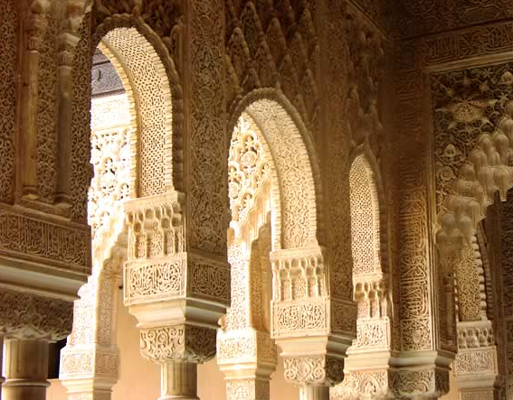

Sekumpulan orang berbaju panjang putih dan penutup kepala putih dengan motor dan bendera kelompok mereka tiba-tiba mendatangi beberapa warung makan di sebuah kompleks pabrik. Dengan berteriak-teriak membawa nama Tuhan mereka mengobrak-abrik warung makan yang buka siang hari di bulan puasa itu, aroma kemarahan terlihat jelas dari pembuluh yang bersemburat dari wajah mereka. Buruh pabrik yang kebanyakan wanita yang sedang makan di warung makan pun lari pontang panting ke luar, mereka ketakutan, ketakutan dengan orang-orang yang dengan membawa nama Tuhan, menyebarkan amarah, kebencian dan ketakutan di warung makan tersebut, dan mereka mengaku beragama Islam.

Pertanyaan yang langsung keluar dari kepalaku begitu melihat sepenggal berita di televisi nasional itu adalah.... "Dimana Islamnya..?"

\[caption id="attachment\_467" align="aligncenter" width="567"\] image source : quraninstitute.net\[/caption\]

Aku memang bukan ahli agama, cuman orang awam. Pendidikan Agama Islam yang kudapat cuman sebatas pelajaran agama dan pesantren kilat waktu sekolah dulu, sama belajar ngaji di mesjid belakang rumah waktu kecil dulu, paling ditambah beberapa kuliah agama waktu S1, itupun kebanyakan bolos. Aku juga bukan orang alim, beneran, walaupun kalo celanaku kuangkat semata kaki dan jenggotku kupanjangin dikit aku sudah mirip relawan pejuang palestina, tapi sesungguhnya aku jauh dari sebutan alim. Bahkan, bakal ada sekitar 2245 orang di daftar teman facebook-ku yang akan tertawa paling keras kalo sampai aku mengaku alim. Walaupun bukan ahli agama dan bukan orang alim, aku cukup bisa untuk mengerti, bahwa Islam itu bukan Islam seperti yang dipertontonkan LPWYBDBP (Laskar Perusak Warung Yang Buka Di Bulan Puasa) itu.

Islam yang aku tahu itu lembut, selembut kasih sayang rasul menyuapi orang buta yang melempari beliau dengan kotoran setiap hari. Islam yang aku tau itu cerdas, secerdas ayat pertamanya yang menyuruh umat manusia untuk membaca, ya membaca, bukan merusak warung. Islam yang aku tau itu terbuka dan moderat, seterbuka perjanjian madinah yang bahkan menjamin hak umat nasrani, yahudi, dan pagan sama dan setara saat jaman Rasul memimpin dulu. Maafkan keterbatasan ilmuku, tapi setauku Islam tidak pernah mengajarkan umatnya untuk mengintimidasi mereka yang berbeda dengan kita, Islam tidak pernah mengajarkan, wahai orang-orang yang beriman, bela agamamu dengan sorban putih beramai-ramai naik motor dan teriakan Allahuakbar sambil merusak tempat-tempat mereka yang kau pikir tidak menghormati agamamu.

Masak iya, ada saudara-saudaraku sesama muslim yang lebih memilih untuk kembali ke masa kebodohan dengan selalu merusak dan mengintimidasi. Dengan menyebar kebencian ke penjuru negeri. Sementara di negara mayoritas Islam lain, umatnya sudah sampai level gimana caranya memberikan kontribusi pada peradaban, di negara kita levelnya masih di level barbar. Sementara di Mesir, Presiden Mursi yang ikhwanul muslimin, hafidz Quran, punya wakil orang kristen koptik, cewek pula, di negara kita masih banyak ustad yang ribut gara-gara seorang Ahok maju jadi wakil gubernur.

Apa kemunduran Islam di Indonesia karena mayoritas muslim di Indonesia, termasuk aku, terlalu malas ya? Yang merasa pintar dan moderat lebih sibuk dengan blackberry, iphone, twitter dan beronani dengan pemikiran briliannya sendiri, dan malas berkontribusi kepada masyarakat luas. Yang merasa paling alim sibuk berfatwa dan menghakimi kekafiran orang lain, dan malas menggunakan akalnya sedikit saja untuk menyadari bahwa Islam itu adalah rahmat, bukan ancaman.

Ada gap dalam masyarakat kita, gap yang disebabkan oleh ketidakpedulian kita untuk maju secara kolektif sebagai sebuah bangsa yang satu. Gap antara yang pintar dan bodoh, antara yang liberal dan konservatif, gap yang lebih sering diisi dengan saling menyalahkan dan merasa benar sendiri. Sebuah gap yang akhirnya diisi oleh kebodohan dan nafsu manusia lainnya. Kita terlalu sibuk dengan kelompok kita sendiri. Sehingga mereka yang tersisihkan akhirnya mencari jalan termudah untuk memenuhi kebutuhan dasar untuk eksistensi diri mereka, yaitu cara kebodohan.

Tayangan berita di tivi itu mengingatkan aku kembali atas kemalasanku, malas bergerak untuk kemajuan bangsaku, malas mengingatkan sesama untuk maju, dan lebih sibuk berwacana dan memuja ego dan kecerdasan sendiri, malas untuk menjadi satu sebagai bangsa, dan sibuk menjadi skeptis dan sinis dengan segala hal yang berhubungan dengan negara ini. Padahal Islam sendiri mengajarkan bahwa tidak akan berubah suatu bangsa menuju kebaikan kecuali dengan usaha dan perjuangan bangsa itu sendiri.

Moga-moga kita selalu ingat untuk menyadari, bahwa beragama itu tidak bisa dengan kacamata nafsu, melainkan dengan kacamata akal dan nurani. Seperti saat akal dan nurani para cendekiawan Islam seperti Al Khawarizmi dengan matematika-nya, Ibnu Sina dengan filosofinya, Al Zahrawi dengan kitab pengobatannya, Al-Ghazali dengan idealismenya, Ibnu Batutta dan perjalannya serta cendekiawan Islam lainnya di masa keemasan Islam dulu, membebaskan dunia dari masa-masa kegelapan.
