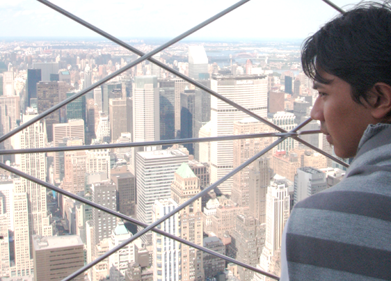

**Juni 1325**

Seorang pemuda berumur 21 tahun tertahan oleh pemberontakan yang terjadi di sebuah kota kecil setelah melewati sisi utara sungai nil dalam perjalanannya menuju Mekkah untuk menunaikan ibadah haji, dan terpaksa harus memutar balik ke Kairo dan memilih jalan lain ke tanah suci. Memilih satu dari dua jalur yang tersisa ke Mekkah. Pemuda itu tidak mengira, sebuah perjalanan yang awalnya diniatkan untuk beribadah itu kemudian berlanjut menjadi sebuah perjalanan legenda seorang pengembara sampai 120.000 km jauhnya ke seluruh penjuru bumi dan baru kembali lagi ke rumahnya di Maroko, seperempat abad kemudian. Perjalanan yang diceritakan dengan apik di buku Rihla, ditulis oleh Ibnu Juzayy seorang cendekiawan dan penyair, buku yang menjadi rujukan ribuan pengelana hingga berabad-abad setelahnya, jauh sebelum Lonely Planet diterbitkan. Pemuda tersebut bernama, Ibnu Batutta.

**Agustus 2008**

Terinspirasi oleh pengembara sepanjang masa, Ibnu Batutta, seorang pemuda berumur 21 tahun sedang berada di tengah-tengah perjalannya menuju Kepulauan Karibia. Dua petugas berseragam hitam-hitam menggiring pemuda tersebut ke sebuah ruangan besar yang hanya berisikan satu meja, kursi, dan beberapa komputer dengan kamera. Berjam-jam setelahnya dihabiskan oleh dua petugas imigrasi AS berbadan gempal itu untuk bertanya, membentak, dan memojokkan lengkap dengan membongkar semua barang bawaan yang dibawa. Satu hal yang tidak pernah diperkirakan oleh si pemuda sebelumnya saat merencanakan perjalanan tersebut. Perjalanan yang harusnya mulus dengan berpindah dari satu kota ke kota lain untuk menghemat biaya penerbangan ternyata harus tertahan di kantor imigrasi bandara internasional Anchorage, di negara bagian terbesar dan paling utara Amerika Serikat, Alaska. Seorang dari negara (mayoritas) muslim dengan penerbangan multi-kota menyinggahi kota-kota utama AS ternyata menjadi dasar logika terkuat oleh kantor imigrasi setempat untuk menuduh pemuda itu, teroris.. Dan pemuda itu adalah...... Aku.

Dari awal aku selalu percaya, bahwa kita semua manusia terlahir sebagai seorang pengembara. Pernah memperhatikan bagaimana adik bayi merangkak terpana menjelajahi seluruh pojok rumah, menemukan hal-hal baru, dan lalu tertawa. Otak kita dirancang untuk selalu mengembara, aliran dopamin di otak dengan efek senang mengalir deras ketika kita menemukan hal-hal baru. Tubuh kita dirancang untuk selalu bergerak, duduk 6 jam setiap hari saja bisa membuat kita 40% lebih cepat mati daripada orang lain yang selalu bergerak, semua indera pada manusia dirancang untuk selalu siap menerima rangsangan dari luar. Tubuh, akal, dan jiwa manusia memang diciptakan untuk melakukan dan haus akan perjalanan.

Sejarah manusia juga mencatat, nenek moyang kita adalah para pemburu dan pengumpul. nomaden dari satu gua ke gua yang lain. Manusia saat itu berjalan puluhan kilometer setiap harinya untuk mengumpulkan makanan. Setelah mengenal bercocok tanam pun, manusia tetap harus berpindah dari satu tempat ke tempat lain untuk membuka lahan dan mendapatkan tanah terbaik. Berpindahnya manusia dengan bahtera Nuh, perdagangan bangsa arab dan cina di jalur sutera, perjalanan pelancong tersohor Ibnu Batutta, Marco Polo, Colombus, penemuan mesin uap, titanic, pendaratan manusia ke bulan, sampai sebentar lagi, planet Mars. Peradaban manusia tidak pernah berhenti melakukan perjalanan. Bahkan, perjalanan lah yang membuat kita bisa berada di titik pencapaian kita sekarang. Tanpa adanya perjalanan yang dilakukan oleh orang-orang sebelum kita. Kita pasti masih tertahan di masa gelap berpindah dari satu gua ke gua lainnya, mengumpulkan buah-buahan dan makanan lainnya.

Perjalanan kita bukanlah sekedar perpindahan dari satu tempat ke tempat lain, untuk bekerja, belajar, atau apapun niat kita. Perjalanan kita adalah pintu gerbang untuk tempat-tempat dimana kita bisa berpikir lebih baik, berkembang lebih baik, menjadi manusia yang lebih baik. Destinasi menjadi tidak penting, karena pengalaman dalam perjalanan kita lah yang akan menelanjangi siapa diri kita sebenarnya dan memberikan pilihan kepada kita, mau jadi manusia seperti apa kita setelah perjalanan tersebut.

Dalam perjalanan, kita dipaksa untuk berpikir lebih keras, berjuang lebih keras, kita dipaksa keluar dari zona nyaman kita. Perjalanan tidak pernah menjanjikan akhir yang baik, terkadang menyisakan rasa sakit berkepanjangan, seperti saat kita Ibnu Batutta yang harus dipaksa menerima kenyataan orang tuanya telah meninggal hanya beberapa saat sebelum dia sampai ke kampung halamannya. Perjalanan akan memaksa kita untuk melihat dunia dan diri kita seperti apa adanya, bukan seperti yang kita bayangkan sebelumnya. Kita akan dipaksa melewati batas kemampuan kita sebagai manusia, dan melihat batas dunia seperti apa adanya. Kita akan dibuat untuk merasakan kebaikan setinggi langit, dan kejahatan sedalam lautan yang paling gelap. Dan lalu kita sadar, tidak ada yang hitam dan putih di dunia yang kita tinggali ini.

Ada cerita senang, ada cerita sedih yang akan tersisa dari setiap perjalanan. Cerita bahagia atas petualangan baru yang sudah berhasil kita lewati. Cerita sedih akan pengorbanan dan rasa sakit terserabut dari perjalanan kita. Semua bercampur aduk menjadi satu cerita perjalanan yang utuh, yang akan kita ceritakan dengan bangga berulang kali sambil menikmati hangatnya tempat yang kita sebut rumah. Cerita yang bisa jadi modal berharga untuk beratus-ratus kilometer selanjutnya petualangan kita. Mungkin kita tidak bisa jadi seperti Ibnu Batutta yang ceritanya menginspirasi jutaan pelancong sesudah dia, sampai sebuah pusat perbelanjaan di sebuah kota kaya di padang pasir uni emirat arab pun dinamakan dengan namanya, tapi setidaknya cerita kita bisa menginspirasi diri sendiri, agar bisa berpindah, dari diri kita sendiri saat ini menjadi diri kita yang lebih baik.

Kita semua terlahir pengembara, menaklukkan tempat-tempat yang belum pernah kita datangi sebelumnya, mulai dari ruang tamu kita sendiri, halaman depan rumah, hingga ke tempat-tempat eksotis di negara di balik dunia, merasakan pengalaman yang belum pernah kita rasakan, menjalin hubungan baik dengan orang-orang yang belum pernah kita kenal, mendengarkan cerita yang belum pernah kita dengar, mendapatkan percikan inspirasi, pemikiran dan ide, meraih pencapaian demi pencapaian, dan memilih menjadi manusia yang lebih baik. Pengembaraan untuk sebuah perjalanan panjang bernama....hidup.

> it is not the destination that counts, it is the journey...
