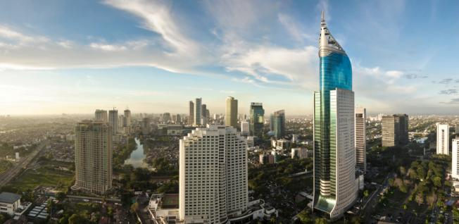

\[caption id="attachment\_487" align="aligncenter" width="600"\] image source : internations.org\[/caption\]

Dari 240juta manusia yang hidup di sebuah negeri kaya raya bernama Indonesia, aku mungkin salah satu orang yang kesulitan untuk mencoba mengerti ibukotanya yang bernama Jakarta. Kota metropolitan dengan populasi separuh seluruh orang yang tinggal di negara sebesar Australia. Kota dengan luas tanah 1/1000 seluruh tanah yang ada di Indonesia, tapi menguasai 70% perputaran uang di negeri ini. Dengan semua hingar bingar nikmat dunia dan harapan yang ditawarkan oleh Jakarta, tetap buatku sulit untuk mengerti kota metropolitan ini. Seharusnya ada seri for dummies yang khusus buat Jakarta. "Jakarta for Dummies", Insya Allah Best Seller..

Jakarta adalah sebuah paradoks, berdirilah di tepi jalan protokol Jakarta, dan lihat pemandangan yang ada di atasnya. Gedung-gedung yang tidak cuman mencakar langit, tapi juga merobeknya dengan keanggunan sekaligus kemegahan. Jakarta di atas awan adalah Jakarta penuh dengan gedung-gedung tinggi setinggi harapan orang-orang yang beradu peruntungan dengannya. Kemegahan langit Jakarta lengkap sudah dengan rancangan arsitektur terkini dan teknologi tercanggih level dunia, bahkan konon, bakal ada 250 gedung tinggi siap mengelu-elukan Jakarta di tahun 2020 nanti.

Lalu lihatlah kebawah, pemandangan rasa New York, Tokyo atau Shanghai tadi pun berubah 180 derajat menjadi pemandangan medan pertempuran yang sebenarnya, pejalan kaki berebut tempat dengan para penjual dan pengemis, ribuan motor dan mobil saling beradu seolah tanpa tujuan. Semua orang yang tinggal di Jakarta terkenal memiliki dua kepribadian, pribadi utama, dan pribadi saat berkendara. Seorang yang lembut hatinya, teduh parasnya niscaya akan berubah menjadi pribadi yang penuh amarah, emosi dan caci maki begitu bersentuhan dengan jalanan Jakarta. Believe it or not, I had tried it myself, pernah aku coba naek motor untuk menyelesaikan urusanku di Jakarta. The street turned me into a filthy demon... Menyeramkan.

Pergi ke utara Jakarta, dan lihatlah rumah-rumah mewah lengkap dengan dermaganya. Rumah 3-4 lantai dengan dermaga dan kapal pribadi yang siap mengantar tuannya kemanapun tujunannya, bahkan mimpi terliarku pun belum pernah sampai ke level itu. Uang memang terkadang membuat manusia melakukan hal yang tidak masuk akal.. Mimpi macam apa yang membuat orang membeli rumah dan kapal serta dermaganya di Jakarta? Like, do they go to work by boat? Akal sehatku hanya berkata mungkin kapal yang mereka miliki adalah sebuah langkah persiapan jika mereka harus berangkat ke kantor saat banjir merendam sebagian besar kota.

Jakarta adalah kota super kaya, seluruh superblok di Jakarta yang sudah dan sedang dibangun, jika disatukan saja sudah seluas negara sebesar singapura. Jika sempat menyinggahi Kuala Lumpur atau Bangkok, kita juga pasti sadar bahwa pusat perbelanjaan di Jakarta jauh lebih banyak dan mewah dibanding kota-kota lain di negara sekitar. Aku pernah lewat di sebuah sekolah swasta di Jakarta, dan melihat sebuah Maseratti seharga kira-kira 3M dipakai hanya untuk mengantar si anak sekolah di TK tersebut, dan menungguinya sampai pulang, lengkap dengan pengasuh dan sopir keluarganya.

Semua uang yang berhamburan di tanah dan langit Jakarta seolah tidak mampu menyembunyikan kelamnya perjuangan para Jakartans yang masih jauh dari kata berakhir. Inti dari bertahan hidup di Jakarta adalah perjuangan. Perjuangan seorang bekerja mencari angkutan umum setiap pagi, perjuangan para kelas menengah di tengah-tengah simpul kendaraan yang macet entah kenapa atau karena terjebak para suporter labil ibukota, perjuangan para pejalan kaki yang harus menghadapi kenyataan hilangnya trotoar mereka dan sulitnya menyeberangi jalan Jakarta, perjuangan para bos mendengarkan tuntutan dan keluhan anak buahnya, perjuangan para istri menunggu suaminya pulang sambil menidurkan anaknya yang rewel di tengah-tengah perkampungan Jakarta.

Orang-orang Jakarta terbukti tangguh, seorang rekan ekspat yang tinggal di Jakarta selalu takjub dengan kekuatan yang dimiliki para penghuni Jakarta. Tidak pernah dilihatnya anak-anak sekolah dengan ceria berangkat jam setengah lima pagi agar tidak terlambat ke sekolah, atau orang-orang yang masih bisa ngetwit konyol disela-sela tekanan kemacetan, atau orang-orang yang rela duduk di atas KRL setiap pergi dan pulang kantor. Orang Jakarta itu luar biasa, mereka terlihat keras bukan karena mereka tidak ramah, tapi memang harus seperti itulah kalo ingin hidup lebih lama di Jakarta.

Lalu apa kurangnya Jakarta? Pencapaian manusia dan uangnya sebagian besar berputar di Jakarta. Ada 41 Trilyun uang negara yang dipakai untuk membangun Jakarta. Kenapa hal sesederhana tranportasi masal yang nyaman saja belum bisa dipenuhi oleh kota ini? Dibandingkan dengan Kuala Lumpur yang tranportasi masalnya masih amburadul aja Jakarta masih kalah jauh. Itu baru soal transportasi, belum soal kemiskinan, kesehatan, pendidikan, kesejahteraan sosial, sampai hal semendasar toleransi antar manusia, Jakarta harus ngos-ngosan memenuhinya. Kemana 41 trilyun itu menguap? kemana 70 % uang rakyat Indonesia yang berputar di Jakarta mengalir? Dimana peluh keringat perjuangan orang-orang Jakarta berakhir?

Jakarta kurang pemimpin. Semua warga Jakarta yang terbukti tangguh, pada akhirnya hanya berjalan sendiri-sendiri tanpa arah yang jelas, sesuatu hal yang tidak salah karena orang Jakarta butuh bertahan hidup. Energi untuk bertahan hidup akhirnya habis untuk diri mereka sendiri, orang Jakarta tidak punya lagi energi untuk memahami lingkungannya, tidak punya lagi energi untuk membangun kotanya. Yang pada akhirnya akan semakin menguras energi mereka, karena kota yang tidak diurusi dengan baik oleh pemimpin dan warganya, akan menjadi kota yang penuh tekanan tanpa harapan.

Pak Jusuf Kalla dengan cerdasnya berkata, Jakarta tidak perlu ahli, ahli di Jakarta banyak, yang dibutuhkan Jakarta adalah pemimpin. Pemimpin yang bisa menumbuhkan lagi harapan warganya, pemimpin yang bisa menunjukkan visi Jakarta sejelas-jelasnya, yang bisa membuka pikiran dan hati warganya, hingga seluruh warganya rela untuk bergerak bersama dengan peran masing-masing untuk meraih satu Jakarta yang jauh lebih baik.

Jakarta tidak butuh pemimpin yang sempurna tanpa cela, tapi Jakarta butuh pemimpin yang mau menyadari kekurangannya, dan memberikan ruang bagi rakyatnya untuk melengkapi ketidak sempurnaannya sebagai seorang pemimpin. Jakarta jangan mau lagi dipimpin oleh orang yang dzalim, yang tidak membawa apa-apa selama dia memimpin, kecuali merubah orang Jakarta yang tangguh menjadi orang Jakarta yang sinis, skeptis dan tidak punya harapan lagi terhadap kotanya.

Untuk Jakarta Baru yang lebih baik...
