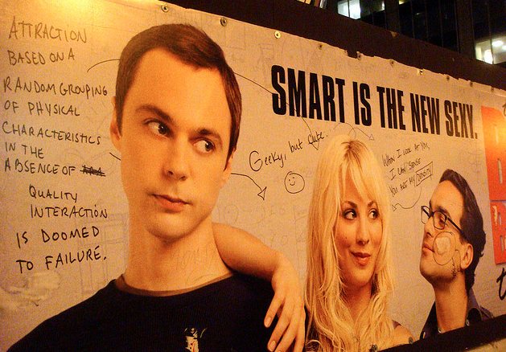

\[caption id="attachment\_559" align="aligncenter" width="600"\] image source : flickr.com\[/caption\]

Selama masa-masa aku sekolah dulu, mulai dari TK sampai mahasiswa, rasanya menjadi pintar itu gampang. Dulu, guru dan teman-temanku selalu memperlakukan diriku bak seorang ilmuwan jenius. Aku gak pernah keluar dari ranking 3 besar saat SD, juara 1 cerdas cermat dengan lawan dari SD unggulan lainnya pun sudah biasa diraih, 4 buku berikut tidak pernah absen terbaca setiap harinya, RPUL, RPAL, buku pintar senior dan junior. Saat SMP pun begitu, ntah karena dianggap pinter atau karena tidak ada pilihan lain, selain menjadi salah satu siswa teladan, aku juga pernah dipilih untuk menjadi ketua lembaga rohani Islam selama dua tahun berturut-turut, jadilah selama dua tahun tersebut aku menjalani hari-hariku sebagai mubaligh muda, penceramah, cendekiawan sekolah, plus raja dangdut.

SMA dan kuliah memang berbeda, aku tidak terlalu fokus soal akademik, kayaknya bosan mikirin pelajaran mulu. Thx to MiRC dan icq, sebagai abege labil awal tahun 2000an di era booming dotcom dan hotmail, aku akhirnya lebih fokus ke hal lain di luar akademik, yaitu aktualisasi diri. Tidak heran begitu masuk SMA ekstrakurikulerku lengkap mulai dari baris-berbaris, majalah sekolah, band, jiujitsu, aeromodeling, palang merah, pramuka, sampai teater! Tahun pertama aku SMA, aku jauh lebih sibuk daripada Amin Rais yang menggulingkan Soeharto sekalipun. Hasilnya? well, bisa dikatakan niatku untuk mengaktualisasikan diriku terlaksana dengan baik, walaupun sebagian besar kegiatanku amburadul tercerai berai, tapi aku masih bisa jadi salah satu bintang utama teater sekolah, jadi sutradara film kelas, dan maen sinetron-nya Rano Karno di Indosiar yang kebetulan syuting di SMA-ku jadi figuran yang sliwar-sliwer di depan kamera, satu-satunya dialog yang aku dapatkan adalah "Wah, ada apa tuh??"..

Kuliah gak usah ditanya, walaupun banyak cobaan menghadang dan godaan melintas, tanpa basa-basi aku bisa lulus tepat waktu dengan IP lumayan. Tidak cumlaude memang, sorry-sorry aku orangnya anti mainstream, terlalu banyak teman-teman angkatanku yang cumlaude, sebagai seorang hipster yang suka ngeles, aku anti sama hal-hal mainstream. Intinya adalah, dari semenjak TK sampai lulus kuliah, predikat pintar itu kayaknya gampang-gampang aja dicapai, tidak cuman olehku, tapi oleh semua orang yang aku kenal pintar. Hanya perlu usaha sedikit, dan yak, dapet.

Lalu setelah lulus, akhirnya aku berhadapan dengan dunia nyata sesungguhnya, dunia yang tidak perduli oleh siapa kamu, motifmu apa, darimana kamu, maumu apa. Menghadapi orang-orang di luar lingkungan dan zona nyamanku selama ini, aku  kaget, terkejut. Ternyata pencapaianku selama ini belum ada apa-apanya dibanding orang-orang di luar sana. Selama ini aku pikir orang-orang super pintar hanya ada di tivi saat menerima penghargaan atau kick andy, di majalah atau jadi salah satu artikel di Wikipedia, ternyata aku salah, orang pintar sekarang di dunia ini jauh lebih banyak dari itu.

Coba lihat sekeliling, niscaya kita akan menemukan banyak orang cerdas di sekitar kita, nongkrong di warung kopi, bakal ada sekelompok orang yang sibuk berdebat tentang logical fallacy dari politikus-politikus di tv, pergi ke mall, dengan mudah ditemukan beberapa anak muda yang saling membandingkan karya seni kontemporer terbaru dari Cemeti Art House Jogja dan Galeri di Shanghai. Lihatlah di majalah, banyak sekali kontributor dari anak-anak yang bahkan jauh lebih muda dari aku. Dan contoh-contoh itu semakin menjadi bukti nyata kecerdasan generasi masa kini, dengan seringnya aku menemukan anak-anak umur 5 tahun bicara trilingual, bukan bilingual, trilingual. Coba aja nongkrong sebentar di rak buku anak di toko buku di kota-kota besar di Indonesia, niscaya dengan gampangnya kita menemukan anak-anak yang bicara fasih bahasa inggris dengan bapaknya, lalu bahasa mandarin dengan ibunya, dan berpindah tanpa cela bicara bahasa Indonesia dengan baby-sitternya. Seingatku dulu saat 5 tahun aku sudah jadi yang paling jenius seangkatanku, cukup hanya dengan menghafalkan 5 sila Pancasila.

Lalu akhirnya aku sadar, dunia berputar semakin lama semakin cepat. Jelas saja sekarang lebih banyak orang pintar daripada 10 tahun yang lalu, informasi yang berputar seperti gak ada batasnya dengan akses yang terbuka lebar. Dulu mustahil rasanya rakyat jelata bisa mengakses isi lembaga antariksa NASA. Sekarang, bahkan seorang anak bakul mendoan di banyumas pun bisa turut menyaksikan siaran langsung pendaratan Curiousity di Planet Mars. Dulu kita cukup pintar bermodalkan RPUL dan RPAL,  sekarang, bahkan wikipedia bahasa jawa punya entry lebih banyak daripada RPUL dan RPAL digabungkan jadi satu.

Akhirnya aku harus menerima kenyataan bahwa proses belajarku ternyata memang tidak bisa berhenti setelah aku menerima ijasah dan nangis terharu berpelukan dengan ibuku. Kalo aku berhenti belajar sekarang, hanya butuh waktu kurang dari lima tahun buatku untuk termasuk golongan IQ-IQ melati yang sering diolok-olok Sudjiwo Tedjo.

Jadi inilah aku sekarang, terobsesi mengalahkan anak lima tahun yang bicara tiga bahasa dan membaca Jane Austin di kinokuniya itu. Kucoba sekuat tenaga untuk tidak berhenti membaca, berbagi, bergerak, dengan energi dan antusiasme penuh lengkap dengan aliran dopamin deras mengalir setiap kali kita menemukan hal baru. Inilah aku, mulai lagi seperti TK dulu, mulai belajar lagi, kali ini tidak dengan menghafal pancasila, karena aku sudah hafal, tapi dengan membuka lembaran baru dari pelajaran yang tersebar luas tanpa batas mulai dari sekelilingku.

Dan aku pun membaca lagi.... Semoga Tuhan meridhoi dengan ilmu yang bermanfaat

Bismillah...
