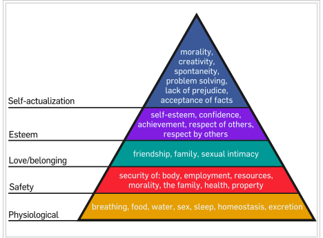

Beberapa hari terakhir ini aku tidak terlalu update blog seperti biasa. Ini gara-gara konstelasi politik di Jakarta yang semakin membuatku mempertanyakan tingkat kewarasan para politikus di negeri ini, itu dan beberapa feedback luar biasa yang aku dapatkan soal blog yang aku piara dari satu setengah tahun yang lalu.

Seperti yang diketahui oleh pembaca budiman sekalian, aku menulis blog cuman sebagai sarana penyaluran ekspresi ide-ide yang bersemayam di kepalaku dengan lengketnya selengket abege cewek yang over posesif sama cowoknya. Sudah bisa menyalurkan isi kepala saja aku sudah senang bukan kepalang,, tapi itu semua berubah setelah negara api menyerang.

## Apa yang berubah?

Setelah efek dari suara di kepala yang tidak pernah berhenti untuk menyuruh diri ini menulis di blog membuatku setiap hari mengeluarkan sebagian isi kepala disini, baru aku sadari ternyata isi pikiran ini ternyata bisa menyebar sampai mereka yang sebelumnya tidak mengenalku sekalipun. Kunjungan di blogku yang biasanya berkisar antara 50-70 orang tiap harinya, sekarang mencapai 500 kunjungan menyebar tidak hanya dari Indonesia, tapi juga negara-negara anggota G-20 lainnya, baru tau ternyata ada banyak juga yah orang yang kurang kerjaan tiap harinya nyasar ke blog ini.

Itu membuatku berpikir kembali tentang pesan yang aku sampaikan di blog ini. Dan aku sadar..

## I should take blogging seriously.

Seserius apa? seserius niatku untuk membuat dunia ini menjadi tempat yang lebih baik buat aku, anak cucuku, dan seluruh umat manusia.. tsaaah.

Itulah kenapa beberapa perubahan minor aku lakukan pada blog ini, blog ini aku perlakukan seperti sebuah pertunjukan, sebuah showcase, dimana yang jadi bintang, sutradara, dan pembantu umum adalah isi kepala ini.

Url panjang yang sebelumnya nempel di wordpress pun sudah aku pindahkan ke http://bydnta.co , lalu ada kategori dan tag yang aku rapikan, dan konten blog yang semoga lebih enak dibaca.

Payahnya adalah, aku bukan ahli soal teknis-teknis blogging yang bener itu kayak gimana, aku lebih ahli kalo soal, emm, aku ahli apa yah, ah lupakan saja, jadi intinya aku gak begitu ngerti soal teknis blogging mesti gimana, manajemen kontennya harus kayak apa, publikasinya harus kemana, teknologi SEO-nya seperti apa, dan tetek bengek sosial media dan publikasi internet lainnya.

Yang bisa aku lakukan kayak gini ya sudah, sambil belajar saja lah. google sana sini, nyontoh dari blog-blog dalam dan luar negeri yang sudah established duluan, nyasar di video-video konyol di youtube, dan terjebak dalam posting-posting gak waras di 9gag.

## People don't buy what you do, they buy why you do it.

Itu kutipan dari Simon Sinek, sama seperti kamu, aku juga gak kenal siapa dia. Cuman seperti yang barusan kukutip diatas, aku yakin orang-orang gak bakal peduli aku ngapain aja sama blogku. Tapi orang-orang akan memberikan perhatian, lebih pada alasan kenapa aku repot-repot melakukan ini semua.

## Karena aku punya misi.

Misiku untuk jadi orang yang bisa terus-terusan belajar dan gak berhenti memberikan kontribusi baik untuk kehidupan. Lewat ide-ideku, lewat pemikiranku, lewat karya dan kerja nyataku.

## Aku juga punya kebutuhan

Kebutuhan untuk mengaktualisasikan diri. Menurut Maslow dalam teori kebutuhan manusianya, umm aku gak terlalu ngerti cara ngejelasinnya dengan baik, coba liat aja langsung diagram berikut

 

Nah, aku sedang berusaha memenuhi kebetuhan aktualisasi diriku seperti yang terangkum dalam diagram diatas. Walaupun aku gak begitu yakin kebutuhan di bawahnya sudah terpenuhi dengan baik apa belum, mis: sexual intimacy, halah.

bydnta.co adalah kendaraan politik yang tepat buatku untuk mengaktualisasikan diriku, kebetulan aku gak begitu cocok dengan ide restorasi Indonesia atau semacamnya, \*Mr. Harry Tanoe will surely kill me for that\*. Anggap saja bydnta.co itu galeri untuk melihat dunia dari kacamata seorang pria bernama Denta, hence, bydenta, or for shorter and sexiness purpose, bydnta.co

## Aku ingin bersenang-senang

Dengan pesan yang aku sampaikan, dengan interaksi yang aku buat, dengan segala yang aku yakini dan lakukan. Yang namanya senang-senang memang mesti total, begitu pula dengan apa yang aku lakukan dengan blog ini. Harus setotal yang aku bisa.

bydnta.co mungkin memang tidak akan jadi ormas atau partai politik (mungkin lho yah, siapa tau 10 tahun lagi aku cukup gila untuk mendirikan Partai Bydnta Indonesia, who knows), tapi bydnta.co bakal menjadi salah satu bukti eksistensi seorang Denta yang akan muncul di hasil pencarian google saat 70 tahun lagi, cicitku membisikkan kata ini di google voice search mereka.

## "Search : Kurniawan Satria Denta"
