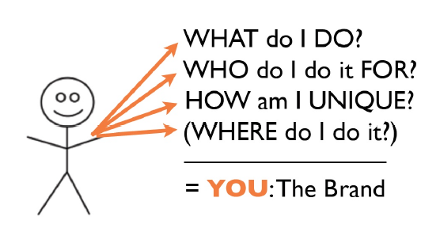

Ini adalah tulisan pertama dari seri tulisanku tentang personal branding.

Pernah mikir gak, kira-kira apa yang membedakan kita dengan orang lain di sekitar kita? Apa yang membuat kita unik? Atau apa yang membuat orang-orang mengenal kita sebagai seorang individu?

\[caption id="attachment\_575" align="aligncenter" width="600"\] image source : flipflopmarketing\[/caption\]

Disinilah personal branding berperan, mau tidak mau, sadar atau tidak sadar, masing-masing dari kita pasti punya branding yang unik yang membuat orang-orang bisa membedakan kita dengan orang lain, entah itu tampak luar kita, pekerjaan kita, hobi kita, sampai gosip tentang kita, intinya adalah semua yang melekat pada diri kita adalah personal branding kita.

## Trus kenapa coba kita mesti repot-repot ngurusin personal branding kita?

Jawabannya sederhana, karena ada 6,973,738,433 (and still counting) jumlah manusia di bumi ini, dan suka tidak suka proses evolusi selalu berjalan, survival of the fittest atau seleksi alam masih ada dan bahkan lebih ketat dari sebelumnya, kalo sebelumnya kita bersaing hanya dengan spesies lain, saat ini kita bersaing juga dengan sesama spesies manusia. Dan salah satu cara meningkatkan kemampuan survival kita, adalah dengan sebuah personal branding yang baik.

Dengan branding yang baik, kita akan punya posisi tawar yang lebih dalam hidup, tidak cuman soal pekerjaan saja, tapi juga dalam kehidupan sosial kita. Branding yang baik bukan hanya membantu kita untuk mendapatkan pekerjaan yang kita impikan, atau posisi, atau materi, lebih dari itu, branding yang baik akan meningkatkan kualitas hidup kita sebagai seorang manusia.

## Personal branding bukan sekedar metode promosi diri.

Personal branding yang baik akan membantu kita dalam menciptakan definisi diri kita, nilai apa yang kita punya, dan memberikan alasan untuk orang-orang mencari kita untuk membantu menjadi solusi atas masalah yang mereka punya. Cukup keren bukan?

Seorang calon temanku di masa yang akan datang, Jeff Bezos, pendiri amazon (bukan amazon yang hutan itu pastinya) berkata dengan simpel soal personal branding.

## ‘Your brand is what people say about you when you are not in the room’

Perkenankan aku menjabarkan hasil pembelajaranku selama ini di universitas google fakultas manajemen, tentang personal branding.

Kita mulai dari brand, atau merk, aku akan lebih sering menyebut dengan istilah brand, entah kenapa lebih terasa catchy. Jadi begini, brand adalah sekumpulan persepsi yang ada di kepala setiap pelanggan tentang produk atau layanan yang kita berikan. Brand adalah sebuah janji akan pengalaman yang didapat dari setiap pelanggan setiap kali mereka menggunakan layanan tersebut. Brand merefleksikan reputasi.

Dalam personal branding juga begitu, kita mengelola merk bernama diri kita. Misalnya aku, namaku dr. Kurniawan Satria Denta, dan itu adalah merk-ku, ada sekumpulan persepsi yang tersimpan di benak setiap orang ketika mendengar namaku. Ada reputasi, dan pengalaman yang dirasakan setiap kali orang-orang ber-interaksi denganku. Kita semua punya merk masing-masing, kalo kita tidak membentuknya sendiri, maka orang lain yang akan membuat asumsinya masing-masing atas diri kita. Rugi bukan?

## Personal branding mencakup definisi diri, tujuan hidup, nilai hidup, karya dan interaksi kita dengan dunia luar.

Branding ini gak mesti kita harus mengatakan hanya yang baik-baik semata soal kita, dan menutupi kelemahan kita. Sebaliknya, kita malah harus jujur dengan apa yang bisa kita lakukan, dan apa yang tidak bisa kita lakukan. Apa yang menjadi kelebihan kita, dan apa yang masih menjadi kekurangan kita. Dan personal branding juga bukan berarti, kita harus jago dalam semua hal, atau disukai semua orang. Itu sama tidak mungkinnya dengan berusaha memisahkan kekuatan cinta Nasar dengan Musdalifah. Lagipula, kalo kita berusaha untuk menjadi semua, dan disukai oleh semua, kita akan berakhir nothing kawan, nothing.

Personal branding adalah sebuah proses dimana kita membuat kita lebih dari orang lain dengan cara mencari tau apa nilai unik kita, baik nilai unik secara profesional, misalnya kemampuan kita bermain sulap, atau nilai unik yang personal, misalnya selera humor kita yang garing tapi tetap lucu.

Lalu setelah mendapatkan apa sisi lebih kita, kita akan mencari jalan untuk mengemas dengan oke dan meningkatkan nilat tambah kita dengan pesan dan image yang terus menerus kita sebarkan ke dunia luar.

Kalo udah gini, kita akan lebih mudah dikenali dari keahlian atau personalitas kita, akan lebih mudah untuk mendapatkan reputasi dan pengakuan, dan tentunya ujung-ujungnya akan lebih mudah bagi kita untuk mendapatkan lebih dari hidup ini. Pekerjaan, teman, atau pasangan hidup adalah tiga contoh sederhana dari apa yang bisa kita dapatkan dari sebuah personal branding yang baik.

\[caption id="attachment\_576" align="aligncenter" width="556"\] image source : MIVISTA\[/caption\]

## Langkah 1, Tentukan siapa dirimu.

Jika kita tidak tau siapa diri kita, lalu image apa yang mau kita sebarkan ke dunia luar? reputasi apa yang mau kita bangun? Pastikan dulu, apa tujuan hidup kamu? Nilai apa yang kamu pegang? Sifat apa yang kamu miliki? Apa yang menjadi passion kamu? apa yang bisa memotivasi kamu? Dan yang menjadi pertanyaan pamungkas, apa yang membuatmu lebih dari orang lain di dunia ini?

Dedikasikan waktu khusus untuk memikirkan kembali jawaban dari pertanyaan-pertanyaan tersebut. Banyak lho dari kita yang sudah umurnya sudah cukup dewasa, tapi ditanya soal tujuan hidup aja masih suka bingung, mlongo, dan lalu tiba-tiba disorientasi. Menentukan siapa diri kita sangat krusial sebelum kita masuk ke langkah berikutnya.

## Langkah 2, Tentukan apa yang kamu lakukan.

Kalo bahasa bisnisnya adalah, layanan apa yang kamu tawarkan untuk orang-orang di luar sana. Ini bukan hanya soal pekerjaan lho. Mendengarkan curhatan teman-temanmu bisa termasuk layanan yang kamu tawarkan begitu kamu tau kamu adalah seorang pendengar yang baik, atau selalu penasaran dengan update terbaru dari teman-temanmu, yang dalam bahasa ilmu psikologi biasa disebut dengan, kepo.

Langkah ini akan jadi sangat gampang dilakukan kalo kita sudah tau siapa diri kita, daftar apa yang kita lakukan bisa panjang, cari yang paling menjadi passion kamu, yang paling bisa memotivasi kamu. Aku misalnya, paling suka soal mendapatkan ilmu baru, ngomong, nulis, jalan-jalan, ama menemukan hal-hal baru. Yasudah, hal yang menjadi layananku adalah segala sesuatu yang berhubungan dengan sharing ide dan bagaimana mewujudkan ide itu menjadi kenyataan. Kalu kamu apa?

## Langkah 3 dan 4, Positioning dan Strategi

Nah ini yang agak ribet nih, apalagi berhubungan dengan strategi branding kita itu sendiri. Kalo kamu suka menciptakan musik misalnya, postioning ini akan membantu kamu bisa tetap menjadi yang diingat orang diluar ratusan ribu musisi lainnya diluar sana.

Dan strategi yang baik akan membuatmu tetap ada di jalurmu, meraih tujuanmu, dan bahkan mendapatkan serta memberikan lebih dari apa yang kamu lakukan saat ini.

Soal positioning dan strategi branding ini akan aku ceritakan lebih lanjut di tulisanku tentang personal branding selanjutnya.

>   **"**_Regardless of age, regardless of position, regardless of the business we happen to be in, all of us need to understand the importance of branding. _ _We are CEOs of our own companies: Me Inc._ _To be in business today, our most important job is to be head marketer for the brand called You."_ - **_Tom Peters -_**
