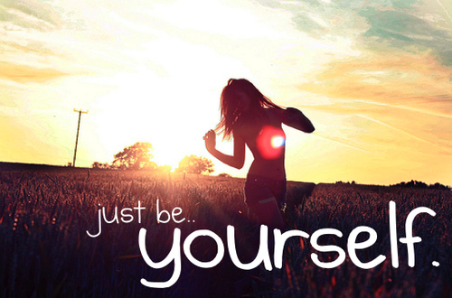
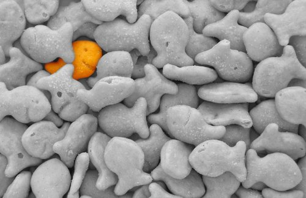
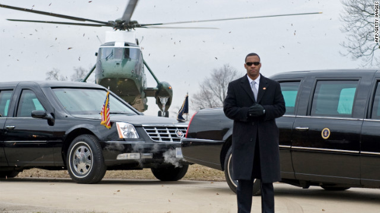
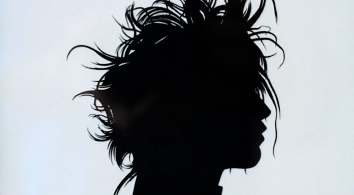
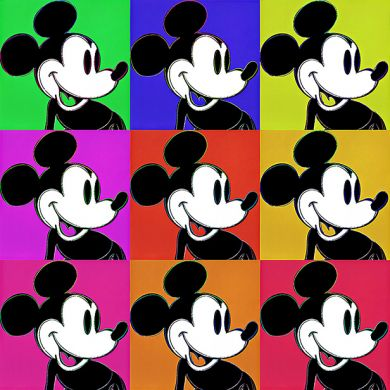
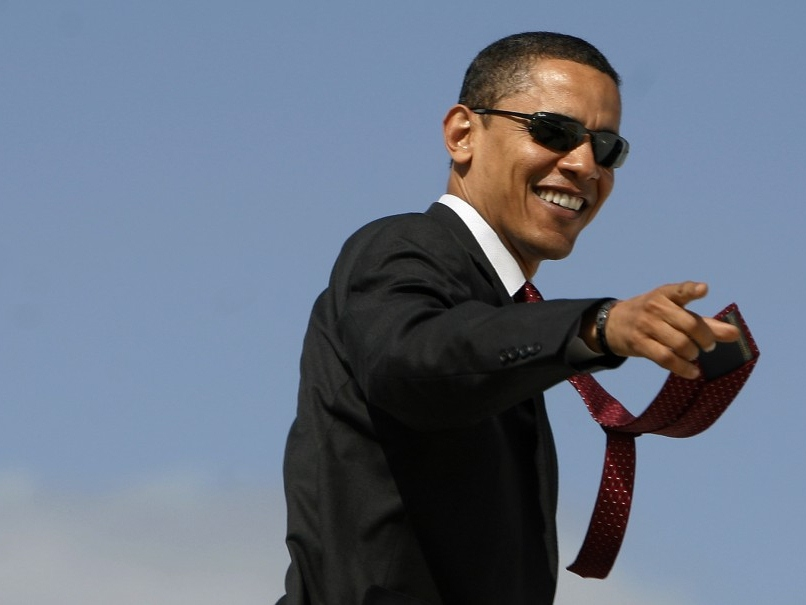
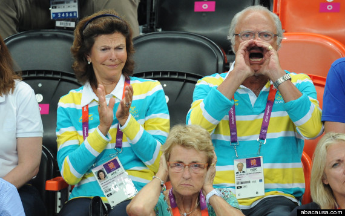

Ini adalah seri kedua dari tulisanku tentang personal branding, untuk membaca tulisan sebelumnya sila klik [disini](http://bydnta.co/2012/08/14/ngapain-repot-repot-personal-branding-01/ "Ngapain repot-repot? | Personal Branding #01").

Tulisan ini tidak akan membahas panjang lebar, hanya akan mencantumkan daftar panjang prinsip yang harus kita pegang teguh dalam mengembangkan personal branding kita..: )

\*drum roll\* \*ba dum jssss\*

# 10 Harus dalam personal branding

 

## 1\. Harus jadi diri sendiri

\[caption id="attachment\_582" align="aligncenter" width="500"\] image source : favim.com\[/caption\]

 

## 2\. Harus unik

\[caption id="attachment\_583" align="aligncenter" width="600"\] image source : limegreen.com.au\[/caption\]

 

## 3\. Harus nampak jelas

\[caption id="attachment\_584" align="aligncenter" width="500"\] image source : thinknice.com\[/caption\]

## 4\. Harus mudah diingat

\[caption id="attachment\_586" align="aligncenter" width="500"\] image source : flickriver.com\[/caption\]

 

## 5\. Harus selalu siap sedia

\[caption id="attachment\_587" align="aligncenter" width="600"\] image source : cnn/afp\[/caption\]

 

## 6\. Harus original

\[caption id="attachment\_588" align="aligncenter" width="600"\] image source : scence360.com\[/caption\]

 

## 7\. Harus konsisten

 

 

## 8\. Harus menawarkan solusi

\[caption id="attachment\_590" align="aligncenter" width="500"\] image source : kamyabology.com\[/caption\]

 

## 9\. Harus luar biasa

\[caption id="attachment\_591" align="aligncenter" width="600"\] image source : cdn.com\[/caption\]

 

## 10\. Harus luar biasa menyenangkan

\[caption id="attachment\_592" align="aligncenter" width="570"\] King of Sweden, olympic 2012 , source : huffingtonpost.com\[/caption\]
