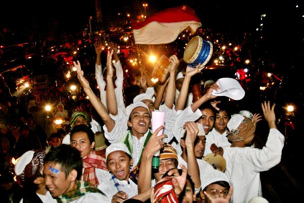

Tidak ada yang berbeda dari tugasku sebagai dokter jaga di UGD salah satu rumah sakit pemerintah di Jogjakarta beberapa hari yang lalu, pasien datang dan pergi, ada pasien yang diberikan obat dan bisa langsung pulang, ada juga yang harus dirawat lebih lanjut di bangsal rumah sakit. Yang membuat jaga malamku berbeda saat itu adalah karena waktu itu adalah malam takbiran, malam sebelum lebaran dimana hampir seluruh warga kota berhamburan ke jalan bersuka cita merayakan keberhasilannya menjalani ibadah puasa selama sebulan.

 

Beberapa jalan ditutup untuk karnaval takbiran, dengan anak-anak kecil membawa lampion beraneka rupa menyerukan takbir, tahmid, dan tahlil dengan suara mereka yang menggemaskan, ada juga remaja-remaja dengan kostum aneka macam, mulai dari kostum yang relevan dengan lebaran seperti baju koko, sampai yang membuat kita mengernyitkan dahi seperti kostum pocong dan laksmana Cheng Ho. Sekilas, karnaval saat takbiran di kota ini mirip dengan karnaval rakyat di Rio, Brasil, tapi versi islami, dan minus bikini.

\[caption id="attachment\_597" align="aligncenter" width="600"\] image source : latitudes.nu/idul-fitri-forgiving-family-traffic-jams/\[/caption\]

Semua orang tidak absen untuk turut bersuka cita, jalanan macet dengan para pengendara yang menepi agar bisa melihat dengan jelas, mulai dari anak kecil sampai orang dewasa, yang asli orang jawa, sunda, madura, cina sampai papua. Semua sangat antusias layaknya mereka baru pertama kali melihat takbiran tersebut di kota ini, padahal karnaval takbiran adalah sebuah kebiasaan yang hampir pasti dilakukan setiap tahun di kota ini menjelang lebaran, bersama dengan kebiasaan-kebiasaan lainnya khas lebaran.

Lebaran adalah sebuah momen yang penuh dengan kebiasaan yang klise, diluar dari ritual agamanya tentu saja, kebiasaan-kebiasaan yang sama dilakukan setiap tahunnya, mudik, opor ayam, ketupat, baju baru, takbiran keliling kota, kue nastar, salam tempel, sampai ke pertanyaan sejuta tante-tante di seluruh nusantara, "kapan kawin?" adalah beberapa contoh sederhana dari klise lebaran di Indonesia.

Bisa dimaklumi memang kalo ada sedikit kejenuhan dengan klise-klise lebaran tersebut, tiap tahun kok makanannya tupat sama opor ayam mulu, kenapa gak diganti dengan kalkun dengan saus cranberry gitu? tiap tahun kok lebaran gitu-gitu aja, pake baju koko, muter-muter ke tempat saudara, bosen, jenuh. Kenapa sih tiap tahun pertanyaannya sama mulu, kapan kawin? diganti kek nanyanya, kapan mati misalnya.

## Cliche is a cliche because it works.

Aku tidak akan berbicara soal arti atau filosofi dari lebaran, karena aku yakin sudah pada mendengarkannya pas ceramah sholat Ied, atau kalo gak sholat Ied, minimal pasti dah tau dari ceramah di radio, TV, internet, say hello to Mamah Dedeh dan Ustad Maulana.. Tapi bekerja di Rumah Sakit dari malam takbiran sampai hari ke-4 lebaran ini mengajarkan aku satu hal.

Bahwa klise-klise membosankan saat lebaran itu, sesungguhnya adalah hadiah terbesar buat kita yang sangat sayang untuk kita lewatkan begitu saja tanpa kita syukuri. Klise lebaran bisa jadi adalah sebuah kemewahan bagi orang lain yang diberikan cobaan untuk tidak bisa merasakannya, contohnya ya, orang-orang yang terpaksa harus sakit saat lebaran.

Sungguh beruntung aku tidak harus tergeletak diatas kasur dingin bangsal rumah sakit, dengan selang infus terpasang, dan oksigen tidak boleh terlepas. Aku yakin saudaraku sesama muslim yang dirawat itu, lebih memilih dicekoki opor ayam satu panci daripada harus tergeletak rumah sakit, pasti dia lebih memilih untuk berada bersama tante-tantenya bertanya 1000 pertanyaan kapan kawin yang sama, daripada harus terjebak untuk dirawat, tidak bisa pergi kemana-mana

Lebaran memang sebuah momen dimana kita diingatkan kembali betapa beruntungnya kita hidup di dunia ini, dengan kasih sayang yang melimpah dan rejeki tiada habisnya dari Sang Pencipta.

Lebaranku misalnya, memang sih harus dilewatkan dengan bekerja, tapi Alhamdulillah aku masih punya kesempatan sholat Ied di halaman belakang rumah sakit, silahturahmi dengan rekan-rekan dokter dan perawat, menyapa keluarga pasien dan makan nasi kotak spesial yang hanya disediakan oleh rumah sakit saat lebaran. Walaupun di akhir hari terasa sangat capek, sampai berkhayal untuk menciptakan mesin waktu dan kembali dimasa dimana hidangan lebaran pertama kali disajikan, dan membuang semua makanan bersantan dari daftar menunya, agar dimasa depan tidak ada puluhan orang berjejal di UGD dengan keluhan yang sama, mules dan diare.

Gak ada yang tidak bisa disyukuri dari tiap lebaran, sejenuh apapun kita dengan lebaran kita, masih ada jutaan muslim di luar sana yang hanya bisa membayangkan, untuk dapat menikmati lebaran dengan kemewahan dan suka cita yang sama seperti yang kita rasakan.

## Selamat Lebaran, Mohon Maaf Lahir dan Batin.

Semoga kemenangan, selalu bersama kita semua, bahkan saat kita kalah sekalipun.

Amin.
