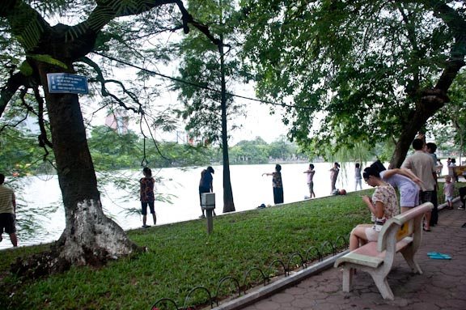

Beberapa tahun terakhir kata entrepreneur adalah istilah yang cukup nge-hits di Indonesia, istilah yang cenderung lebih dipakai untuk menyebut orang yang mengelola atau memiliki usaha, karena mungkin kata wirausahawan terdengar sangat pelajaran-bahasa-Indonesia-SMP sekali dan kurang prestise terdengar di telinga.

Kata entrepreneur dibicarakan dan terpampang dimana-mana seiring dengan meningkatnya keinginan masyarakat di negeri ini untuk menguji peruntungan mereka menjadi seorang wirausahawan.  Tawaran seminar, kursus bahkan kelas khusus entrepreneurship menjamur sampai ke pelosok kabupaten di penjuru Indonesia. Menawarkan ilmu, tips dan trik bagi para pemula untuk memulai dan menjalankan bisnis mereka.

Efek dari semakin seringnya istilah entrepreneur dikumandangkan, entrepreneur pun menjadi istilah yang sangat generik untuk digunakan, sehingga banyak orang yang juga entrepreneur itu memodifikasi kata tersebut sehingga lebih cocok dan spesifik untuk menggamparkan entrepreneur macam apa mereka itu. Istilah yang berformat \[terserah\] + preneur pun jadi jamak digunakan sekarang, jika kamu adalah seorang wanita dan pengusaha, sila gunakan womenpreneur, kalo pengusaha muslim, bisa pake moslempreneur, ada juga teknopreneur, dll dll.

## Lalu apa pula itu bolangpreneur?

As clear as its named, bolangpreneur adalah orang yang menjalani usaha/bisnis mereka, sambil nge-bolang alias traveling alias jalan-jalan alias muter-muter gak jelas.

Danau Hoan Kiem, Hanoi, adalah tempat yang tepat untuk menghabiskan sore hari santai, setelah sehari sebelumnya menghabiskan hari dengan sampan trip di Tam Coc, melelahkan tapi sekaligus menyenangkan. Di antara para warga kota Hanoi yang juga turut bersantai di salah satu dari 15 danau yang menghiasi Hanoi itu, seorang pemuda Indonesia sibuk dengan laptop mengecek email dan private message salah satu situs jual beli terbesar di Indonesia, hal yang hanya sempat dilakukannya via iPhone-nya kemaren saat jalan-jalan di Tam Coc dan Hoa Lu sehari sebelumnya.

Hanya butuh waktu sejam buatnya untuk mengecek penjualan dan pengiriman barang yang sudah didelegasikannya ke adiknya di Indonesia sana. Walaupun ada sedikit masalah dan si pemuda harus menelpon ke Indonesia dengan kartu seluler setempat yang dibeli dengan sisa Dong yang dia miliki. Semua berjalan lancar setelahnya, dan begitu yakin sudah tidak ada masalah lagi, dia kembali sibuk menjelajah situs tripadvisor untuk rekomendasi destinasi dia berikutnya esok hari, Ha Long Bay.

Pemuda tersebut, seorang kaskuser, berjualan kamera dengan omset ratusan juta sebulan, adalah contoh hidup dari seorang bolangpreneur. Dan yang menjalankan bisnis seperti dia gak cuman satu atau dua orang, tapi banyak. Seorang teman di Jogja dengan bangga berujar dirinya tidak perlu studio dan kantor untuk menjalankan bisnis fotografinya, semua klien bisa ditemui sambil ngopi, kalo butuh studio tinggal nyewa. Dengan begitu dia tidak terlalu perlu memikirkan biaya kantor dan studio yang cukup besar. Dan sisa waktunya bisa dihabiskannya di jalan, sambil traveling dan secara konsisten mengupdate bidikan fotonya ke instagram.

Dengan jaringan internet yang sudah ada dimana-mana, tidak sulit untuk menjadi seorang digital nomads dan roaming entrepreneur, dan yang perlu kita lakukan sebenarnya sederhana, hanya dibutuhkan sebuah konsistensi, sistem dan fleksibilitas dari produk dan manajemen yang kita jalankan.

Justru pertanyaan pertama yang harus dijawab jika ingin menjalankan usaha kita on-the-go adalah, apa benar itu yang kita butuhkan? Jalan-jalan sambil menjalankan usaha memang sederhana, tapi butuh sistem yang jelas serta kesiapan kita menghadapi segala kemungkinan yang ada dalam perjalanan kita nantinya. Fleksibilitas menjadi kata kunci, dalam traveling apa pun bisa terjadi, gimana kalo nanti dijalan tidak ada akses internet, trus kalo handphone sama laptop kita ketinggalan atau hilang? atau kita ternyata terjebak di sebuah pulau di pasifik karena ketinggalan satu-satunya kapal ke kota terdekat?

Untuk itu yang paling penting dalam menjalani gaya hidup bolangpreneur ini adalah membuat sistem yang bagus terlebih dahulu, kalo soal traveling kemana, apa aja yang disiapkan, visa-nya gimana, paspornya dimana ngurusnya, dan tetek bengek traveling lainnya itu gampang diurus. Sistem dan manajemen di usaha kita yang harus kita buat dulu agar siap dan bisa dijalankan dimana saja dimuka bumi ini.

Sistemnya bisa berbeda tergantung bisnis apa yang kita jalankan, bisnis penjualan barang tentunya butuh sistem yang  bisa mengakomodasi pemesanan, pengiriman, dan logistik dari jauh. Tentu berbeda jika kita menjalankan bisnis konsultasi yang cukup dengan email dan tools internet lainnya.

Dalam membuat sistem yang baik tentu saja kita perlu back up system, sebuah sistem pendukung apabila sistem yang telah kita rancang tadi tidak berjalan dengan baik. Punya satu orang di negara asal yang bisa menghandle pengiriman misalnya, akan jauh lebih baik dibanding kita mempercayakan orang ekspedisi barang untuk mengambil langsung ke rumah kita.

Laptop dan ponsel adalah dua alat esensial buat para pelancong yang juga menjalankan usahanya di jalanan, tapi kita juga tidak bisa mengandalkan dua alat itu 100%, kemungkinan gadget kita rusak atau hilang atau udah rusak, hilang pula jauh lebih besar saat traveling. Simpan semua file penting di atas awan via google docs atau box.net. Minimalisir penggunaan software yang hanya bisa digunakan di laptopmu, maksimalkan software-software yang berjalan via browser dan online, dengan begitu jika terjadi apa-apa dengan laptop dan ponsel, kita bisa langsung pergi ke warnet terdekat dan menjalankan bisnis kita tetap dengan mulus, walau tanpa laptop dan ponsel sekalipun.

Sebagai bolangpreneur, jaga keseimbangan antara petualangan dan pekerjaan, jangan sampai kita keasikan dengan petualangan kita di Cheng Du menuju Tibet, kita sampai lupa untuk mengecek orderan hari itu. Dedikasikan waktu khusus tiap harinya untuk mengecek order dan mengurusi bisnis. Misalnya 2 Jam setiap hari dari jam 4-6 sore. Kita sendiri yang menentukan seberapa banyak waktu yang dibutuhkan dan kapan, tentunya menyesuaikan dengan kebutuhan bisnis yang kita jalankan.

Selain itu, pastikan budget kita cukup untuk menjalani bisnis plus berpetualang, kalo memang duit kita tidak cukup untuk menjalani bisnis sambil keliling di negara-negara nun jauh disana, bukan berarti kita tidak bisa menikmati asiknya menjadi bolangpreneur, gak perlu jauh-jauh, mengecek orderan sambil makan es krim di Toko Oen, Malang dan memikirkan trip berikutnya ke Bali via Banyuwangi juga tidak kalah seru sebagai seorang bolangpreneur.

Melancong dan berbisnis tampak seperti dua hal yang bertolak belakang, tapi jika traveling dan running a business benar-benar adalah passion kita, tidak ada salahnya untuk menggabungkan keduanya dalam satu itinerary, bukan? : )
