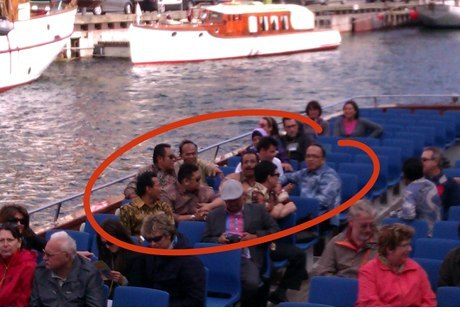

Biasanya aku terlalu sibuk dengan urusan pekerjaanku sendiri di kantor, di rumah, di rumah sakit, sampai tidak sempat mengikuti perkembangan politik di negeri ini. Tapi mau gak mau aku tetap akan menyempatkan diri untuk tahu, apa kabarnya negaraku ini, sembari menunggu kabar baik Bakrie gak jadi nyalon jadi presiden, dan Soetan Bathoegana pensiun dari politik dan banting setir jadi petani mujaer.

Emang dasarnya gak suka sih, cuman rasanya kok rugi ya kalo jadi orang apatis saja terhadap politik atau jalannya pemerintahan, sebagai warga negara, kita bayar pajak lho, saat kita beli permen saja itu ada duit kita yang masuk ke dalam kantong negara dalam bentuk pajak.

Kalo kita mau gak peduli sama negara ini, dalam perspektif retribusi yang kita bayarkan buat negara, itu sama aja kita bayar sewa dan tinggal di rumah tapi gak peduli kalo rumah itu rusak, penuh tikus, busuk, toiletnya mampet, AC-nya bocor, pintunya ilang, jendela dicolong, dll dll.

Jadi wajar kalo aku sakit hati begitu melihat duit pajak-ku dihambur-hamburkan oleh bapak-ibu dewan yang katanya terhormat cuman buat studi banding ke Denmark dan Turki buat mempelajari logo dan mengganti logo Palang Merah Indonesia.Entah bego apa memang tidak peduli lagi dengan rakyat mereka, bukankah ada cara yang lebih murah untuk studi logo pak, bu? pernah dengar google? atau kalo memang butuh belajar dari Denmark, gak bisa ya meminta diplomat kita yang disana untuk mempelajari logo palang merah lalu dilaporkan ke anda-anda, jika butuh diskusi, bisa lewat skype bukan?

Oh  ya, lalu apa hasilnya perjalanan anda-anda sekalian ke Denmark? Sebagai rakyat saya penasaran logo sebagus apa yang anda dapatkan dari sana. Atau mungkin anda terlalu sibuk berwisata di atas perahu menikmati indahnya pemandangan Copenhagen, jadi lupa mempelajari logo dengan detail.

\[caption id="attachment\_620" align="aligncenter" width="460"\] foto diambil oleh pembaca detik, memergoki anggota dewan studi logo di atas perahu wisata di Kopenhagen\[/caption\]

Itu baru anggota Dewan, yang di pemerintahan juga sama konyolnya. Ada menteri yang dipasrahi untuk ngurusin olahraga, tapi bangun kompleks olahraga saja gak becus, gak cuman satu, gak cuman dua, tapi tiga. Mulai dari Hambalang, kompleks SEA Games, dan sekarang yang paling panas, PON. Malu pak sama kumisnya, apa iya sesulit itu koordinasinya?

Ada juga menteri yang dengan konyolnya menawarkan solusi pindah keyakinan kepada para minoritas korban kerusuhan di satu pulau di Jawa Timur, solusi dia adalah pindah keyakinan? bukan perlindungan? alangkah sialnya menjadi minoritas di negeri ini.

Orang nomor satu di negeri ini juga tidak kalah konyolnya, alih-alih membakar semangat dan memotivasi seperti pidato para pendiri Indonesia, pidatonya justru mengandung sedatif. Berkali-kali kejadian ada yang ketiduran saat dirinya pidato. Jangan heran pak, pidato anda memang ,mohon maaf, kosongan, tidak ada isinya. Anak kecil saja tahu, jangan marahin anak kecil yang polos itu tertidur saat pidato bapak. After all, we are paying your salary as the president, can we demand you to be more entertaining? And no sir, a full album of your song can not be considered as entertaining.

Pemimpin itu harusnya bisa nyatu yah ama rakyatnya, bisa nerangin jalan, nunjukkin yang bener mana, kasih semangat, kasih tau arah, memberikan inspirasi, arahan, bukan pidato kosong, bukan marah-marah gak jelas, bukan bikin album. Well, bikin album sih boleh-boleh aja, tapi mbok ya pastikan rakyatnya seneng dulu to pak, kalo rakyatnya makmur, bahagia, situ mau ngisi semua kounter disc tarra dan bulletin cuman dengan lagu-lagu sampeyan ya gak masalah kita-kita.

Susah memang untuk menjadi optimis kalo yang kita lihat contohnya adalah yang duduk berkuasa diatas sana, yang menikmati kekuasaan untuk dirinya dan golongannya saja, bukan untuk melayani dan memberikan terbaik untuk rakyat dan bangsanya.

Untung saja kalo aku melihat-lihat sekeliling, walaupun mungkin kecil presentasinya dibanding total penduduk Indonesia, sudah banyak warga negara yang peduli dengan negeri ini. Di twitter, facebook, youtube, kaskus, kompasiana, banyak generasi muda yang menyuarakan idealisme, aksi, dan karya mereka untuk Indonesia. Suara-suara yang awalnya terdengar sayup-sayup itu makin lama makin menyebar dan membangkitkan semangat, menyebar dari satu wilayah ke wilayah lain di Indonesia, sahut menyahut. Apa yang sekarang adalah twitter, dan media sosial lainnya tampaknya adalah versi baru dari siaran radio yang mengumandangkan perjuangan pemuda saat jaman-jaman sulit pra-kemerdekaan dulu.

Mungkin memang sudah terlanjur, kebanyakan dari mereka yang kita pasrahkan kepercayaan untuk mengurusi negara ini adalah para idiot dan bajingan, tapi bukan berarti itu membuat kita jadi sinis dan putus harapan.

Kita bisa kok merubah negara ini, kita ambil kekuasaan dari mereka yang menelantarkan rakyatnya di atas sana, sedikit demi sedikit, pelan tapi pasti, one tweet, post, video, podcast, movement at a time.

Mari berjuang bersama, merubah rumah kita menjadi rumah yang lebih nyaman ditempati, dan dengan kelembutan serta kasih sayang yang kita punya, menggali kuburan sedalam mungkin buat para pemimpin korup yang masih berani hidup diatas tanah air kita, tanah air Indonesia.
