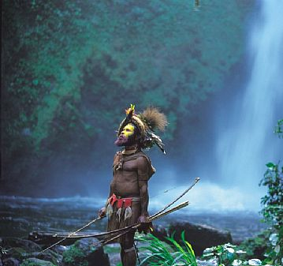

Di antara hiruk pikuk pilkada DKI yang lalu, yang alhamdulillah berjalan dengan lancar, aku mendapati seorang teman malah sibuk mengurusi segala administrasi kepindahannya dari Jakarta. Dia pindah ke New York, kota yang sering disebut sebagai pusatnya dunia, kota yang disebut-sebut dalam ribuan film, musik, dan buku. Ketika aku bertanya, kenapa harus pindah kesana, sambil tersenyum dia menjawab sederhana, “karena aku ingin menggapai mimpi Amerika...”

The American Dream, atau mimpi Amerika, adalah sebuah etos nasional dari negeri adidaya Amerika Serikat, sebuah ideal dimana semua orang di Amerika memiliki kesempatan yang sama untuk sukses dan sejahtera, tanpa memandang asal usulnya, bergantung pada kerja keras dan pencapaian dari masing-masing orang tersebut.

Aku tidak bertanya lebih lanjut lagi soal mimpinya di Amerika sana, setelah obrolan ringan tentang kepindahannya, justru aku yang dipenuhi rasa ingin tau di kepala ini, bukan tentang mimpi Amerika, mimpi Amerika sudah banyak yang tau, sudah satu dunia yang tahu, semua rakyat amerika bahkan hingga imigran dari seluruh penjuru dunia pun ada disana, untuk meraih mimpi Amerika tersebut.

Yang jadi pertanyaanku justru satu, bagaimana dengan mimpi Indonesia? ada apa dengan mimpi Indonesia sehingga temanku tadi memutuskan untuk meraih mimpi lain di luar negaranya, which is cool by the way, dan mengambil mimpi dari negara di seberang pasifik sana, untuk melengkapi hidupnya.

 

\[caption id="attachment\_645" align="aligncenter" width="359"\] source : http://blog.oxygencreator.web.id/\[/caption\]

Ada apa dengan mimpi Indonesia? Atau pertanyaan yang lebih lanjut lagi, memangnya ada ya yang dinamakan mimpi Indonesia itu? Apakah kita semua terlalu takut untuk bermimpi dengan Indonesia? Ataukah mungkin kita terlalu sibuk bermimpi sendiri-sendiri, yang Jawa dengan mimpi Jawanya, yang Papua dengan mimpi Papuanya, yang Islam, Kristen, Katolik, Hindu, Buddha dengan mimpinya, yang feminis, yang liberal, yang konservatif, yang kiri, yang kanan, yang lain-lain dengan mimpinya sendiri-sendiri, sehingga kita lupa untuk bermimpi satu, mimpi Indonesia.

Apakah kita terlalu besar sebagai bangsa? terlalu berbeda? untuk punya mimpi Indonesia bersama? Atau kita cuman terlalu bebal dan malas untuk bisa menerima, bahwa dibalik semua perbedaan dan masalah yang ada di negeri ini, sesungguhnya kita masih bisa bersama-sama punya mimpi yang sama..?

Dan lamunanku tentang mimpi Indonesia ,dengan bantuan google, pun berujung kepada pembukaan UUD 1945. And know what, Ternyata disana sudah sangat jelas tercantum dasar untuk mimpi Indonesia yang satu!  Mimpi Indonesia yang diawali dengan kemerdekaan dasar, untuk bersatu, berdaulat adil dan makmur. Mimpi yang diawali dengan perlindungan negara kepada rakyatnya, seluruh rakyatnya, untuk bebas, maju sejahtera, cerdas, dan merasakan perdamaian abadi.

## Lalu mimpiku semakin liar melayang tentang Indonesia

Mimpi dimana setiap rakyat benar-benar merasakan kemerdekaan yang sesungguhnya, ketika setiap orang yang tinggal di negeri ini, dari ujung sabang sampai ujung merauke punya kesempatan yang sama, untuk lahir, berkembang, menjadi cerdas, kuat, sehat, mencari pekerjaan, berkarya, berekspresi, hingga makmur sejahtera, tanpa membedakan keyakinan, pemikiran, suku, golongan, bahkan orientasi seksual.

Mimpi dimana para pemimpin di negeri ini, tulus melayani rakyatnya, dan rakyatnya pun tulus mengabdi pada negara.

Ketika hukum ditegakkan untuk semua, ketika orang segan dan enggan untuk menyakiti sesamanya, saat ribuan penyidik KPK menghabiskan hari-harinya untuk nongkrong di kantin makan serabi karena sudah tidak ada lagi kasus korupsi untuk dikerjakan, tidak ada koruptor, bahkan korupsi menjadi kata yang sangat jarang terdengar dan janggal ketika diucapkan kembali.

Ketika semua rakyat benar-benar satu dengan Indonesia, tidak ada lagi yang minta merdeka, dan orang-orang papua pun sibuk memaki-maki media Australia yang mengungkit-ungkit kemerdekaan Papua sambil berkata lantang saat konferensi pers, “Indonesia dan Papua itu satu, ko sakiti Indonesia, ko sakiti pula orang Papua!”

Dan walaupun FPI masih suka lantang berteriak Allahu Akbar berdemo di depan istana negara, kali ini bukan soal demo menentang lady Gaga tampil di senayan, tapi demo membela beberapa saudaranya sebangsa yang beragama Katolik, karena sulit mendapatkan tempat untuk membangun gereja mereka.

Memang SMA 6 dan 70 masih suka bertarung, tapi bukan  dengan saling bacok dan melempar batu, tapi dengan saling unjuk kemampuan kreatif mereka. Setiap sore akan ada yang menantang SMA tetangga untuk dance atau rap battle, dimana yang kalah harus mentraktir coca cola dan chitato bersaus keju di seven eleven setelahnya, nongkrong dan tertawa bareng sebagai sesama anak muda Indonesia.

Dimana para wanita pekerja tidak takut naik angkutan di malam hari. Dokter, guru, buruh, dan pekerja lainnya dihargai kontribusinya dengan layak. Pemuka agama sibuk menyebarkan kedamaian dan optimisme. Para ilmuwan dan orang-orang terdidik tidak henti-hentinya mencerdaskan bangsa. Seniman menghiasi negeri dengan karya-karya indah mereka. Dan ketika jutaan pelancong dari seluruh penjuru dunia berbondong-bondong ke Indonesia, untuk menikmati hidup dan belajar dari negara adidaya baru ini.

Dan mimpi Indonesia pun berubah menjadi mimpi umat manusia juga, ketika seorang pemuda bertanya pada temannya orang Amerika, tentang alasan kepindahannya ke Indonesia, dan dijawab dia dengan senyum dan jawaban sederhana

> “Karena aku ingin menggapai mimpi Indonesia....”

Berlebihan? Well, that’s the dream. Mau kamu asmat, dayak, apa sasak, mau kamu ahmadiyah, sunni, syiah, mau kamu ganteng, jelek, cantik, pas-pasan, atau bahkan apapun paspor kamu, Belanda, Jamaika, atau Amerika, kalo kamu merasa satu dengan Indonesia, berarti kamu orang Indonesia, dan selamat bermimpi dan berjuang bersama Indonesia.

## Kami, putra dan putri Indonesia, bersama bermimpi satu, mimpi Indonesia.
