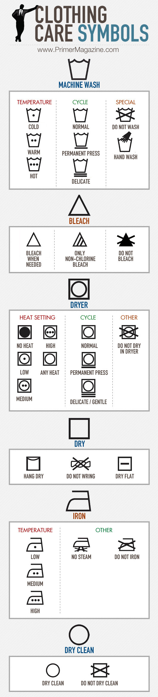

Setelah beberapa saat harus mengurusi cucianku sendiri membuatku sadar, bahwa ada beberapa simbol di label pakaian yang gak aku mengerti. Beberapa memang cukup straight forward, misalnya ikon setrika yang disilang, artinya gak boleh disetrika. Tapi ada beberapa pertanda terlalu sulit untuk diintrepretasikan. Beruntungnya, tidak seperti pertanda dari wanita, pertanda label cucian ada penjelasannya dengan gamblang di dunia maya. Found one of it.. My gap jeans will thank me for this.

