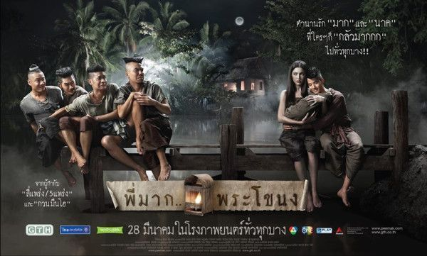

Sebagai orang yang suka nongkrongin bioskop dari jaman masih pake celana merah dan mesti sering nipu-nipu umur biar dibolehin masuk untuk show film tertentu, aku akhirnya menjadi orang yang tidak strict pada genre atau aliran film tertentu, pokoknya apapun itu film yang menggugah hasrat untuk ditonton, ya aku tonton.

Pun begitu dengan sinema Thailand, sebelum akhirnya bisa melihat film dari negeri Siam itu di layar lebar, beberapa film mereka sudah berhasil merebut hatiku yang sepi ini, sebut saja Shutter dan versi folklore paling creepy Nang Nak di layar tivi yang mungil nan imut itu. Big respect kepada Blitz Megaplex yang secara konsisten mau muterin film-film alternatif dari Asia, termasuk Thailand.

Pertama nonton film Thailand di bioskop itu filmnya Banjong Pisanthanakun, 4bia, gak ada ekspektasi apa-apa selain emang pengen tau rasanya nonton film Thailand di layar lebar dan rasa penasaran nyobain velvet class-nya Blitz. Lalu setelah 120 menit teriakan dan cengkeraman kemudian (selimut yang disertakan di velvet sungguh berguna saat menyimak film horror), aku pun bisa mengatakan “Those guys up there in Thailand, really know how to make both watchable and memorable cinema pieces…”

4bia 2, suck seed, hello stranger, ladda land, etc pun menjadi daftar selanjutnya film Thailand yang kusempatkan tonton di blitz, simple stories with great production values selalu jadi senjata utama dari film-film mereka yang membuatku tidak ragu-ragu untuk nonton film Thailand.

Lalu bulan ini, datanglah film terbaru mereka, oleh sutradara yang sukses membuatku menghafalkan kembali ayat Kursi setelah melihat film-film horornya, Banjong Pisanthanakun, bersama Mario yang cute, si cantik Davika dan tim cacat segmen horor komedi di 4bia dan sekuelnya, Nuttapong Chartpong, Pongsatorn Jongliwas, Wiwat Khongrasri, Kantapat Permpoonpatcharasuk. (salah satu dari mereka aku yakin seyakinnya adalah doppelganger Desta club80s).

Pee Mak Phrakanong, film yang diadaptasi dari legenda rakyat Thailand, sudah dibuat puluhan versi film, sinetron, dan operanya, yang salah satu versi filmnya, Nang Nak (1999), membuatku bersyukur tidak hidup di Thailand pada akhir abad 19. Kali ini oleh Banjong dkk dibuat versi horor komedinya.

Premis ceritanya masih sama dengan pakem legenda Nang Nak, alkisah di desa Phrakanong sebelum akhirnya menjadi bagian dari Bangkok dengan puluhan Apartemen dan Kondo berjejeran di tepi aliran sungainya, arwah seorang istri dan bayi dengan setia menunggu suaminya Pee Mak pulang dari perang, setiap sore (maghrib?),  panggilan (arwah) sang istri yang merindukan suaminya menghantui seluruh isi desa. Sampai akhirnya sang suami, Pee Mak  pulang dan menghapus rasa rindu yang menggebu-gebu, hingga tidak menyadari, bahwa istrinya sekarang, sudah bukan manusia lagi.

Cerita yang sudah familiar oleh jutaan orang Thailand itu tidak menghentikan Banjong untuk menyajikan kejutan-kejutan cerita dalam Pee Mak. Tidak seperti film horor komedi dari negeri tercinta kita Indonesia yang kebanyakan tidak terstruktur, asal-asalan dan ngawur, Pee Mak dibuat dengan struktur cerita dan formula komedi yang cukup rapi, ditampilkan dengan pakem komedi dan twist yang sudah terbukti berhasil di 2 segmen horor lucu 4bia 1 dan 2. Plus romansa yang cukup manis sukses membuat beberapa cewek di row belakang kursiku menye-menye keenakan.

Membuat film horror rasa konyol bukan berarti harus dengan cara yang juga konyol, di Pee Mak lengkap tersaji deretan production values yang serius dikerjakan khas film-film buatan GTH Studio, gambar jernih, detail menawan, dan kekuatan akting yang cukup total. Semua itu dijamin membuat kita terhibur, dan tidak merasa rugi mengeluarkan uang untuk menonton Pee Mak di layar lebar, jangan heran film ini jadi box office di pemutaran perdana di negeri asalnya, hanya kalah oleh Ong Bak-nya Tony Jaa.

Beberapa hal di Pee Mak memang masih jadi catatan yang mengganjal, seperti beberapa momen yang dipaksakan dan seperti sengaja dipanjang-panjangin, atau mungkin beberapa orang akan terganggu dengan anakronisme seperti munculnya komedi putar dan bianglala di desa kecil di Thailand di akhir abad 19, ketika listrik saja belum ada, atau referensi film-film dan tokoh yang baru muncul jauh di masa depan (300, last samurai, david blaine, ang lee), kalo yang terakhir tampaknya memang disengaja sebagai pakem komedi sang sutradara yang juga muncul di film-filmnya sebelum Pee Mak.

Kesimpulannya, Pee Mak Phrakanong kembali hadir untuk menunjukkan kepada kita bangsa Indonesia, tentang bagaimana seharusnya horor komedi itu dibuat, bukan dengan balutan paha dan dada, plot cerita semi stensilan, slapstick norak, apalagi hanya pamer jejadian dengan kemampuan absurd seperti bisa keramas, atau nenteng cangkul kemana-mana.

Dan sama seperti saat aku menonton 4bia, Banjong kembali membuatku mati-matian menahan kemih, jika sebelumnya karena ketakutan, kali ini karena tertawa keterlaluan.

_ps. Pee Mak di Indonesia hanya diputar di jaringan bioskop Blitz._
