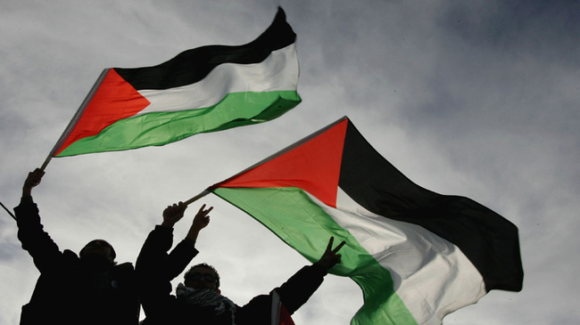

Pernah bayangin gak betapa canggungnya Indonesia waktu awal-awal merdeka dulu? Negeri yang sudah dikenal lebih dulu sebagai bagian dari kerajaan Belanda tiba-tiba secara sepihak ngaku-ngaku kalo sudah merdeka. Jaman awal-awal kita merdeka dulu, pendiri negara ini tidak bebas kesana kemari untuk meminta dukungan pengakuan dari negara lain, bahkan perwakilan kita saja tidak bisa masuk ke dalam PBB. Indonesia saat itu dianggap tidak lebih dari gerakan separatis sempalan Hindia Belanda semata.

Tapi di belahan dunia yang lain, ada yang anti mainstream dengan yakinnya menjadikan kabar burung dari negara nun jauh di tengah ekuator bernama Indonesia, menjadi sebuah awal gerakan kebangkitan melawan imperialisme barat. Di Kairo, 16 Oktober 1945, 16 orang arab, yang bukan sembarang orang arab, terdiri dari mantan menteri, politis, akademisi, dan ulama, berkumpul di suatu tempat untuk membentuk _Lajnatud Difa'i'an Indonesia ,_ Komite Pembela Indonesia, dengan tujuan mengumpulkan dukungan negara-negara di timur tengah untuk mengakui kemerdekaan Indonesia. Dan akibat dari vokalnya komite tersebut, negara-negara lain lalu turut mengakui dan mendukung kemerdekaan Indonesia hingga akhirnya Belanda mau tidak mau merelakan Indonesia menjadi negara yang merdeka dan berdaulat. And yes you were right, ulama palestina juga ada disana dengan lantangnya mengajak pemuda Palestina lainnya untuk mendukung kemerdekaan Indonesia, how cool was that? those Palestinians were not even got their Independence yet..

Sudah cukup alasan buat kita untuk turut serta dalam perjuangan Palestina, kita gak mungkin bisa menikmati kemerdekaan ini tanpa bantuan dari mereka sebelumnya, kita tidak mungkin bisa hore-hore sana sini ngemol kencan nongkrong nonton bioskop tebar pesona PDKT dengan bebas tanpa bantuan pejuang Palestina. Lagi pula konstitusi kita dengan jelas mengamanatkan bahwa kemerdekaan itu adalah hak segala bangsa bukan. So don't you dare give me the "why the hell should we help Palestine" look.. seriously..

##### _pic source :  eccpalestine.org_

Teman, Palestina sekarang membutuhkan kita, saudara mereka seperjuangan, aku tidak perlu memaparkan kembali betapa jahatnya negara bernama Israel itu terhadap rakyat Palestina, ini memang bukan lagi soal agama atau politik. Ini soal kemanusiaan, dan kita tidak perlu menjadi orang suci untuk bicara soal kemanusiaan. Kalo mereka saja bisa membantu kita dulu saat twitter facebook bahkan internet aja belum ada, apalagi sekarang. Teknologi memungkinkan kita bisa membantu mereka tanpa harus mengorbankan hidup kita yang nyaman dan tenteram di Indonesia, bahkan hal-hal yang aku sarankan berikut, bisa kita lakukan tanpa beranjak dari sofa tempat kita nongkrong sambil ngopi sehari-hari.

> Cool thing is, not everything is about money support...

## 1\. Cari tau dan sebarkan hanya berita yang kredibel tentang Palestina

Dengan banyaknya informasi yang beredar saat ini, tidak semua informasi tentang Palestina adalah benar. Kebanyakan dari kita juga tidak berada di sana untuk mengkonfirmasi apa yang sebenarnya terjadi disana. Lalu apa masalahnya dengan info kekejaman yang kita sebarkan, foto-foto korban perang yang kita share di media sosial, kalo itu semua tidak benar, toh sama-sama bisa membangkitkan simpati dan empati orang lain. Well, that might be the case at the beginning, tapi jika orang-orang tau apa yang kita bagikan itu tidak benar, akan muncul rasa skeptis dan ketidakpercayaan yang tinggi, ujung-ujungnya, teman-teman kita bisa saja tidak percaya kalo kekejaman itu benar-benar terjadi di Palestina.

Jadilah filter yang baik, dengan sedikit google saja kita bisa tau kok mana foto yang benar mana yang bukan, mana info yang benar dan mana yang menyesatkan. Lihat saja apa yang terjadi pada salah satu pejabat kita hari ini, karena kurang tepat mencantumkan foto di twitternya, orang-orang malah teralihkan fokusnya dari pesan sebenarnya yang sangat baik untuk membantu Palestina, jeleknya? ya kredibilitas yang mengajak untuk membantu jadi berkurang, bahkan mungkin membuat orang lain jadi ragu untuk membantu.

Cari sumber info yang terpercaya, jangan menyebarkan informasi sampai kita tau informasi itu jelas, benar dan dapat dipertanggung jawabkan. Jangan asal retweet dan repath. Karena hanya informasi yang kredibel yang bisa membuat orang lain percaya apa yang kita percaya. Alasan sama yang membuatku follow @RSIndonesia di twitter, sebuah inisiatif dari teman-teman kita di Mer-C yang membangun Rumah Sakit di Gaza. Mereka punya relawan disana yang melaporkan kondisi langsung gaza, so far sih aku yakin they are credible, reliable.. Walau bukan berarti info dari sumber terpercaya tidak perlu kita klarifikasi lagi yah, cuman memang jauh lebih mudah mencari kejelasan informasi yang bersumber dari sumber yang dapat dipercaya.

Jika sudah dapat informasi yang benar, sebarkan! sebanyak mungkin orang harus tau tentang Palestina. Sebarkan dengan cara yang baik tentu saja, jangan kita sebarkan info tentang kekejaman Israel sambil nyinyir ke orang-orang yang lagi euforia piala dunia. Orang yang lagi hore kan belum tentu tidak perduli dengan Palestina. Be nice, niat kita kan baik untuk mengajak orang turut beraksi untuk saudara kita disana. Niat yang baik tentu saja harus dilakukan dengan cara yang baik pula.

## 2\. Sisihkan materi dan donasi langsung

Bayangkan suatu kondisi dimana terjadi perang, banyak korban berjatuhan, yang masih bertahan hidup perlu dirawat, perlu recovery, dan itu butuh biaya yang tidak sedikit. Ada banyak cara untuk menyumbang untuk Palestina, beberapa lembaga donasi di Indonesia juga memfasilitasi donasi kita, seperti [www.act.or.id](http://www.act.or.id/) [www.dompetdhuafa.org](http://www.dompetdhuafa.org) atau [www.mer-c.org](http://www.mer-c.org/) .

Berapapun donasi yang kita berikan, Insya Allah berarti untuk saudara kita disana, cukup 50ribu pun sudah bisa membuat relawan kita di RS Indonesia di Gaza membelanjakan jumlah tersebut untuk membeli obat-obatan dan alat kesehatan. Jumlah tersebut bahkan jauh lebih kecil daripada budget pulsa kita sebulan. Sangat, sangat ringan sekali.

Jangan lupa kalo bisa ikut memantau apakah uang yang kita donasikan benar-benar dipakai dengan bertanggung jawab. Caranya? keep your eyes on them and read the report. Simple!

## 3\. Ajak handai taulan

Gak pede kalo cuman nyumbang 50ribu? Berdayakan saja kontak twitter, BBM, whats app, path, line, kakao talks, we chat, facebook, friendster (eh), dll, kirim pesan satu-satu (kalo bisa jangan broadcast, seriously, broadcast is always annoying), informasikan yang benar ke mereka tentang Palestina, trus ajak untuk ikutan beraksi bareng. Atau pasti punya teman satu geng kan, pas nongkrong nonton bareng, jangan lupa cerita soal Palestina, lalu ajak patungan bareng buat donasi kesana. Hal yang sama bisa juga dilakukan bareng teman-teman kantor, tetangga, saudara, pacar, TTM-an, dsb, dst.

Jangan takut pada nyinyirin, lagian ini kan bukan soal ajakan preferensi partai atau capres. Kita semua Insya Allah diberikan kemampuan kok untuk membantu sekuat mungkin.

## 4\. Sisipkan doa untuk Palestina

Lagi gak ada duit untuk donasi? atau gak punya teman untuk diajak gabung beraksi (sedih amat)? Kirim saudara kita doa. Apapun agama dan keyakinanmu, doakan saudara kita agar diberikan kelapangan hati dan kekuatan, pengertian untuk selalu kuat menghadapi cobaan. Doakan kita selalu diberikan kesempatan dan rejeki untuk membantu saudara kita. Doakan relawan agar selalu diberikan keikhlasan untuk berjuang. Doakan para penjajah itu agar dibukakan mata hatinya.

## 5\. Tahan emosi dan kirim energi positif

Sangat mudah emosi kita meluap-luap saat melihat kekejaman barbar yang dipertontokan Israel di Palestina sana. Tapi tahan lah emosi, emosi yang berlebihan itu bisa jadi berbalik merugikan kita atau saudara kita sendiri nantinya. Kita harus jadi kuat untuk mereka, agar mereka tau mereka tidak sendiri. Agar mereka tau, saudara mereka disini tidak melupakan mereka. They need those positive energy to survive.

Have some faith! Ada yang bilang konflik Palestina-Israel itu konflik ratusan tahun tanpa jelas ada solusinya apa, jadi percuman juga turut serta ambil bagian dari konflik abadi ini. Well guess what? waktu awal kita merdeka dulu, konflik kita dengan Belanda juga sudah berjalan ratusan tahun bukan? But our brothers and sisters there had never lost faith, dan jika mereka saja dulu bisa gigih membantu kita yang mereka kenal cuman dari informasi sangat terbatas dari surat kawat dan artikel koran, kita tidak pantas untuk hilang keyakinan atas perjuangan mereka.

> Their fight is our fight, and it's real.

Jangan remehkan juga bantuan kita yang mungkin terlihat kecil. Semesta bekerja dengan cara yang sangat unik. Kepakan kecil sayap kupu-kupu yang kita lakukan untuk Palestina sekarang, dapat berakhir menjadi sebuah tornado besar yang menghepaskan ketidak adilan imperialisme di Palestina sana nantinya. (ref. [butterfly effect](https://www.google.com/url?sa=t&rct=j&q=&esrc=s&source=web&cd=1&cad=rja&uact=8&ved=0CB4QFjAA&url=http%3A%2F%2Fen.wikipedia.org%2Fwiki%2FButterfly_effect&ei=br6-U-2FMYy7uASg3IL4BA&usg=AFQjCNEP311TLFYmX-vgqxerAMtx7VzFdg&sig2=8zrVSesywq_NVUgUzVXtzg))

**Trus mau tunggu apa lagi? ambil hp, kabarkan tentang palestina, dan bantu! Let's support their fight with the conveniences at our fingertips!**
