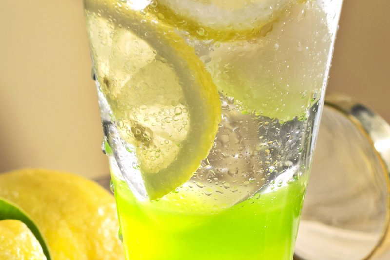
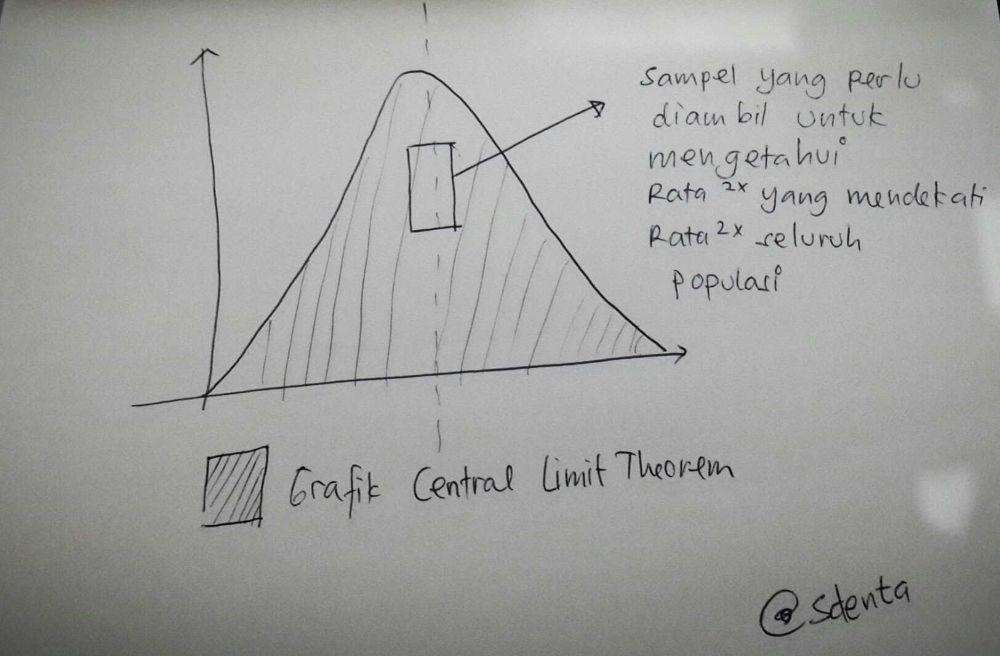

\[caption id="attachment\_877" align="aligncenter" width="450"\] source. lasallefood.com\[/caption\]

Waktu kita belajar ilmu pasti atau sosial saat sekolah dulu, seringnya kita tidak ikut memahami atau mencari tau tentang bagaimana aplikasi pada saat kehidupan nanti. Padahal banyak hal dalam hidup ini bisa kita pahami dengan sederhana jika kita tidak meninggalkan pengertian dasar atas bagaimana alam semesta dan segala isinya ini bekerja.

Taruh lah tentang quick count / hitung cepat, metode ilmiah yang sudah sejak pertengahan 80an dipakai oleh beberapa negara demokrasi untuk mengetahui dengan cepat hasil dari pemilihan umum yang dilakukan sebelumnya. Hitung cepat ini pastinya berbeda dengan survey politik yang diadakan sebelum pemilu, karena survey politik mengambil data dari preferensi pemilih yang bisa saja berbeda dengan yang mereka coblos di balik bilik pemilihan. Hitung cepat, sebaliknya, mengambil data dari tabulasi hasil pemilihan yang sudah dilakukan di TPS-TPS yang dijadikan sampel, dimana tentu saja basis data tersebut sudah tidak bisa dirubah lagi.

> Mas tau artinya sampel gak? sampel kan berarti cuman seiprit.. berarti kan bukan gambaran keseluruhan dari rakyat Indonesia.. Berani-beraninya bilang kalo hasil hitung cepat itu menggambarkan hasil dari pemilihan umum... cih...

Kebetulan saya bekerja di dunia dimana obat-obatan diciptakan, diproduksi, dan didistribusikan. Untuk mencari tau apakah sebuah obat itu berfungsi dan aman tentu kita akan melakukan sebuah uji klinis, dimana orang-orang yang dijadikan subyek penelitian tersebut tidak mencakup seluruh manusia yang ada di muka bumi, dengan kata lain hanya mengambil sampel-nya saja. Walaupun data studi hanya diambil dari sampel, jika obat-obatan tersebut terbukti manjur dan aman pada sampel, kita tetap yakin bahwa obat itu memang secara bukti yang ada manjur dan aman. FDA di Amerika, EMA di Eropa dan BPOM di Indonesia juga akan mengeluarkan izin edar, walaupun obat-obatan tersebut hanya diujikan pada sampel semata.

Kenapa begitu? ya disinilah indahnya ilmu pengetahuan. Kita tidak perlu memeriksa seluruh populasi jika ingin mengetahui karakteristik atau hasil yang terjadi setelah sebuah intervensi dilakukan pada populasi tersebut. Sama seperti ketika lebaran, saat tamu-tamu datang lalu ibunda menyuruh kita membuat es sirup. Untuk mengetahui apakah sirup itu cukup manis atau tidak, apa yang teman-teman lakukan? Tepat sekali.... Hanya cukup dengan mencicipi sesendok kecil saja, alias sampel, kita sudah bisa tau apakah es sirup itu cukup manis apa tidak. Bayangkan jika kita harus menghabiskan seluruh populasi sirup di gelas tersebut hanya untuk mengetahui kadar kemanisannya, berapa lama waktu yang harus dihabiskan tamu kita untuk untuk menunggu es sirupnya datang agar bisa bergegas mencicipi hidangan lain di tetangga sebelah.

Hal yang sama juga terjadi pada populasi. Mari mengingat kembali masa-masa kelam saat kita mengerjakan skripsi dulu dan harus berhadapan dengan ilmu kampret bernama Statistika. Untuk mencari tau outcome dari intervensi yang kita lakukan, kita hanya perlu mengobservasi dari sampel yang kita ambil. Dua teori yang mendukung kenapa hanya dengan mengambil sampel yang tepat kita sudah dapat memprediksi karakteristik populasi (sama seperti karakteristik es sirup kita tadi) adalah Central Limit Theorem dan Law of Large Number. (buat yang niat belajar, bisa liat video cakep soal CLT [disini](https://www.khanacademy.org/math/probability/statistics-inferential/sampling_distribution/v/central-limit-theorem), dan LoLN [disini](https://www.khanacademy.org/math/probability/random-variables-topic/expected-value/v/law-of-large-numbers?k&playlist=Statistics)).

Pada Central Limit Theorem, kita belajar bahwa semua rata-rata dari sampel yang kita ambil, akan selalu mengarah ke distribusi normal, lalu dengan bangganya Law of Large Number menyatakan, jika kita ingin mengetahui atau memprediksi apa yang terjadi pada populasi, kita hanya perlu mencuplik angka-angka yang terdapat pada distribusi normal seperti yang dinyatakan oleh Central Limit Theorem.

Jelas sekali, metode pengambilan sampel adalah kunci sahih tidaknya observasi yang kita ambil untuk menggambarkan karakteristik populasi. Sama seperti ketika kita mencicipi sirup buatan kita, jika kita mencicipi sesendok sampel saat kita belum mengaduk sirup, kita pasti hanya akan mendapatkan bahwa es sirup kita terlalu manis (karena kita ambil sampel di dasar gelas), atau terlalu hambar (sampel diambil diatas permukaan). Yang lalu kita lakukan adalah mengaduk air dan sirup yang ada dalam gelas hingga mencapai distribusi normal. Sampel yang lalu kita cicipi tersebut adalah sampel tersahih untuk mengetahui gambaran rasa dari seluruh populasi es sirup kita. Kita pun bisa dengan cepat bisa menghidangkan sirup tersebut ke tamu, tanpa harus menuggu keputusan KPU tanggal 22 Juli.. hehehe..

Dengan metode pengambilan sampel yang tepat, kita juga bisa mengetahui gambaran hasil pemilu di populasi pemilih Indonesia. Itulah kenapa selama sejarah penggunaan metode hitung cepat di Indonesia, bisa dikatakan hampir semua hasilnya, ajaib, bisa mirip banget dengan hasil yang diputuskan KPU.

> Lalu fungsi hitung cepat itu sendiri apa? kalo memang bisa tau hasil pemilu, ngapain kita susah-susah rekapitulasi, tabulasi, bla bla di KPU? ngapain mesti mahal-mahal bikin pemilu kalo dengan quikon aja ente sudah tau hasilnya?

Sabar mas, jangan emosi dulu.. Hitung cepat memang bukan diniatkan untuk menggantikan hitung-hitungan dari KPU. Sejatinya hitung cepat adalah sebuah proses ilmiah yang digunakan sebagai pembanding dari hasil akhir penghitungan KPU. Jadi, jika ada hasil hitung cepat yang telah memenuhi kaedah ilmiah ternyata berbeda dengan hasil akhir pemilu, berarti kita harus siap-siap dengan kemungkinan bahwa ada yang tidak beres dengan proses pemilu kita.

Hal yang sama juga akan kita rasakan ketika kita yakin telah mencicipi sirup yang telah disajikan dengan kaedah ilmiah yang tepat dengan hasil kemanisan yang presisi, ternyata saat kita sajikan. Si tamu malah dengan emosi bilang......

> EXCUSE ME, EXCUSE ME, WHY IS IT SO SALTY??

Salam 22 Juli...:-)

_Disclaimer : Saya bukan ahli di ilmu statistika atau metode penelitian, hanya mencoba memahami dengan ilmu sangat dasar sekali yang saya miliki. Jadi kalau ada yang kurang tepat dari paparan yang saya gambarkan, mohon sekali saya diperbaiki._
