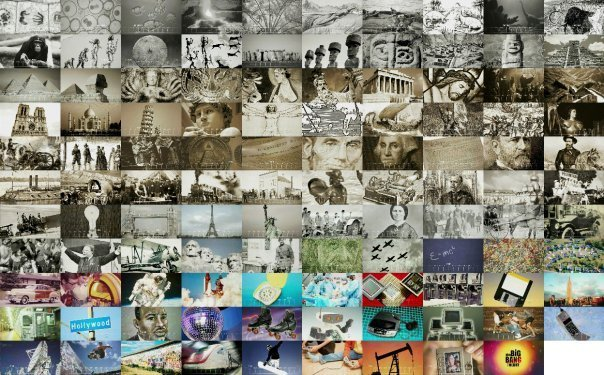

\[caption id="attachment\_880" align="aligncenter" width="450"\] TBBT opening collage\[/caption\]

Sebagai orang yang besar dengan televisi, komputer, telepon, dan kenyamanan peradaban modern lainnya, aku tidak akan pernah berhenti bersyukur atas apa yang nenek moyang kita lakukan sehingga kita bisa mencapai peradaban dimana bangun siang di akhir pekan menikmati magisnya alunan gitar Woodie Guthry adalah legal dan sah di mata peradaban umat manusia.

Terima kasih pertama akan aku ucapkan untuk nenek moyangku yang berhasil melompati evolusi dan menjadi primata unggulan dengan menemukan (baik sengaja maupun tidak) cara untuk mengendalikan api. Masa itu pasti adalah masa-masa sulit buat primata bernama Homo Erectus (iya, nenek moyang kita), yang harus berkompetisi dengan primata lainnya di muka bumi ini. Masa itu mungkin ya, adalah masa dimana semua primata hidup sejajar, yes, Dawn of The Planet of The Apes itu pernah kejadian somewhere in ratusan ribu tahun lalu (tentunya dengan versi yang lebih sederhana, bukan versi dimana kera bisa naek kuda berfilosofi dan berperang dengan homo erectus no,, they were not that cool).

Jika saja nenek moyang kita tidak menemukan cara untuk mengendalikan api, dan menemukan teknik untuk mengolah makanan (grilled baby grilleeed...) yang menjadikan makanan lebih mudah dicerna sehingga ada surprlus kalori yang cukup untuk akhirnya dengan elegan digunakan oleh tubuh untuk mengembangkan yes, otak, kita mungkin akan kalah dengan primata lainnya dalam kompetisi evolusi ini, mereka bisa jadi primata yang pake dasi naek sepeda ke tempat kerja, dan kita adalah primata yang dikurung minta pisang sambil bergelantungan kesana kemari.

Well but evolution is a really freaking demanding process. Ternyata api saja dan otak yang berkembang, rahang yang lebih kecil, tubuh yang lebih efisien (thanks to cooked food) tidak cukup membuat kita bisa jadi spesies juara di muka bumi ini.

Bagaimana mau jadi juara, jika dari 24 jam waktu yang disediakan. Manusia saat itu harus menghabiskan kira-kira 20 jam sendiri untuk bereproduksi, kidding haha that would be awesome, 20 jam itu habis hanya untuk berjalan puluhan kilometer berburu dan mengumpulkan makanan. Jadi lama nyari parkir dan antri sejam buat makan sushi itu nothing teman-teman dibanding perjuangan leluhur kita dulu.

But thanks to a more and well developed brain, leluhur kita akhirnya lelah menghabiskan hidupnya untuk bekerja mencari makan, dan akhirnya kepikiran untuk membuat revolusi... Revolusi mental, kidding again. Terima kasih kedua harus diucapkan sebesar-besarnya untuk revolusi pertanian

Revolusi Pertanian adalah momentum awal perjuangan manusia hingga kita bisa sampai pada masa dimana kita bisa makan nasi rendang ikan tongkol dendeng balado (gulp! nyam) tanpa harus menghabiskan berjam-jam berburu hewan memancing ikan mengumpulkan beras dan biji-bijian membuat api dan memasaknya di dalam gua. Cuman perlu nyebrang ke restoran padang di depan and voila!

Dimulai dari 12 milenium yang lalu, manusia akhirnya merasa bahwa itu saatnya untuk settled dalam hidup dan berhenti bermain-main. Banyak hipotesis yang menjelaskan dimana revolusi itu bermula dan mengapa. Tapi yang jelas revolusi pertanian adalah masa dimana orang-orang sudah tidak lagi berburu dan mengumpulkan makanan dan beralih ke menjinakkan ternak dan mengumpulkan benih untuk bercocok tanam.

Hasilnya memang revolusioner! untuk pertama kalinya dalam sejarah evolusi, manusia bisa mendapatkan makanan tanpa harus berpindah-pindah tempat tinggal. Manusia akhirnya bisa merasakan nikmatnya surplus makanan, sehingga tidak perlu lagi menghabiskan sebagian besar harinya untuk mencari makanan. Itu berarti ada surplus waktu, yang akhirnya digunakan untuk bereproduksi (nah ini baru bener), populasi pun berkembang pesat. Tapi ternyata sudah bereproduksi berkali-kali pun masih ada sisa waktu (of course, nenek moyang kita gak sejantan itu juga kali), mau mencari makanan, lha gak semua orang perlu mencari makanan, hanya butuh sekelompok orang mulia bernama petani untuk memenuhi hajat perut orang banyak. Jadi surplus waktu dan tenaga manusia waktu itu memang akhirnya menjadi sangat berlimpah. Dari surplus itulah kita jadi punya waktu dan energi untuk mengembangkan apa yang kita agung-agungkan selama ini.... Peradaban Manusia.

Yak betul, peradaban Yunani, Mesir, Mesopotamia Babilonia, Sungai Nil, Kerajaan Roman, Mongolian, Persia, Kutai, Samudra Pasai, Majapahit, Piramid, Sphynx, Taman Gantung, Borobudur, Code of Hammurabi, Kama Sutra, Eiffel Tower, Monas, 50 Shades of Grey, Internet, MiRC, Friendster, Facebook, Path, Ipod Instagram dan jutaan hasil karya manusia yang baik maupun buruk, semua tidak akan terjadi tanpa dimulai dari revolusi pertanian.

Surplus makanan dan energi hasil dari revolusi pertanian pula yang membuat tidak semua manusia harus bertugas mencari makanan. Membuat manusia akhirnya mengembangkan tugas lain dalam masyarakat, biar gak dibilang magabut mungkin. Sejak itulah lahir mulai dari petani, tukang batu, filsuf, petualang, pendeta, hingga penyanyi rock, astronot, dokter, caleg, presiden, dll dll. Jika bukan karena itu, kita tidak akan pernah bisa mendapati profesi-profesi unik macam social media buzzer atau bahkan wine tasting expert (yes, there’s such job).

Had our ancestor stayed firm to be hunterer and gatherer, I would never have had the luxury of weekend opening my macintosh checking hilariously nerve wrecking video on youtube while updating my blog. Yang jelas sih, I wouldn’t survive long as hunterer and gatherer, lah antri sushi aja males, gimana bisa 20 jam habis cari makanan doang.

_**Thank you my beloved ancestors, thank you for the really lovely weekend..**_
