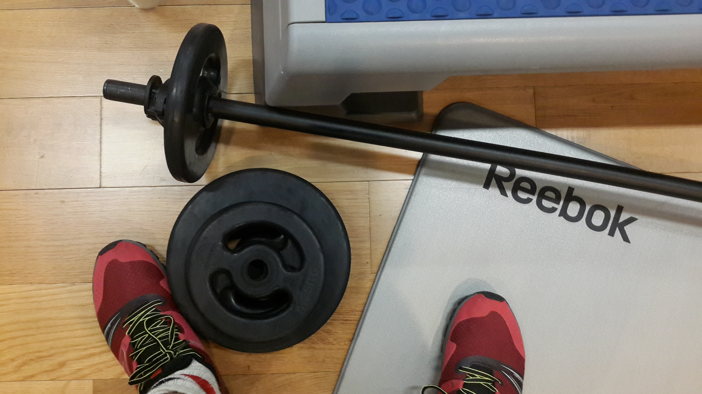

Setahun belakangan ini, setelah menyadari bahwa tidak ada olahraga lain yang paling fleksibel, efektif, dan efisien untuk dilakukan di ibukota selain, yes, lari. Aku kembali lagi dengan sepatu lari lamaku, membeli sepasang sepatu baru, beberapa celana lari, dan tentu saja, sebuah garmin yang cukup handal untuk mencatat seberapa jauh progres lari setiap minggunya plus, biar bisa dishare ke orang-orang atas nama motivasi diri dan sekedar penambah eksistensi. Cukup? ternyata masih kurang, setelah mulai lari lagi aku baru menyadari bahwa endorphin yang dihasilkan setelah lari akan menuntut lebih dari sekedar 6 kilo lari setiap harinya, dan here I am, sudah ikut race pertamaku di Gianyar beberapa minggu yang lalu dan sudah mendaftar untuk race di beberapa acara marathon kedepan, bukan untuk ikutan kompetisinya, hanya untuk menikmati sensasi sekedar finish yang susah untuk digambarkan jika tidak dirasakan sendiri oleh masing-masing orang. Lagipula, siapa yang bisa mengalahkan para elit yang oh my God super freaking nonsensely fast dari Afrika itu.

Seperti segala sesuatu yang ada di bumi ini, lari juga ada ilmunya, atas dasar keinginan untuk lari yang benar dan tepat agar waktu dan uang yang dikeluarkan tidak sia-sia, beberapa porsi dari waktuku aku habiskan untuk belajar bagaimana sesuatu sesederhana mengayunkan kaki dan tangan secepat mungkin seperti lari bisa dilakukan seefektif dan seefisien mungkin.

Aku mulai dengan mempelajari bahasanya. Everything has its own lingo, included running. Lihat saja di jam lari yang ada di pasaran, di dalamnya tercantum banyak sekali istilah yang kalo kita salah mengerti, bisa salah juga latihan kita.

_Pace_ misalnya, ada yang dihitung per mil, atau per km. _Pace_ adalah waktu yang dibutuhkan pelari untuk mencapai 1 km atau 1 mil.  5' pace (km) berarti untuk menempuh 1 km, pelari tersebut membutuhkan 5 menit waktu untuk berlari. _Pace_ ini penting terutama saat race berlangsung, strategi kita sampai finish sedikit banyak dipengaruhi oleh _pace_ yang kita tentukan. Cara menghitung _pace?_ di google banyak kalkulatornya, sederhananya hitung saja total waktu yang kamu butuhkan pada satu kali lari, dibagi dengan jarak tempuhnya, misalnya kamu butuh 60 menit waktu untuk 10 km, berarti _pace_ rata-ratamu adalah 6'pace (km). Paling gampang yang kalo jam kita punya fitur hitung _pace juga_ , trust me it's truly functional.. _Pace_ juga bisa digunakan untuk menyebutkan rata-rata _pace_ kita sesuai tipe race yang kita ikuti, jadi jangan heran kalo ada yang tanya, "berapa target pace marathon di jakarta lo cuy?"..

Tipe sesi latihan lari juga punya istilahnya masing-masing, _easy run -->_ sesuai istilahnya, ini adalah lari-lari lucu, sesi yang dilakukan agar otot-otot kita tetap terbiasa dengan namanya lari. Dibilang _easy run_ kalo kita bisa lari dengan _conversational pace,_ alias bisa ngobrol sambil lari, jadi kalo kita lari tapi nyanyi balonku ada lima aja kesulitan, ya itu bukan _easy run._ 

Ada juga _tempo run,_ sesi lari dimana 2o menit dihabiskan untuk lari dalam batas maksimal _pace_ kita, dimulai dan diakhiri dengan pemanasan dan pendinginan tentunya. Sesi ini sesi lari untuk memperbaiki kecepatan lari kita dan untuk itu ini bukan sesi dengan tingkat kesulitan rendah, makanya hanya dilakukan seminggu sekali.

Sedangkan pada sesi _interval,_ lari dilakukan pada intensitas tinggi dan rendah dilakukan selang-seling untuk membangun kekuatan lari yang lebih dan membakar lebih banyak kalori.  Mirip dengan _interval,_ ada juga sesi _fartlek,_ dimana sebuah sesi _easy_ _run_ yang panjang, diselingi beberapa sesi sprint aka lari cepat. (fartlek is Swedish for speed play).

Selalu ada pertanyaan, apakah untuk bisa finish marathon  berarti kita harus lari setiap hari. Ternyata tidak, di kalender latihan kita, tetap harus ada _rest day_ paling gak sekali dalam satu minggu, dan sesi latihan non-lari lainnya tentu saja. Karena lari tidak hanya soal otot paha, betis, dan ankle yang kuat. Tapi juga soal sumbu tubuh yang kokoh, otot dada dan perut yang mantep, dan punggung yang perkasa, untuk itu setiap pelari harus mendedikasikan waktu latihannya untuk sesi _strengh training (_angkat beban misalnya_)_ ataupun _cross-training (latihan apapun selain lari),_ my favourite? tetap sesi body pump dan RPM di klub kebugaraan dekat kantor, gak perlu waktu banyak, dan masih bisa kena tujuan latihannya. Atau kalo tidak sempat ya fitness club di hotel manapun itu aku sedang berada, 30-40 menit sesi _strength training_ 2x seminggu harusnya cukup.

Trus istilah-istilah yang ada di gadget lari itu apa aja artinya? well, _cadence_ itu jumlah langkah per menit saat lari, bpm itu _beat per minute_ (clear enough), zone (1/2/3/4) itu zonasi detak jantung kita, untuk tau fungsi kardio, biasanya berfungsi untuk mengatur regimen latihan, misalnya lari pada zona 2 20 menit, lanjut zona 4 10 menit, dst dst. VO2 Max itu untuk tau kapasitas aerobik kita, alias jumlah maksimum oksigen yang bisa diambi sel tubuh, semakin tinggi semakin bagus.

Lalu apa pula itu _carbo-loading._. Itu adalah ritual para half dan full marathoners beberapa hari sebelum race untuk mengisi tubuh dengan sebanyak mungkin karbohidrat (from any sources you could think of, nasi pasta bagel ketupat dll) yang bisa disimpan dalam bentuk glikogen, yep glikogen adalah sumber utama energi saat kita lari jauh, semacam bekal untuk lari jauh lah, jika glikogennya kurang, tubuh akan mengambil sumber energi dari lemak, which is not good not good at all karena waktu untuk metabolisme energi dari lemak itu lebih lama sehingga waktu lari kita pun akan melambat semakin melambat dan akhirnya \*dang!\* _hitting the wall (aka gak  bisa lari lebih jauh lagi, hence the term_).

Kayaknya masih banyak lagi term lari yang ada di luaran sana tapi harusnya untuk beberapa term sudah cukup self explanatory (5k, 10k, 21k misalnya), bip untuk nomer race yang ditempel pada dada, atau chip time, waktu race yang diketahui dari chip yang dipasang dalam bip. Gak perlu tau semua istilah lari gak papa, yang penting ya larinya itu sendiri, mau newbie, marathoner, ultra marathoner, tri athlete, atau elite, lari adalah bahasa yang menyatukan kita, sejauh apapun kita lari dan secepat apapun tidak jadi masalah, yang jadi masalah tinggal mau, apa tidak mau.. And if you have achieved runner's high (the endorphin overloaded feeling after running) even only once, gak bakal ada alasan lagi untuk tidak mau lari lebih jauh dan lebih lama lagi.

HUP HUP!!
