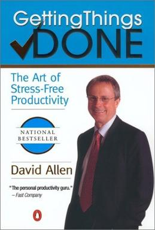

7 tahun yang lalu di sebuah pertemuan mahasiswa kedokteran di Canterbury, sekitar 1 jam perjalanan kereta dari London, aku mengikuti training manajemen waktu paling dahsyat yang pernah aku dapatkan seumur hidupku menjadi mahasiswa, training berbentuk workshop itu diadaptasi dari metode “Getting Things Done”-nya David Allen, buat para antusias dalam dunia produktivitas dan semacamnya, aku yakin GTD-nya David ini sudah cukup familiar atau minimal sudah pernah dengar sebelumnnya.

Prinsip GTD sendiri sederhana, kita diajarkan mengikuti sebuah alur untuk memproses semua yang kita dapatkan pada suatu waktu tertentu, dan mengalokasikan hal tersebut pada suatu waktu atau klasifikasi tertentu, disimpan atau dibuang sama sekali. GTD memastikan segala sesuatu yang kita temui setiap hari, tidak terlewat untuk dikerjakan, dan semua waktu yang kita miliki bisa dioptimalkan untuk mengerjakan tugas sesuai dengan yang kita alokasikan sebelumnya.

Metode GTD ini luar biasa, berhari-hari setelah training tersebut masih aku habiskan dengan mengagumi proses yang luar biasa cerdas itu, GTD mengajarkan kita untuk fokus pada manajemen alur tugas kita, tidak fokus pada variabel waktu, karena waktu tidak bisa dirubah, hanya 24 jam setiap harinya, kecuali kalo kamu memutuskan untuk tinggal di merkurius, there you go with 1407 jam dalam sehari, tempat yang cocok untuk mereka yang merasa 24 jam masih kurang dalam satu hari untuk mengerjakan semua tugas yang ada. Aku pun membeli buku David Allen, mempelajari hingga detail metode yang diajarkan, membeli folder, buku catatan, map, semua tetek bengek stasioneri yang dibutuhkan untuk klasifikasi tugas dan waktu mengerjakannya. Sampai ke Indonesia, aku pun menjadi duta GTD dimana setiap kali training manajemen waktu, GTD tersebutlah yang aku ajarkan, kemana-mana sampai harus bawa folder besar untuk memberikan contoh penerapan GTD yang baik.

Sekarang? Well, setelah masuk ke dunia kerja yang ritmenya serba cepat dengan tugas hilir mudik tak tentu arah, email masuk dengan jumlah dan kecepatan yang hampir setara dengan email spam pembesaran alat vital dan tawaran warisan pangeran dari afrika di email pribadi, aku merasa sangat sulit untuk terus  bisa keep up dengan sistem GTD ini, bagaimana bisa mengklasifikasikan tugas pada folder tertentu jika waktu yang ada saja sudah habis untuk membalas email, mempersiapkan presentasi, laporan, review dan approval dokumen, meeting, traveling, dll dll. Sangat janggal jika kita menghabiskan waktu lebih banyak untuk mengatur tugas harian kita daripada mengerjakan tugas itu sendiri.

Masalahnya adalah, menjadi efisien dan efektif dalam bekerja itu bukanlah sebuah pilihan, tapi kewajiban yang melekat pada setiap pekerja, setiap manusia. Jadi tidak ada kata lain selain menjadi produktif jika tidak ingin tergilas dengan kejamnya jaman, halah.

Karena saat ini aku bekerja di dunia industri, dimana bisnis adalah kendaraannya, memberikan dan mendapatkan value adalah tujuannya, semakin produktif, efektif dan efisien bisnis yang dijalankan, semakin banyak value yang diberikan dan didapatkan, simpel. Dalam dunia ini, aku mau tidak mau harus belajar tentang _value delivery_, sebuah proses yang memastikan bahwa value yang ditawarkan oleh perusahaan bisa sampai ke tangan pelanggan dengan tepat dan sesuai dengan ekspektasi awalnya. _Value delivery_ dimulai dari bagaimana value itu dibuat, disimpan, dipasarkan, dijual dan diantarkan sampai ke tangan pelanggan.

Dari situ aku belajar, bahwa ternyata bukan hanya bisnis yang butuh _value delivery_ yang mumpuni, kita sebagai manusia juga harus punya sistem dimana kita bisa memberikan sebanyak-banyaknya dan sebaik-baiknya nilai ke dunia ini, dan mendapatkan nilai yang setara atas apa yang kita berikan tersebut. Bukankah itu cara menghabiskan hari yang paling sempurna, saling bertukar nilai yang baik dengan dunia.

Inti dari _value delivery_ ada pada input, proses, dan output (IPO). Sama seperti yang diajarkan pada metode GTD, yang diajarkan oleh Hendry Ford dengan proses manufaktur ciptaannya yang melegenda sampai sekarang, kita harus punya flow yang jelas dan terarah untuk _value delivery_ versi kita sendiri. Sebuah flow, atau kalo dalam istilah pabrik disebut _production line_, tersebut harus bisa memproses segala input yang kita temui, menjadi value yang nyata pada pekerjaan kita, agar bisa efektif dan efisien, flow tersebut harus bisa sinkron dengan ritme hidup kita, termasuk sinkron dengan ritme biologis kita sehari-hari.

Input adalah sesuatu yang kita dapatkan setiap hari, bisa email, tugas dari atasan, kupon makanan, bon, sms dari pasangan, struk belanja, proposal, ide baik yang tampak berguna atau acak, semua input harus kita proses dalam sebuah sistem yang sudah kita set sebelumnya, misalnya setiap ada email apa yang harus kita lakukan, setiap ada ide, akan kita catat dimana, setiap dapat surat tagihan, apa yang harus kita lakukan, dll, dst. Jadi dalam sistem produktivitas kita, ada templat untuk memproses email, memproses ide, memproses surat, memproses perintah atasan, dll, dst. Proses yang sudah kita siapkan untuk masing-masing input berujung pada sebuah output yang tangible. Bagaimana kita tau output tersebut sudah tangible apa belum? Pake, ehm, rasa.. Jika kita merasa plong dengan apa yang sudah kita lakukan dari input sebelumnya, entah kita balas email, buat ceklis, centang ceklis, menyimpan dokumen, membuang dokumen, apapun itu jika kita merasa plong setelahnya, berarti input yang ada sudah kita proses dengan baik.

Apa pentingnya mindset Input, Proses, Output (IPO) ini? IPO ini adalah cara kita untuk membuat otak kita terbiasa dengan protokol untuk mengerjakan masing-masing input, ketika otak kita sudah terbiasa, otak akan mengalokasikan sebanyak mungkin porsi protokol tersebut pada sistem auto pilot, dengan auto pilot, kerja kita akan lebih efisien karena otak tidak perlu berpikir semuanya dari awal lagi setiap kali mengerjakan tugas yang sama, dengan kerja yang lebih efisien, kerja otak akan lebih fokus pada hal yang memang butuh pemikiran yang lebih dalam, kerja pun akan lebih efektif. Kenapa harus begitu? Karena memang begitulah cara kerja otak, menapis mana yang penting dan yang tidak penting, jika semuanya dianggap penting oleh otak, maka waktu dalam satu hari itu akan habis oleh sesuatu yang sebenarnya remeh, tapi dianggap sebagai sebuah hal antara hidup dan mati oleh otak kita.

Ambil contoh menyetir mobil, sebuah tugas yang luar biasa kompleks tapi oleh otak kita  dibuat menjadi sederhana karena sebagian besar dari protokol mengendarai mobil sudah diset autopilot oleh otak kita, bayangkan kalo setiap kali kita menyetir, kita harus mikir lagi bagaimana cara menghidupkan mobil, pedal mana yang harus kita pakai, bagaimana cara memasukkan gigi, belok kanan dan kiri. Habis sudah energi kita untuk mikir hal-hal yang  sederhana itu. Auto pilot otak ini yang membuat kita bisa lebih fokus pada hal-hal yang lebih menyangkut hidup dan mati saat mengendarai mobil, misalnya menjawab pertanyaan pacar, mau makan kemana kita malam ini?

Tulisan ini adalah contoh dari sebuah input, mau kamu proses jadi output seperti apa? Apapun, make it something with value… or not.. your choice. :-)

Have a nice Week.
