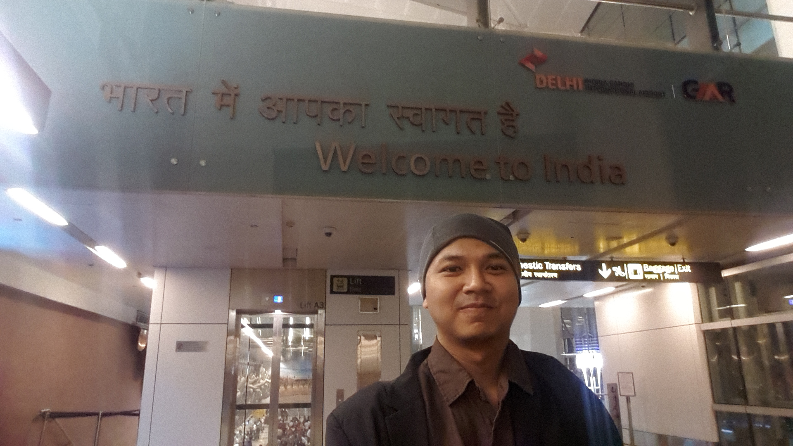

Jika ditanya area mana di muka bumi ini yang paling tidak ingin aku datangi, salah satu jawaban yang pasti akan keluar dari mulutku adalah, India. Bukan karena kumuhnya, bukan karena makanannya, atau parade tarian di antara tiang dan pepohonan itu.. lebih karena betapa penuhnya negara tersebut akan manusia, 1 milyar homo sapiens.. My mind just cannot comprehend that much of people in one single mega place.

Jadi ketika eks bos a.k.a one of the wisest man I ve ever known berkata. “You should go to Delhi, we have a meeting there”. Aku cuman bisa menjawab datar. “Umph. Ok sir...” \*damn it why Delhi\*

Singkat cerita berdiri lah aku di depan gate kedatangan bandara indira Gandhi dengan wajah penuh heran. Pertama, the airport is quite impressive, besar dan modern tidak seperti yang dikatakan seorang teman yg beberapa tahun sebelumnya datang ke india harus terjebak bersama sapi-sapi suci tepat sekeluarnya dia dari bandara. Kedua, aku berdiri terheran-heran tepat di depan sesosok pria berpakaian bak prajurit punjabi dengan seragam putih-putih berornamen ala Jodha Akbar plus turban besar berwarna biru tua. Agak gempal, berkumis putih tebal. Dia membawa papan putih bertuliskan "dr.Khur Nee Wawan"

Bapak tersebut turut heran aku memasang wajah heran. Aku heran apakah bapak ini yang akan membawaku ke hotel. nama yang tertulis di papannya memang bukan namaku walaupun jika diucapkan akan terdengar familiar meskipun janggal.

Kecanggungan pun pecah ketika si bapak prajurit punjabi membuka mulutnya berkata "dr. Khur nee wawan? GSK Indonesia?" \*for real, these people are bad at spelling\* aku mengangguk kecil masih terheran-heran. senyum lebar dan goyangan kepala dan leher yg seirama dengan  setiap suku kata yg keluar dari dirinya benar-benar memecahkan kedinginan ekspresi dia tadi saat menunggu tamu dari Indonesia ini. Alhamdulillah sekali kecanggungan itu tidak berakhir dengan seluruh orang di bandara menari-nari dengan aku dan si bapak berturban berkejaran di balik pilar bandara.

> ### Welcome to India sir! Let me bring your luggages for you..

\*Ranjiit!! Sumpah demi Tuhan bapak ini mirip Ranjit dari serial How I Met Your Motheeer.\*

Bandara yang megah itu ternyata memang baru saja selesai direnovasi, jalanan super lebar dan lengang langsung menyambut sekeluarnya aku di bandara, tanpa deretan sapi, tanpa deretan manusia tumpuk-menumpuk di tepi jalan. Sama seperti kota-kota metropolis lainnya di Asia, Delhi tampaknya sedang bersolek agar tampak lebih cantik. Hmm, this is actually not bad, kataku dalam hati sembari meminum air botolan dingin yang disediakan dalam mobil yang lumayan bisa menghilangkan dahaga setelah transit cukup lama di Bangkok. Kenapa ya gak ada direct flight dari Jakarta ke India, kurang banyak apa coba orang India di Jakarta.

Dan lalu kemudian, just like a summer fling that last only one, well, summer, impresiku terhadap Delhi langsung berubah drastis begitu doppleganger Ranjit ini membawaku keluar dari jalan tol masuk ke dalam jalanan sebenar-benarnya New Delhi. Gerbang tol yang barusan dilewati benar-benar seperti sebuah portal yang memisahkan antara dua dimensi yang berbeda, yang tadinya aku berada di jalanan mulus keluar dari bandara super modern dan deretan gedung berjejer rapi menyambut seketika berubah menjadi jalanan super padat dengan mobil, motor, bis kota setengah ringsek, auto (atau kalo di Jakarta terkenal dengan nama legendarisnya, Bajaj), penuh sepenuh-penuhnya. Tampaknya sedang ada perlombaan, klakson siapa yang paling keras. Pada satu titik aku merasa klakson di India itu berbeda dengan klakson di belahan bumi lainnya, di India, klakson tampaknya menempel menjadi satu dengan pedal gas yang berbunyi semakin sering dan kencang semakin pedal diinjak. Ditambah rumah-rumah kumuh dan deretan orang tumpuk-menumpuk bahkan ada yang tidur di tepi jalan, lengkap sudah. FYI, itu kira-kira jam 11 malam, bahkan imajinasi terliarku belum sampai bisa membayangkan seperti apa chaos-nya ketika jam pergi dan pulang kantor.

Orang bilang banyak sapi di India, betul. kumuh dimana-mana ramai orang tidur di pinggir jalan, betul juga. Kalo datang ke India siap-siap diare, tentu saja betul sekali. Diare adalah hal yang pertama kali menyambutku sesampainya di Hotel tempat aku menginap selama di Delhi, aku bahkan belum memakan apapun makanan di sana. Satu-satunya yang aku telan adalah air mineral di mobil si bapak sebelumnya. Air mineral saja sudah bisa bikin diare, atau memang itu air mineral khusus untuk peserta meeting mengingat tema meeting saat itu adalah mengenai, yep, diare.

Semua yang orang bilang tentang India, semua sterotipe India, generalisasi India.. adalah benar.. juga semua yang berlawanan dengan yang pernah orang bilang tentang india, juga benar. India adalah mega paradoks terbesar yang ada di planet ini. Sebuah mega paradoks yang memaksa otak kita berpikir keras untuk mencernanya, well kurang lebih sama susahnya dengan mencerna makanannya.

Tapi setelah 3 hari berada disana, aku sampai pada kesimpulan, kita harus belajar banyak dari India. Ini negara yang panjang sekali sejarahnya, Delhi sendiri saja katanya sudah berusia 5000 tahun, yep  , 5 milenium, berkali-kali dihancurkan dan dibangun kembali, masih bisa tegak berdiri sampai sekarang, sangat persisten. India mengajarkan bahwa hidup memang harus gigih. Seorang bapak penjual susu di tepi jalan yang akhirnya aku beli karena kelelahan setelah kehilangan arah jalan bercerita, anaknya juga dokter tapi sedang praktek di Amerika, dia cerita dengan gaya santai nir congkak, cerita basa-basi setelah aku menjawab pertanyaannya kerja apa aku di Indonesia. Seorang penjual susu dalam plastik bening di atas meja sederhana tanpa kios tanpa atap bisa menyekolahkan anaknya hingga jadi dokter di Amerika? Enough said then.

Cuman ya itu, jika ingin ke India dengan niatan jalan-jalan, pastikan sedang dalam kondisi full stamina. Banyak energi yang akan dibutuhkan untuk menikmati Incredible India, mulai dari flight dengan transit dari Indonesia yang cukup panjang, berdesak-desakan dalam bus atau metro, menanti kereta api antar kota yang harusnya diberi nama PHP-Train atas hobinya menggantung penumpang tanpa kepastian sampai ke petualangan kulinernya yang luar biasa, luar biasa bagi pencernaan kita. Satu tips kalo lagi ke Delhi, paling enak kemana-mana naik Auto (Bajaj), selain banyak bertebaran dimana-mana, kita bisa nawar walaupun sebenernya bajaj di Delhi itu pake argo, jangan takut nawar agak sadis, kalo gak cocok, bisa pindah ganti auto, kalo mau lebih murah lagi tinggal ke kantor polisi itu kita bisa pra bayar auto, tinggal pilih mau kemana, bayar, dapat slip, trus nanti slipnya dikasih ke mamang Auto-nya. Benar-benar Bajaj of the future, harusnya di Jakarta juga dibikin gitu (dear Pak Ahok).

Apakah sepadan energi yang dikeluarkan untuk jalan-jalan ke India? Sangat sepadan, aku sampai akhirnya merubah salah satu prinsip hidupku untuk jangan pergi ke India menjadi aku harus kembali ke India dalam waktu dekat karena sayangnya waktu itu level energiku sedang tidak optimal sehingga harus membatalkan perjalanan lanjutan menikmat Agra dan harus langsung kembali ke Indonesia.

### India I will be back! will be back for sure! Yahtzeee!!
