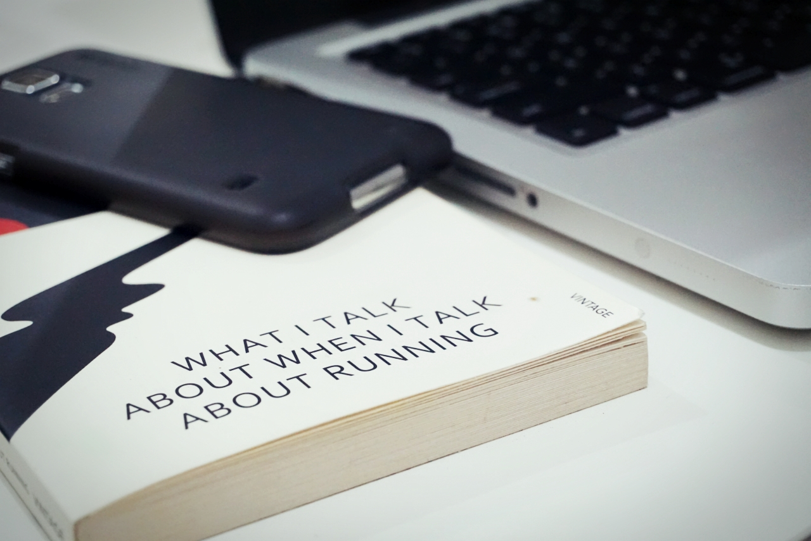

Yes, and no. Yes, you can get the highest university degree in this universe, but No, that does not mean you are already well educated. Yes, get a school is important, but No, it does not mean that you have to finish up until Ph.D. School is school, education is another thing. Those two do not always overlap. Whether you are in school or not, getting yourself educated is of paramount importance. Be curious, be a fool, everyone starts from a rookie, no one was born an expert. Be a foolish, satisfaction from the things you have already known will kill you. Look things up, scrutinize your surrounding, find out every little things in your life, google everything, seriously, google every single thing you could think of, extend deeper than everyone else. Being smart is not about getting ahead from others, it is about how you survive.

Watch movies, lot's of movie, go to cinema, deconstruct the movies, find every things that you have never known of, google it. Read books, plenty of books, go to library, bookstore, ask for books as gift from others. Being surrounded by book is one of the most magical things one could've had ever imagined of. Get lost in your books, pursue the references from the book, get another books, perplexed? just google it. Collect as many books as you can, even if you do not plan to read it straightaway. A library of mostly unread books is far more inspiring than a library of books already read, said Gabe Habash. Tell story, tell story to your spouse, to your friends, to your kids, to strangers on the bus. Oh, and listen to their story also. To share is to learn.

Don't worry about doing wrong, don't worry about not knowing the essence of what you are searching of, just search. You can always connect the dot later.

### _Don't be a fool, get a school._
