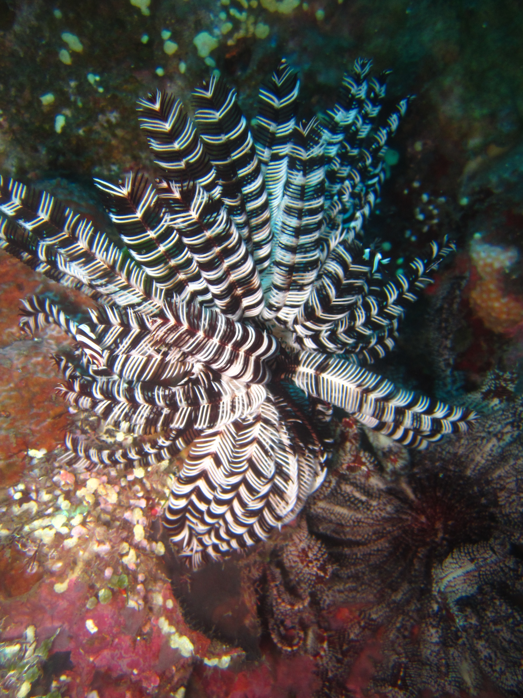

Pada sebuah Juni yang cerah pada tahun yang belum seberapa lama terlewati itu, sampai lah aku di Bali. Setelah memastikan bahwa semua agenda di Bali telah selesai, kuputuskan untuk melakukan satu hal yang sudah aku idam-idamkan sejak masih tinggal di Manado dulu. Mengambil Diving License, seriously, sebagai anak yang selalu bangga menyebut dirinya anak pantai yang tercermin dari tingkah laku dan warna kulitku, agak sedikit memalukan rasanya bahwa hingga beranjak dewasa, walaupun sudah beberapa kali mencoba discovery scuba, belum memiliki satu kartu berwarna putih berlabelkan PADI di dalam dompetnya.

Setelah pada waktu itu selalu bolak-balik Jakarta-Bali untuk urusan pekerjaan, aku akhirnya sadar bahwa Bali adalah pilihan yang masuk akal untuk mengambil lisensi menyelam. Aksesnya mudah, pilihan providernya banyak, dan sederet diving spot yang dengar-dengar sih, gak pernah gagal memanjakan mata para penyelam dari seluruh penjuru dunia. Tanya sana-sini, google kesana kemari, akhirnya aku memutuskan Tulamben, Tulamben menjadi tempatku mengambil lisensi selam. After a few calls and messages, finally got a good deal, dan berangkatlah aku ke Tulamben.

Karena satu dan lain sebab, aku terpaksa sendirian menuju Tulamben, menyetir mobil pinjaman, courtesy of Uke, thanks Uke, it was supposed to be an easy ride, walaupun belum pernah menyetir hingga ke utara bali sana, petunjuk yang diberikan cukup jelas, tinggal menyusuri bypass dari kuta hingga Ida Bagus Mantra, melewati tepi Gianyar, Padang Bay, Amlapura bla bla hingga voila, Tulamben! Tapi karena teringat aku harus ke Denpasar dulu untuk menyinggahi seorang teman, courtesy of Bije, thanks Bije, aku akhirnya harus mengandalkan google maps untuk mengarahkanku kembali ke jalan yang benar dari pusat kota Denpasar menuju Ida Bagus Mantra.

Sial tak dapat dihindari, tanpa disadari, Google Maps yang sudah merasa jauh lebih pintar dari orang asli Bali itu melakukan reroute otomatis yang tidak mengarahkan aku ke by pass lagi. Tapi, sigh, membuat aku melewati jalan raya Ubud, tidak ingin berdebat dengan Maps dan karena ingin cepat sampai, sudah pukul 11 malam waktu itu, aku ikuti saja apa maunya. Sampai akhirnya tanpa sadar aku melewati Kintamani, danau batur hingga, wait for it, Trunyan. If you checked on google maps, you would easily realize how ridiculous the route is. Sampai akhirnya aku sudah tidak bisa menyetir lagi karena satu-satunya jalan adalah menaiki jalanan rusak parah di perbukitan bersudut 45 derajat.

Di tepi jurang di perbukitan antah berantah, aku memutuskan untuk putar balik. Tapi karena itu jalan ada di tepi jurang dan mustahil untuk putar balik, dengan hati berbunga-bunga, bunga bangkai, aku harus menyetir mundur hingga kira-kira 3 kilometer menurunin bukit. Damn it Maps!

Jam 5 Pagi, sampai juga di Tulamben. Yep, gak salah baca, jam 5 pagi.. Perjalanan yang seharusnya paling lama 2 jam dari Kuta menuju Tulamben, harus aku tempuh dalam 8 jam! Thanks again, Google Maps!

Bli Suker sang Dive Master yang masih terkantuk-kantuk menyambutku di depan Sea Huahaha Dive Center, menyuruhku istirahat terlebih dahulu begitu mengetahui betapa panjangnya perjalananku untuk mencapai Tulamben. "Kita mulai kelasnya sebangunnya mas Denta saja..." Kata Bli Suker.. Yep, I was the only one, berasa privat.

Kelas dimulai di meja depan teras sekaligus restoran kecil punya Bli Suker di tepi jalan raya tulamben yang gersang. "Buoyancy adalah bla bla bla..." "Arus laut itu bla bla bla...." "Saat memasang regulator ke tangki dan BCD, pastikan bla bla..." mengambil lisensi selam memang harus dimulai dengan mempelajari teorinya terlebih dahulu. Setelah sekian lama ber-bla bla teori itu, 40 menit tepatnya, setelah menghela nafas cukup panjang diantara hisapan rokok yang entah sudah batang keberapa itu Bli Suker berkata.. "Sigh, teori memang membosankan, mari kita mulai nyemplung saja.. Orang macam mas Denta ini saya rasa mampu langsung open water..".... HELL YEAH Orang macam mas Denta, though I still didn't get it, maksudnya apa orang macam mas Denta.

Regulator terpasang, tangki aman, BCD oke, pemberat oke. Lalu berangkat lah kita berdua menyusuri jalan raya menuju pantai berbatu bekas limpahan material dari letusan gunung Agung beberapa dekade yang lampau itu, hence the name Tulamben = Batulamben = Batulambih = Banyak batu.

"Waduh, gede juga arusnya ya... Biasanya gak segede ini.." Kata bli Suker dipinggir dermaga kecil. "Tapi tenang, saya yakin ini gak masalah buat orang macam Mas Denta..."

WTF are you talking about, batinku.. but enough with orang-macam-mas-denta, daripada jiper langsung aja hajar, If it scares you, it might be a good thing to try, kata Seth Godin. Langsung kupasang BCD dan pemberat, mengambil sirip dan masker, off to the deep blue we go! It cannot be that hard, tinggal nyemplung aja. Well it was that hard. Harder than I expected it was supposed to be apparently.

Untuk beberapa waktu, aku terombang-ambing oleh gelombang yang cukup kuat padahal itu baru beberapa kaki dari bibir pantai. Melihat aku yang agak sedikit spaneng berusaha memasang sirip ke kaki bli Suker lalu menenangkanku, "santai aja, trust your BCD..." It worked, kunci dari menyelam memang gak boleh tegang atau panik, bagaimanapun kita tidak akan cukup kuat untuk melawan alam, jadi pasrah saja, tenang dan nikmati.

Sirip terpasang, masker terpasang, regulator aman, setelah mendapatkan aba-aba dari dive master, aku kempiskan BCD. Sejurus kemudian meluncur dengan mantap menuju laut biru yang dalam. Satu meter turun, equalize, dua meter, equalize, tiga meter, equalize, sampai akhirnya menyentuh meter ke-10 turun ke hamparan pasir di dasar lautan, area drop off. Bli Suker pun menurunkan semua ilmunya. Semua ilmu yang harusnya diajarkan di kolam diturunkan padaku di perairan terbuka. Belajar memperbaiki posisi masker, melepas dan memasang BCD di dasar laut, memakai regulator cadangan, etc etc sembari melihat segerombolan ikan kecil yang lalu lalang acuh tak acuh seolah sudah biasa dengan kehadiran penyelam. "ppppftt, Rookie.." kata salah satu ikan tersebut melihatku terbata-bata melapas BCD di bawah sana.

It was magical, dalamnya laut biru itu benar-benar menghipnotis hingga ke sela-sela otak yang paling dalam. It is completely a whole different set of universe deep down there. Seperti Superman, rasanya seperti Superman, melayang diantara metropolitan bawah laut tulamben, melayang bermanuver diantara ruangan di rongsokan US Liberty, melayang jungkir balik bak peter pan di taman koral, bercanda dengan ikan Kuwe, jika beruntung, ada stingray dan hiu yang juga menampakkan dirinya menyapa para penikmat dunia bawah laut. Sebuah keramaian yang tampak gaduh tapi sunyi, hanya ada suara nafas saut menyaut dan gelembung udara penanda realita.

Setelah 5 kali turun berpindah-pindah spot, puluhan gambar terambil, ratusan koral, plankton dan ikan menyapa, sampai juga aku pada kesimpulan, jika ingin mengambil lisensi selam, ambillah di Tulamben. Benar-benar tempat yang sempurna buat pemula. Dengan arus di dalam laut yang tidak begitu kuat, kedalaman yang oke dengan visibilitas cukup jernih, kegiatan perikanan yang tidak terlalu ramai, spot dan spesies yang beraneka ragam dalam area yang tidak terlalu luas membuat Tulamben untuk para pemula bisa dikatakan all-in-one package, paket kombo, paket hemat, happy meal, apapun itu.

Adalah sebuah kerugian yang sangat besar jika kita tinggal di Indonesia tapi tidak bisa menikmati alam lautnya yang luar biasa. Bali, Komodo, Wakatobi, Bunaken, Raja Ampat, Sabang, Takabonerate, and so forth and so on the list goes awesomely deep. Pengalaman membebaskan diri dari gravitasi, memasrahkan diri pada kemurahan hati arus laut, menyatu dengan sunyinya karang serta bisikan ikan adalah salah satu pengalaman spiritual paling menakjubkan yang pernah aku rasakan dengan seluruh panca inderaku.

### _Sink beneath the surface and you will be free. Immerse with the ocean so at the end you will come to realize that we are not a drop in the ocean, we are the entire ocean in a drop._
