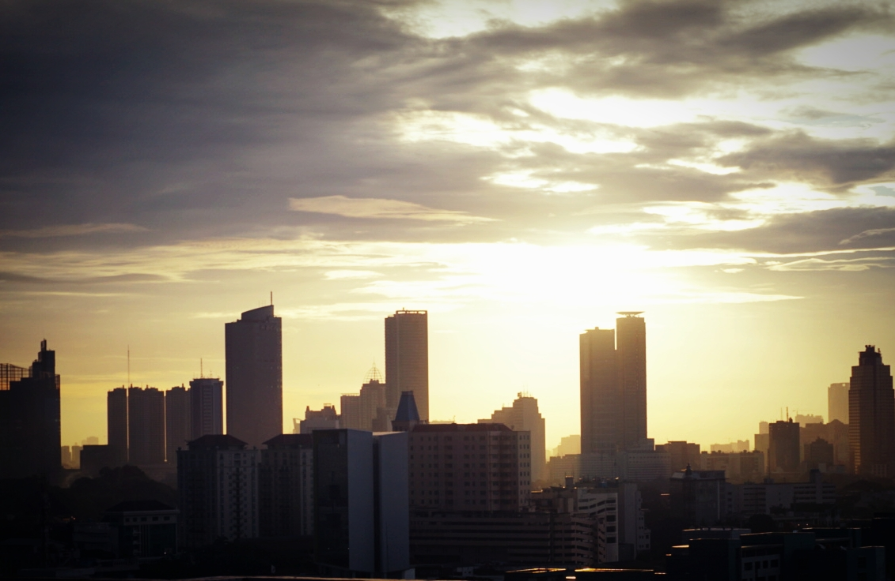

Semua indera dan syaraf serta perangkat otak kita diciptakan untuk bersosialisasi, berinteraksi dengan dunia diluar dunia sunyi kita sendiri. Manusia memang sejatinya adalah makhluk sosial, itu pasti.

Tapi manusia juga butuh waktunya sendiri, putus dengan dunia luar, membersihkan toksin dari jutaan stimulasi yang keluar masuk otak setiap menit setiap detiknya.

### Putus, Disconnected.

Ada masa ketika aku tidak akan melakukan apa-apa, memikirkan apa-apa selain bangun, menyeduh secangkir kopi pekat dan membawanya untuk diminum di atas atap. Melihat hamparan gedung dan rumah manusia selama yang aku mau, hanya turun untuk menambah secangkir kopi lagi atau membuat makanan seadanya, begitu seterusnya hingga siang berganti malam.

Memutuskan diri dari dunia luar. Membersihkan pikiran dan akal agar bisa digunakan dengan jernih lagi keesokan harinya.

### It feels great.

Di hari yang lain dengan tujuan yang sama, aku berjalan hingga stasiun terdekat, pergi entah kemana kereta komuter akan membawa, duduk di gerbong yang hanya berisi satu dua orang yang selalu menyapa dengan senyum klise penuh basa basi tapi tetap diam tanpa suara. Keluar di entah stasiun mana, menyusuri trotoar, mencari kedai untuk memesan seduhan kopi hitam terbaik mereka, keluar lagi, menyusuri jalanan lagi, mencari secangkir kopi lagi, begitu seterusnya hingga siang berganti malam.

### It is beautiful.

Merapikan kembali fokus pikiran dengan membuang pikiran sia-sia yang tidak diperlukan.

Diantara seduhan kopi dan putusnya aku dari rutinitas itu akhirnya dengan indah bisa kutemukan mana yang salah dari isi hidupku, aku mungkin belum tahu bagaimana memperbaikinya, tapi setidaknya aku tau mana yang harus menjadi fokus hariku setelahnya.

Dalam sunyi kita bisa mendengar dengan jelas, dalam sepi kita terbebas untuk melihat tanpa batas. Tanpa sekat kekhawatiran, tanpa halangan ketergesa-gesaan.

What's with the hurry? "Nature does not hurry, yet everything is accomplished", said Lao Tzu

Yang paling penting adalah kendali, kendali penuh akal kita atas hidup kita sendiri. Kendali yang hanya bisa didapatkan jika kita bisa memberikan cukup ruang akal untuk tidak hanya mencari jawaban, tetapi juga merangkai pertanyaan yang tepat. Hingga pada akhirnya ada cukup ruang bagi akal untuk mencari jalan keluar.

Terkadang memang tidak ada yang bisa menemani kita sebaik kesendirian. Kesendirian yang bisa jadi memberikan jauh lebih banyak daripada yang diberikan alam raya ini pada hidup. Walaupun kesendirian bisa saja membawa kita untuk bertemu dia yang paling asing dan paling kita takuti, yaitu diri kita sendiri, diri kita yang lain, diri kita yang asing.

### _What a lovely surprise to finally discover how unlonely being alone can be_

### _\- Ellen Burstyn-_
