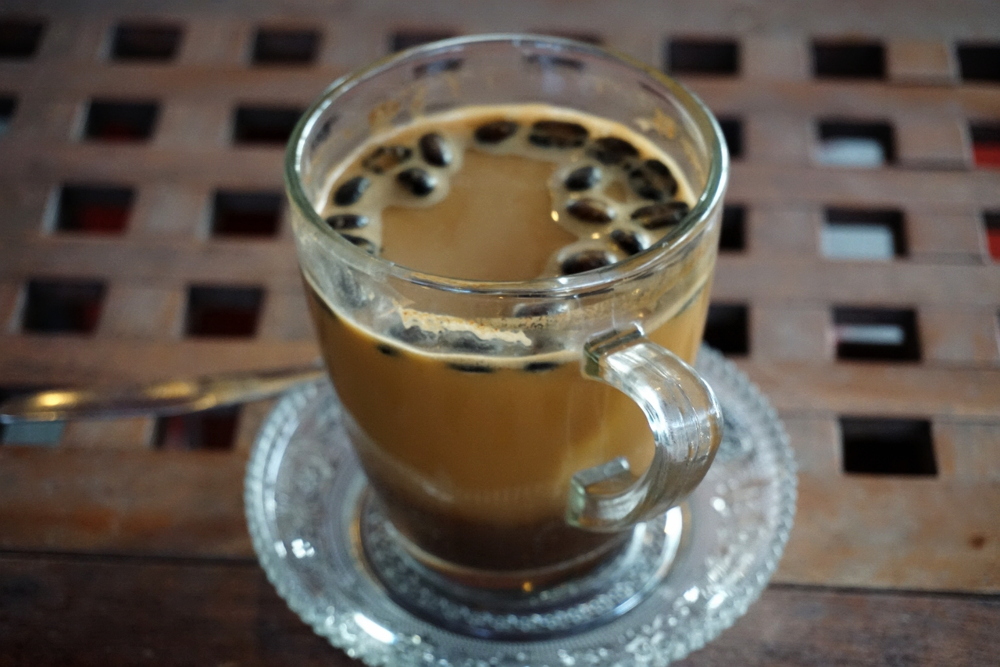

Just a short disclaimer before I continue with my blabbering piece about coffee. I am not a coffee savvy, not a coffee professional, not a coffee roaster, definitely not living the life among the crème de la crème of espresso artisan. If I had to define the relationship between me and coffee, I am no less no more than a coffee drinker. A casual regular guy who take a sip or two of black liquid extracted from so called magic beans that firstly came from Ethiopia. Medium roasted, no sugar, morning and afternoon, as  always.

I really appreciate how coffee influence my life, in the good or the bad, coffee don't do no judgment by the way. Coffee is an enabler, it enabled people in Mecca during the early time of coffeehouse establishment, to play, gossip, enjoying social and business life like never before, until of course the authority imposed a ban over coffeehouse for its involvement in political movement. It enabled Edward Lloyd to convert his coffeehouse into one of the largest insurance market in the world, Lloyd's of London. It also enabled the most spectacular coffeehouse conversion in the history of human being to happen, the conversion of coffeehouses in New York into NYSE and Bank of NY, or what the rest of the world is now known as Wall Street.

It enables me to start my humdrum life in ecstatic feeling like I am going to conquer the world that day. My brain, my brain recognizes the bold, pungent, earthy, sometimes fruity and a little acidic taste of coffee like it recognizes itself, as if coffee was once an essential part of the body, like blood, that run the brain before evolution started saying, "No, this black liquid cannot be an integral part of human body, it is too dangerous, too dubious, let's just stick with blood.."

I am as well amazed with how a simple cup of coffee comes out of a very delicate process, starting from planting and picking the beans, roasting, until the brewing. I was once spent the entire afternoon with coffeemaker who explained the importance of temperature and water type in coffee brewing, which I have already forgotten like the most of the explanation, it's too complicated. Coffee is complicated, just like life, maybe that's why I love it so much. It comes with a quirky resemblance of life.

One cannot simply ignore the grandiose, the magnificent influence of coffee in every day life. Neither can me. It brings sanity in my lunacy, brings color in my apathy, brings power in my fragility. Ah dear Coffee, I love you and I know you always love me back. Thank you for enabling me with your sweet angel taste of sin that smells like freshly ground of heaven.

### _If you forget how to love, just fall in coffee._
