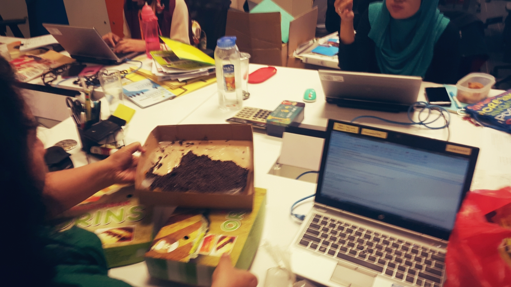

This afternoon at the office, between the usual rhythm of intertwining emails and meetings, projects and presentations, someone came with a special takeout to our new communal working stations. A chocolate sweet martabak that I believed fell straight from heaven as a proof that God's forgiveness does really exist.

It was strange though, my ego usually cannot trust chocolate sprinkle as an icing of a sweet martabak, my ego just cannot comprehend _hagelslag_ with of course a strong Dutch influence distracting my gustatory experience under martabak supremacy. But there was something different with this afternoon's sweet martabak. Like it was really its destiny to come straight to 35th floor of my office building right to our table as a reminder, a reminder of how I ended up there in the beginning.

I am always tempted and captivated with Martabak as long as I can remember, and one of the true reason why I can survive in Jakarta or why did I even think of moving to Jakarta at the first place was actually because this city, is really a capital city of Martabak. There are various genre in the universe of martabak, Jakarta does not only provide one genre, it provides martabak from every imaginable genre, from sweet to savory, medan to bangka, padang to pakistan, you can even find the contemporary genre like those martabak up north which are able to put almost everything as the topping of martabak, as long as it is still edible of course.

### And my love, always goes with sweet martabak.

If you are not familiar with sweet martabak, I will assume that you are not living in Indonesia or staying long enough to experience the sweet indulgence of an eggy batter cooked in buttered iron pan until it puffs up and tender enough to be folded or cut into half and sliced into small pieces with anything as topping from cheese, peanuts to nutella. Hence the name, martabak, comes from arabic, muttabaq, means folded.

Because sweet martabak is always special, unlike its savory counterparts, I believe we can only find sweet martabak in Indonesia. Yes there's crepe in Paris, Pannekoek in Amsterdam, Flapjack in Montreal, Palacinka in Balkan, Banana roti in Bangkok, etc but nothing of those peers of batter-esque cuisine come close to a hot and moist sweet martabak.

Once the batter is done on the iron cast, topping are on, cut and folded in half, closed up in a sandwich-ian manner, then the magic starts to happen. The heat will melt all the topping and butter into one single beauty of universe. The butter, the condensed milk, the cheese, the peanuts, or the chocolate will submerge through in between the spongy cake. Moist and tender in every bite, with a seductive drizzling of fat, sugar, and unforgiven mistakes. Plus a crisp outer that beat crunchiness in so many level. After all that only you will realize, that if love does exist, it will come in the form of sweet martabak.

This afternoon martabak hit my tongue so hard, every moment behind every bitten of martabak I swallowed all my life suddenly reconstructed behind my flashing eyes. Then my mind struck with realization that in almost every moment in my life, easy or hard, happy or sad, there's always a plate of sweet martabak on the table that brings compassion, forgiveness, love and happiness come to life.

### _I fell so hard in sweet martabak I don't know how to revive. And honestly, I don't want to._
