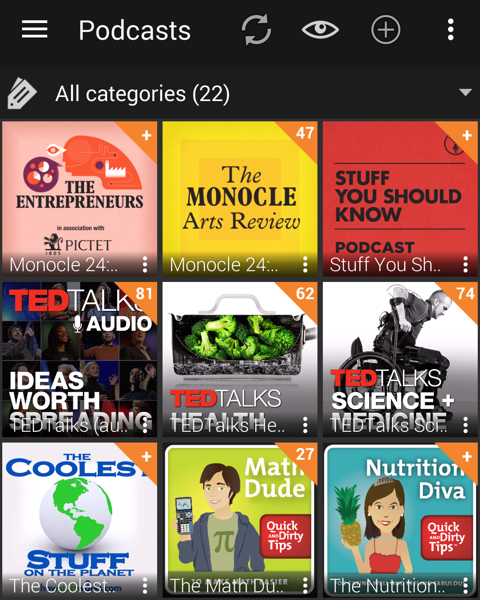

45 menit berangkat plus 1 jam pulang. 105 menit waktuku habis di jalan selama 5 hari dalam seminggu. Ditotal kira-kira 525 menit seminggu, 2100 menit sebulan, 25200 menit setahun. Setahun aku habiskan waktu setara 17 hari hanya untuk bergerak dari apartemen-kantor bolak-balik. 17 hari yang terbuang sia-sia. Walaupun terkadang aku merasa bersalah juga jika harus mengumpat kemacetan, karena tempat tinggalku relatif tidak begitu jauh sebenarnya dari Sudirman, hanya di proklamasi. Salut lah sama mereka yang tinggal di Bekasi, misalnya. Man, life is tough.

Tidak banyak pilihan ketika menghadapi kemacetan selain berserah diri kepada Tuhan Yang Maha Kuasa, macet memang tempat manusia belajar ikhlas dan ikhsan. Tapi seenggaknya kita bisa berikhtiar agar macet Jakarta ini lebih bisa membawa manfaat dari sekian banyak mudharatnya. Karena 17 hari itu waktu yang cukup banyak dan sayang jika harus terbuang percuma.

Jika ada orang bilang kita bisa mengisi waktu kemacetan dengan sesuatu yang produktif, orang itu pasti belum tau betapa tersiksanya mengecek email atau menulis ide ketika sedang berjuang menghalau gerombolan motor yang entah bagaimana dengan ajaibnya selalu muncul dari segala penjuru. Brain was not created to multitask, kayaknya belum banyak orang memahami hal itu seutuhnya. Apa yang dilakukan otak sehingga tampak seperti multitasking sebenarnya adalah memindahkan fokus antara satu pekerjaan dengan pekerjaan lain, sebuah mekanisme yang selain menguras banyak energi, juga tidak berguna. So stop multitasking.

Maenan hp apalagi, memang susah sih untuk menahan diri tidak melihat media sosial, atau membalas pesan-pesan (tampak) penting di grup whatsapp alumni SD. Tapi masalahnya adalah penggunaan HP sambil berkendara sudah terbukti berbahaya, beberapa penelitian di Inggris, Jerman, Amerika membuktikan bahwa konsentrasi berkendara menurun tajam ketika dibarengi dengan penggunaan HP. Stop maenan HP sambil berkendara, well it's easier said than done I know, apalagi buat orang-orang Jakarta pemegang rekor user twitter aktif se-Asia ini.

Mendengarkan radio atau musik akhirnya jadi pilihan paling logis dan sederhana. Tapi dengan acara radio yang itu-itu saja, serupa pula satu radio dengan yang lain, mau selucu apapun tetap saja ujung-ujungnya bosan juga. Awalnya mungkin joke garing, suara cempreng, ngerjain orang di telpon bisa jadi lucu, tapi kalo gitu-gitu terus ya pasti jenuh. Mendengarkan musik juga akhirnya kurang mempan buat orang seperti aku untuk berkelit dari brengseknya kemacetan ibukota.

Akhirnya aku kembali pada cara lawas di akhir 2000an dulu ketika masih harus menghadapi jaga malam nan panjang dan membosankan di Rumah Sakit. Aku kembali ke pangkuan podcast.

Podcast sebenarnya mirip dengan radio, tapi kita bisa milih kontennya sesuka hati dari jutaan episode yang beredar di luar sana. Agak sulit ya untuk bisa bosan mengingat betapa masivnya konten yang tersedia di itunes atau web feed lainnya. It's as simple as clicking on the podcast that we want to listen, and then wait for new episode to come. That's it. Plus sebagian besar dari konten podcast itu tidak berbayar, sama seperti radio, kita hanya perlu bersedia mendengarkan iklan saja diantara konten yang dibawakan.

Dan sekarang hari-hari macetku diisi dengan mendengarkan Sebastian Barry membacakan cerita pendek, atau menjadi hipster snob mendengarkan sederet review dari monocle, menyimak sejarah, ilmu pengetahuan dan bahkan politik dibawakan dengan begitu pelik tapi selalu menggelitik. Bosan? tinggal ganti channel. Macet yang tadinya membosankan pun berubah menjadi sesi menyerap ilmu-ilmu baru yang sama sekali belum pernah aku dengar sebelumnya, pagi ini misalnya, aku baru tau kalo jaman dulu ada terapi medis yang bernama tobacco enema, yep, cukup jelas harusnya dari istilahnya, terapi ini bekerja dengan meniupkan asap rokok ke pencernaan manusia lewat, wait for it, apalagi kalo bukan lubang pantat. I was like, what??

Bagian terbaiknya adalah kita tidak perlu kehilangan sebagian besar dari fokus mengemudi kita, karena sama seperti mendengarkan radio, mendengarkan podcast ada pada tataran latar belakang dari fokus otak kita. How cool is it, driving while getting influx of new information, while getting food for thought, while getting new story from all around the planet. ah, love it.

#### Sigh, what a nerd...T.T
