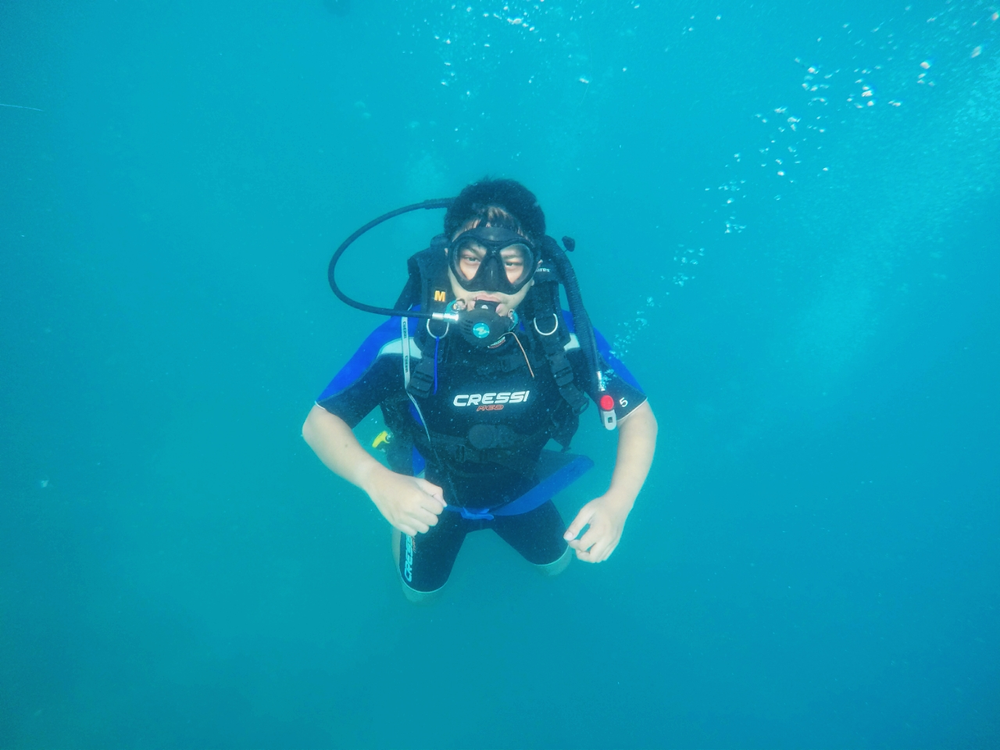

Hai Laut

Apa kabar? Kamu terlihat cantik sekali hari ini, terlihat kuat dan tegar seperti biasa, pandai kamu menutupi kerapuhanmu.

Aku cuman mau bilang, aku gak suka cara kamu begitu.

Aku gak suka cara kamu membayang-bayangi pikiranku, saat aku jauh. Seolah hanya kamu lah satu-satunya yang berarti dalam hidup ini.

Aku gak suka cara kamu memanggilku, dengan kicauan angin dan bisikan koral. Seolah itu akan berhasil membawaku kembali padamu. Ya memang, itu berhasil.

Aku gak suka cara kamu membuatku harus terombang-ambing diatas kapal, diatas terik yang mengoyak lapis demi lapis kulit ari tanpa henti. Hanya untuk merasakan kembali belai manja sejuk dari dekapanmu

Aku gak suka cara kamu mencuri nafasku saat di dalam sana, membuat jantungku berdegup kencang di bawah sepasang manta yang menari-nari memamerkan romantisme tanpa henti.

Aku gak suka cara kamu membuatku terengah-engah pasrah mengikuti arus yang ntah berujung dimana.

Tapi apa aku punya pilihan lain?

Apa aku punya pilihan lain selain terlena pada nyanyian sunyi tapi bisingmu, aroma terik tapi wangimu, kerasnya koral tapi lembutmu?

Di dalam sana, kamu berhasil menamparku dengan kenyataan, betapa maha kecil dan maha tak berdayanya aku, nir arti. Ada kuat dalam rapuhmu, ada sukacita dalam sedihmu, ada rindu dalam marahmu.

Di dalam sana, kamu tak henti-hentinya memanjakanku dengan kesunyian, dengan ruangan sepi maha dalam yang menenangkan isi otakku yang selalu berontak mencari celah  untuk menaklukkan dunia di daratan sana.

Aku tak punya pilihan lain selain mengagumi kesabaranmu atas ketidakmampuanku membalas segala sesuatu maha baik yang kamu berikan dalam hidupku. Mengagumi pengorbananmu agar aku dan orang-orang semacamku bisa terlarut dalam simfoni anemon yang mampu membius orang paling jenius sekalipun.

Aku tak punya pilihan selain mengucapkan terima kasih, membelamu sebisaku di depan mereka yang terus menerus meludahi perjuanganmu.

Terima kasih..

Aku akan kembali. Doakan aku bisa kembali.
