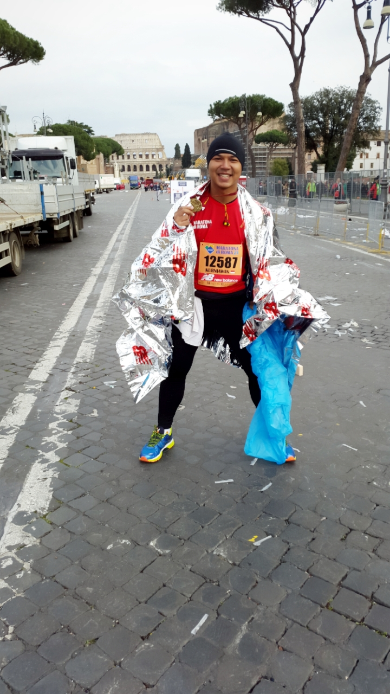
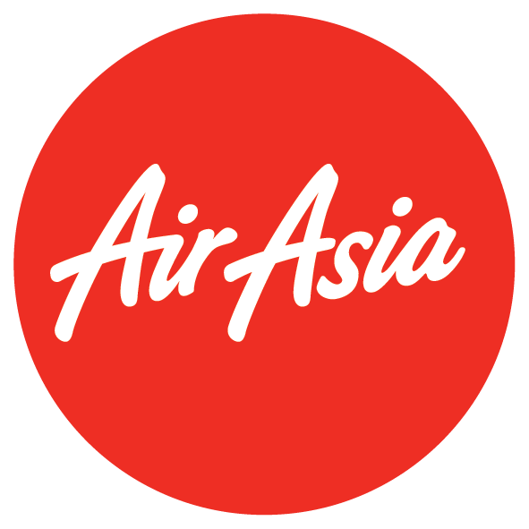
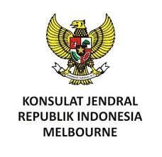

### Dear Sahabat.....

Masih ingat cerita saya menyelesaikan maraton penuh di Roma? (cerita lengkapnya [disini](http://denta.id/2015/04/12/because-all-roads-will-lead-to-rome/))

Kali ini saya akan melanjutkan tantangan lari dari adik-adik dengan kanker dari Yayasan Kasih Anak Kanker Indonesia untuk menyelesaikan maraton penuh 42 km di Melbourne, Minggu tanggal 18 Oktober 2015 saya akan berlari untuk menyelesaikan maraton di salah satu kota paling hip di belahan bumi bagian selatan ini.

Seperti yang sudah-sudah, tantangan ini akan saya gunakan untuk mengumpulkan donasi yang akan digunakan untuk pendidikan anak-anak kanker di Rumah Kita YKAKI.  Teman-teman bisa membantu saya untuk merubah lari maraton saya menjadi donasi untuk adik-adik kita dengan kanker.

Saya akan berlari lagi sejauh 42,195 km dan dengan sedikit klik dan isi formulir [di sini](http://doku.com/u/xre5AvY), teman-teman bisa menyisihkan Rp.42.195,- untuk merubah lari saya dalam kilometer menjadi donasi dalam rupiah. Dengan jumlah yang hanya seharga minuman di kedai kopi ternama itu sudah cukup untuk membantu adik-adik kita dengan kanker untuk belajar dan melanjutkan perjuangan mereka.

Seluruh donasi yang terkumpul, setelah dikurangi biaya administrasi, akan diberikan sepenuhnya untuk dikelola oleh Yayasan Kasih Anak Kanker Indonesia. Terima kasih untuk teman-teman di AirAsia dan Konsulat Jenderal Republik Indonesia di Melbourne atas bantuannya hingga saya bisa berlari di Melbourne.

## Klik ikon berikut untuk berdonasi.

Lebih lanjut tentang YKAKI dan Rumah Kita teman-teman bisa kunjungi [www.ykaki-indo.org](http://www.ykaki-indo.org) dan ikuti saya di instagram dan twitter @sdenta untuk cerita lengkap saya menyelesaikan tantangan ini.

Teriring Salam

Denta

#turnourmiles #ubahlariku #YKAKI #AirAsiaCares #AirAsiaTerbangJauh

**_Official Airline TurnOurMiles Melbourne_**

_**Dengan kebaikan dan dukungan dari**_

