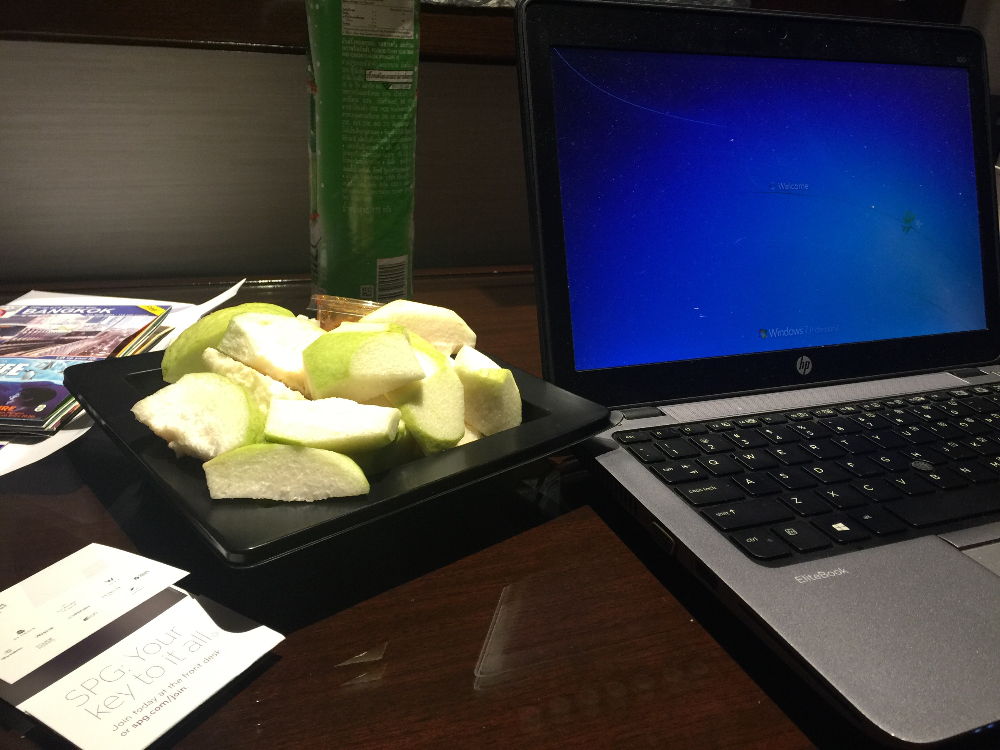

Sudah tiga hari postingan aku kayaknya serius terus. Hari ini gak mau serius nulisnya, karena hari ini adalah hari minggu, hari libur. 

Seenggaknya buat sebagian besar orang.

Karena hari minggu ini aku termasuk dalam golongan jamaah minggu semu. Minggu palsu.  Pseudo-sunday. 

Barusan sampai Bangkok, bukan untuk interview kerjaan seperti saat terakhir aku kesini, tapi untuk meeting di kantor Thailand plus sekalian ikut konferensi yang lumayan ngehits di kalangan spesialis anak se-Asia. It's like comic con for pediatricians. With no comic or action figures booth of course, but there will be abstract stands, in certain pov, it's a same-same.

Anyway, Thailand lagi berkabung, sudah tau sih dari berita, cuman ternyata suasana berkabungnya masih lumayan terasa, dimana-mana foto mendiang raja dipajang dengan quotes ber-aksara Thailand, gak ngerti sih tulisannya apa tapi sedih gitu keliatannya, google-nya aja item putih gak warna warni seperti biasa. Dimana-mana banyak orang pake pita hitam, pas cek-in di hotel pun sama resepsionisnya dikasih tuh pita hitam. Mas jangan lupa dipake ya besok tiap keluar, gitu kira-kira katanya. 

Terakhir kali aku ngalamin satu negara berkabung segini-nya itu ya dulu pas masih kecil pas almarhumah Bu Tien meninggal, aku yang gak kenal aja ikutan nangis, disuruh ama wali kelas nangis, kalo ga nangis bakal diputerin gugur bunga terus sampai akhirnya nangis.

Begitu masuk kamar lupa kalo masih banyak yang harus dikerjain, padahal ngantuk banget gak terkira, semalam begadang karena hanya punya jendela waktu kosong sangat sedikit hanya beberapa jam kira-kira buatku untuk menyelesaikan target mingguan, naek level overwatch. 

Jadi disinilah aku sekarang, diantara pre-works yang harus diselesaikan sebelum mentari esok pagi terbit. Sudah selesai dua, masih ada dua lagi.

Udah tau masih ada kerja, bukannya fokus mikirin kerjaan, yang ada dalam pikiranku malah tadi kenapa pas di supermarket mbak-mbak kasirnya salah mengklasifikasikan suku bangsaku yah?

Jadi baru tau kalo di mesin kasir gourmet market paragon itu, gak tau sih kalo di tempat lain gimana, selain input member/non member pelanggan yang belanja, ternyata si kasir harus meng-input suku bangsa dari si pelanggan. Pilihannya banyak, ada Thailand, Eropa, Amerika, Arab, China, India dll dll. 

Aku pikir hebat bener nih kasir bisa ngenalin suku bangsa dari ngeliat pelanggan sekilas doang. Pasti pas ujiannya pas training nebakin asal orang satu-satu dari rekaman cctv.

Itu eropa, itu amerika, itu india, itu cina, itu Zimbabwe gituu seterusnya sampai selesai ditebak semua orang yang ada di cctv seharian.

Tapi kekagumanku hilang begitu aku tau suku bangsa apa yang mbak kasir input buat aku.

India.

So here I am now between my pre-works having identity crisis looking at the mirror, keep shaking my head while holding my neck.

Shit.
